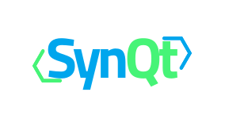

<p align="center">
  
</p>

# SynQt

SynQt is a framework for building complete web systems in Qt and QML, with no
third party servers to stand up. You write your application as a set of entities.
One entity is the client (QML compiled to WebAssembly for the browser, and to a
native app for Windows, macOS, and Linux from the same code). One is the web
edge (the native process that serves the client and faces the internet). Beyond
those, you add the entities your system needs (a database, a cache, an API
gateway, a jobs runner, an auth service, or anything custom). Each entity is its
own folder and its own binary, can run on the same machine or a different one,
and talks to the others through typed connect points. SynQt handles the
transport, the serialization, the reconnection, the authentication between
users and the edge, and the authentication between entities, with a secure
default at every step.

This repository holds the framework itself: the runtime libraries, the `synqt`
command line tool, the contract generator, the test suites and benchmarks, the
worked example systems, and the documentation. The documentation site is at
[synqt.org](https://synqt.org/).

## Quick start

```sh
curl -fsSL https://get.synqt.org/install.sh | sh   # macOS and Linux
synqt new my-app
cd my-app
synqt dev
```

On Windows, in PowerShell: `irm https://get.synqt.org/install.ps1 | iex`.

That one binary is all you install by hand. The first build downloads and pins the
rest of the toolchain (the Qt SDK and the Emscripten compiler) into the project, so
every machine gets the same versions. Full walkthrough in
[`docs/getting-started.md`](docs/getting-started.md).

## Why SynQt exists

Qt can compile a QML application to WebAssembly and run it in the browser. What
Qt does not give you is a finished system: a way to expose server state and
server functions to a browser client safely, a way to add a database or a cache
or an internal service without bolting on a separate vendor product and learning
its security model, a project layout, a build pipeline a web developer can pick
up in minutes, and a default security posture for every link in the system.
SynQt is that layer.

The design goal: building a full web system, backend and all, should feel as
close as possible to writing one local QML application, while the framework keeps
every component in its own trust domain and treats every link as a real network
boundary.

## Core principle: simple by default, expandable by configuration

Every part of SynQt has a short path for the common case and a longer path for the
demanding one, in the same place. A database entity is one line and runs on an
embedded engine with no setup. The same entity, pointed at a managed PostgreSQL
cluster over verified TLS with a connection pool, is a few more lines in that one
entity block, and nothing else in the system changes. Authentication is one
command with secure defaults, and also a set of knobs when you need them. The
simple case stays simple, and the advanced case is reachable from the same place
without a rewrite.

## The model: a system is a set of entities

A SynQt project is a set of entities. Two are always present in a new project:

- `client`: your UI, written in QML, compiled to WebAssembly, shipped to the
  browser. It is untrusted (anything in a browser is). It can only connect out,
  never listen. The same `client/` QML also builds to a native desktop app for
  Windows, macOS, and Linux against the same edge and security model
  ([`docs/desktop.md`](docs/desktop.md)).
- `web` (a web edge): the native process that serves the client bundle and
  accepts the browser's connection. It is the only entity exposed to the
  internet.

You then add whatever else your system needs, each as its own entity:

```
your-app/
  synqt.yaml          # project, topology, and security configuration
  shared/             # contracts: the typed APIs that may cross between entities
  client/             # the browser UI (WebAssembly)
  web/                # the web edge (serves the client, faces the internet)
  database/           # a persistence entity (official blueprint, embeds SQLite)
  cache/              # an in memory cache entity (official blueprint)
  .env                # secrets, per entity, never shipped to the browser
```

Every entity is a separate binary. The client builds to WebAssembly; each service
builds to a native binary. They can be deployed together on one host or spread
across many. You do not run Postgres, Redis, or an API gateway as separate
products you configure and secure yourself: you run SynQt entities, one toolchain,
one security model, one deploy story.

When you do want a particular engine, an entity can be backed by it through a
provider. The default database entity runs on an embedded engine with no setup;
selecting `provider.name: postgres` or `provider.name: mongodb` masks that engine
behind the same entity, so its connect points, and the whole security model around
them, stay identical. Providers are the subject of [`docs/providers.md`](docs/providers.md).

## Connect points: how entities talk

Entities never write network code. They share typed connect points. A connect
point is a named live object owned by exactly one entity (which holds the
authoritative implementation) and consumed by one or more others (which see a
live mirror). Its shape is declared once in a contract in `shared/`. Property
changes and signals flow from the owner to the consumers; function calls flow
from a consumer to the owner, where the owner decides whether to honor them.

From the browser client, the edge's connect points appear under `Server` (an
alias for the edge this client is attached to). From any entity's code, a connect
point on another entity appears under that entity's name, for example
`Database.users.find(id)` from the web edge. Inside a connect point's own
function, the framework exposes the caller through `Caller` (a browser session,
or another entity authenticated by certificate), so the owner can authorize every
request.

```
// shared/Todo.syn : the typed API the browser and the edge share.
contract Todo {
    model items(text, author, done)   // a live list; only these fields cross
    slot add(string text)             // the browser asks, the edge decides
    signal rejected(string reason)
}
```

Full worked systems, including a three entity app with a database, are in
[`docs/examples.md`](docs/examples.md).

## Security is built into every link

Every link in a SynQt system is encrypted, authenticated, and authorized by
default:

- The browser to edge link uses TLS (wss), authenticates the user with a server
  side login (the client never holds a secret), checks the request origin, and
  authorizes every call on the edge.
- Entity to entity links use mutual TLS against a project private certificate
  authority by default on every link, on one host (over loopback) or across
  hosts, so each entity proves its identity to the other by certificate. A
  permission protected local socket is an explicit opt in for co located, equally
  trusted entities. The owner of a connect point authorizes which entities may
  call it.
- The topology is an allowlist. An entity may reach only the entities it is
  declared to consume from. Sensitive entities (a database) are never reachable
  from the browser and never face the internet.
- Authentication is meant to be easy and is secure by default: `synqt add auth`
  wires a provider with PKCE, a hardened session cookie, and CSRF protection,
  with no insecure middle state to forget about.

The security model is the subject of [`docs/security.md`](docs/security.md). Read it before
deploying.

## Features

- A QML first programming model where the boundary between any two components is
  a set of typed connect points, named and access controlled by configuration.
- An entity model: add a database, cache, gateway, jobs runner, auth service, or
  custom entity, each a separate binary, each in the one toolchain.
- One client codebase, two packagings: the same `client/` QML ships to the
  browser as WebAssembly and builds as a native desktop app for Windows, macOS,
  and Linux, against the same edge and the same security model.
- Official entity blueprints so common needs (durable storage, caching) are one
  command away and secure by default.
- A `synqt` command line tool with an npm shaped workflow: `synqt new`,
  `synqt dev`, `synqt build`, `synqt serve`, `synqt check`, `synqt doctor`,
  `synqt add entity`, `synqt add auth`, and the `synqt mesh` certificate commands.
- A build pipeline that installs the pinned Qt and Emscripten, compiles QML
  through the Qt Quick Compiler, and produces every entity's deployable artifact.
- A security model that is on by default at every link: TLS everywhere, user auth
  at the edge, mutual TLS between entities, a deny by default topology, origin
  checking, strict browser isolation headers, and data minimization built into
  the contract format.

## Documentation

The full documentation site is at [synqt.org](https://synqt.org/). The same pages
are in `docs/`.

New to SynQt? Start with [`docs/getting-started.md`](docs/getting-started.md), then the auction tutorial
([`docs/tutorial.md`](docs/tutorial.md), one page per stage): a step by step build of a real time
auction that grows from a client and an edge into a three entity system with sign
in and a database. The second tutorial ([`docs/tutorial-multiplayer.md`](docs/tutorial-multiplayer.md)) builds a
multiplayer arena in 2D Qt Quick, with server authoritative movement and a
database backed leaderboard.

The reference pages:

- [`docs/architecture.md`](docs/architecture.md): the entity model, the planes (delivery, transport,
  objects), the mesh of links and their transports, and the rationale for every
  Qt technology chosen.
- [`docs/programming-model.md`](docs/programming-model.md): contracts, connect points (owner and consumers),
  the `Server`, entity, `Caller`, and `Session` accessors, sessions, scopes, and
  cross entity calls.
- [`docs/entities.md`](docs/entities.md): the entity model in depth, the official blueprints
  (persistence, cache, gateway, jobs), and how to build a custom entity.
- [`docs/providers.md`](docs/providers.md): backing an entity with the embedded engine or a third
  party one (PostgreSQL, MySQL, MongoDB, Redis, or your own) through a provider.
- [`docs/authentication.md`](docs/authentication.md): user identity versus entity identity, the session
  lifecycle, and the secure by default provider wiring.
- [`docs/runtime-api.md`](docs/runtime-api.md): the exact reference for the accessors the framework
  injects into your QML (`Server`, `Session`, `Router`, `Caller`, `Client`, `App`,
  and the generated Source surface).
- [`docs/project-layout-and-config.md`](docs/project-layout-and-config.md): the directory layout and the complete
  `synqt.yaml` schema.
- [`docs/build-system-and-cli.md`](docs/build-system-and-cli.md): the toolchain, the multi binary build, the
  Emscripten pipeline, the certificate tooling, and the `synqt` CLI.
- [`docs/desktop.md`](docs/desktop.md): building the same `client/` QML as a native desktop app.
- [`docs/security.md`](docs/security.md): the threat model and the security design across every link.
- [`docs/csp.md`](docs/csp.md): the Content-Security-Policy the edge emits, and how to widen it.
- [`docs/examples.md`](docs/examples.md): complete worked systems, from a single page app to a three
  entity app with a database.
- [`docs/licensing.md`](docs/licensing.md): the Qt module and platform licenses, what each entity's
  built artifact is licensed as, and SynQt's own license (Apache-2.0).

For working on SynQt itself: [`docs/development.md`](docs/development.md) maps the
codebase and the test suites, [`docs/api-reference.md`](docs/api-reference.md) covers the
generated [C++ class reference](https://synqt.org/api/), and
[`docs/browser-proofs.md`](docs/browser-proofs.md) records the browser coverage.

## License and contributing

SynQt's own source code is licensed under Apache-2.0 (see [`LICENSE`](LICENSE) and [`NOTICE`](NOTICE)).
The license of an application you build with SynQt is inherited from the Qt build
you use: with open source Qt the browser client is GPLv3 and is served to every
visitor, so its source must be published, while the server side stays private if you
self host it; a commercial Qt license lets everything be proprietary. The full
analysis, with diagrams, is in [`docs/licensing.md`](docs/licensing.md).

Contributions are welcome under the CLA in [`CLA.md`](CLA.md); see [`CONTRIBUTING.md`](CONTRIBUTING.md) for the
SPDX header convention and code style.

## Target Qt version

SynQt targets Qt 6.11.1 and the Emscripten version Qt pins to it
(4.0.7). These versions are load bearing: the browser transport (QtRO over a
WebSocket QIODevice), the mesh transport (QtRO over mutual TLS), the WebSocket
upgrade verifier in QHttpServer, OAuth2 with PKCE on by default, and the bundled
SQLite driver all depend on current Qt. The build tool pins these versions so
every entity and every contributor gets a reproducible toolchain.
