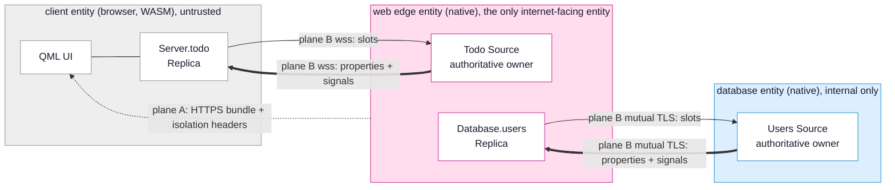
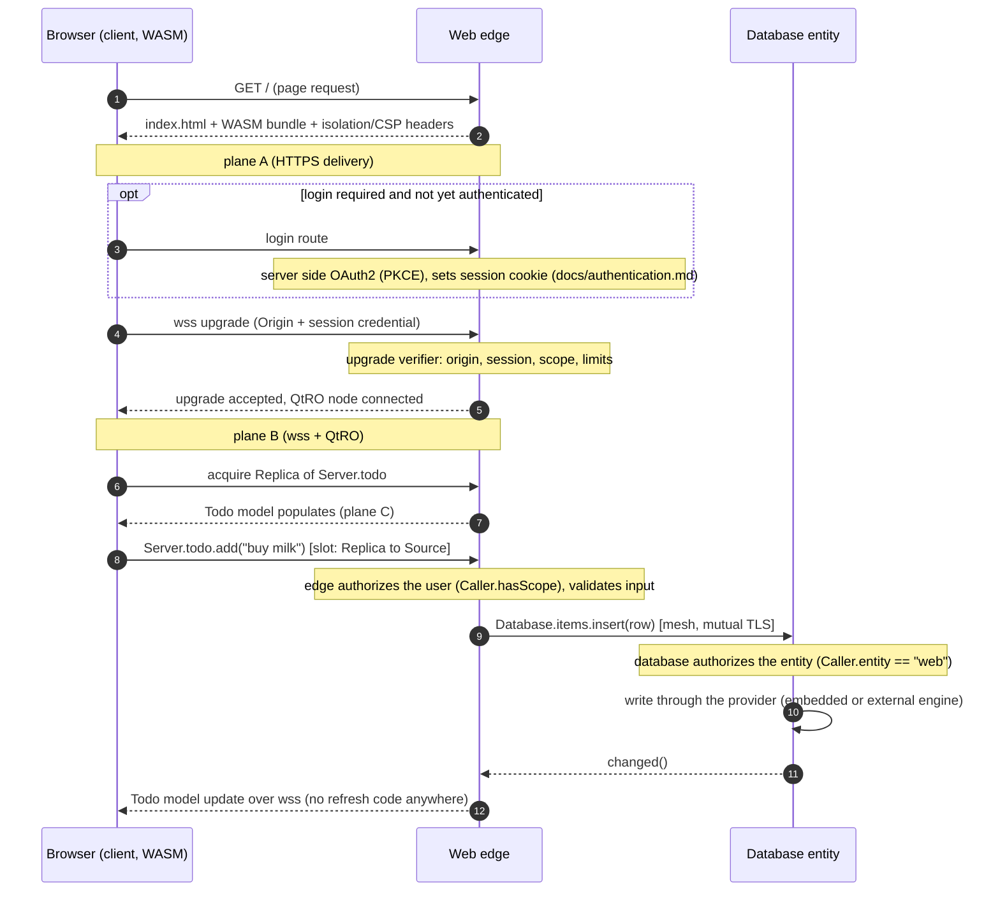

# Architecture

This page describes how SynQt is put together and why each Qt technology was
chosen. A SynQt system is a set of
entities connected in a small service mesh. Every load bearing decision cites the
Qt 6.11 documentation it relies on.

## Entities

An entity is a SynQt node: a unit of the system with its own folder, its own
binary, its own identity, and its own place in the topology. There are two kinds.

- A client entity is a Qt Quick app: QML compiled to WebAssembly and run in the
  browser, and optionally the same QML built as a native desktop application for
  Windows, macOS, and Linux from one codebase (see [desktop
  clients](desktop.md)). It is untrusted. Because the browser sandbox is the
  tightest target it is written against, it can only connect out, never listen,
  and a native build keeps exactly that shape. A project has at least one (the
  user facing app); it may have more (for example a separate admin app) in later
  versions.
- A service entity is a native binary. It can listen and connect. Services carry
  capabilities. The most important capability is web edge: a service with the web
  edge capability serves a client bundle and accepts that client's connection. It
  is the only kind of entity exposed to the internet. Other services (a database,
  a cache, a gateway, a jobs runner, an auth service, or anything custom) have no
  public exposure and are reachable only by the entities the topology allows.

A familiar client and server pair maps onto this model directly: the process that
serves the app and faces the internet is the service entity holding the web edge
capability, and the browser app is the client entity. Everything else is a
service entity you add as needed.

Why entities. A real system is more than a browser and one process. It
has durable storage, caching, scheduled work, and integrations. Forcing all of
that into a single server process, or pushing it onto third
party products with their own deployment and security models, splinters the
toolchain and the security story. Making every such
component a first class SynQt entity means one toolchain, one contract format,
one transport mechanism, and one security model across the whole system.

## The browser constraint still anchors the shape

A browser is a sandbox. A WebAssembly program built with Qt can make HTTP
requests to its own origin or to a CORS enabled server, and can open a WebSocket
to any host, but it cannot open a listening socket of any kind. The Qt for
WebAssembly platform notes are explicit that QWebSocketServer is unusable in the
browser, and that QtRemoteObjects can ride QtWebSockets only if you supply your
own QIODevice. This fixes one fact for all time:

- A client entity is always a connector. It reaches exactly one web edge entity
  over a WebSocket it opens itself.
- A web edge entity is always a listener for the browser link.

Building the client natively for the desktop does not relax this. SynQt keeps the
native client to the same connector-only shape, so the browser sandbox stays the
contract the client is written to and one codebase serves both targets. The only
differences are on the client side (it terminates its own TLS, and it is told
where the edge is), covered in [desktop clients](desktop.md).

Service to service links are not subject to the browser sandbox, so they use more
direct and more efficient transports, described under
[Plane B: transport](#plane-b-transport-the-secure-pipes) below.

## Three planes

SynQt separates concerns into three planes. Keeping them distinct is what lets the
security model be strict without making the programming model painful.

### Plane A: delivery (how the client reaches the browser)

The compiled WebAssembly client (a `.wasm` module, a loader, and assets) is
static content. The web edge serves it over HTTPS using QHttpServer, stamping the
browser isolation headers and content security policy. Delivery is one
directional and stateless. After the browser has the bundle, plane A is done.

Rationale: QHttpServer gives a small routing server with `route()` for paths,
`QHttpServerResponse::fromFile()` for assets, and `addAfterRequestHandler()` for
stamping headers. Using the web edge to both serve the bundle and accept the
browser connection means one port, one certificate, and one origin, which is the
cleanest same origin security story (see [security](security.md)).

### Plane B: transport (the secure pipes)

Plane B is plural: one pipe per link in the mesh.

- Browser to web edge: a single secure WebSocket (wss). It is the only long lived
  connection from the browser. Before it is accepted, the edge verifies the
  request origin and the user session credential (checked in detail in
  [End to end data flow](#end-to-end-data-flow)). The browser side
  socket is a QWebSocket, which in WebAssembly maps onto the browser's native
  WebSocket. QtRemoteObjects does not speak WebSocket, so SynQt wraps the socket
  in a QIODevice adapter (the pattern from the QtRemoteObjects WebSockets example
  and the QtMqtt websocketiodevice example) and hands it to the QtRO node. The
  edge accepts upgrades through QHttpServer, whose base QAbstractHttpServer
  exposes `addWebSocketUpgradeVerifier()`, run with the full request before a
  socket exists.
- Service to service (the mesh default, whether the link crosses a host or stays
  on one, where it binds to loopback): QtRemoteObjects over a mutually
  authenticated TLS connection. The host side uses QSslServer; the client side a
  QSslSocket. Both verify the other against a project private certificate
  authority, with `QSslConfiguration::setPeerVerifyMode(QSslSocket::VerifyPeer)`.
  This is the QtRO SSL example pattern, and it gives encryption plus mutual
  authentication: each entity proves its identity by certificate. The accepted
  socket is handed to the QtRO node with `addHostSideConnection()` (host) and
  `addClientSideConnection()` (consumer).
- Service to service on the same host (opt in): QtRemoteObjects over a local
  socket (QLocalServer and QLocalSocket). The socket is a filesystem object
  protected by filesystem permissions and never touches the network, so the
  operating system enforces which user may connect, but not which entity: on this
  transport the calling entity's name is trusted by colocation. It is a fast path
  you opt co located, equally trusted entities into; the default even on one host
  is the mutual TLS link over loopback, which keeps entity identity certificate
  authenticated everywhere (see [security](security.md)).

### Plane C: objects (the shared object tree)

This is the plane developers program against. The owner of a connect point holds
a QtRemoteObjects Source: the authoritative QObject whose properties, signals, and
slots define the API. Each consumer holds a Replica: a live proxy of that Source.
Quoting the QtRO behavior: properties and signals travel from Source to Replica,
and slots travel from Replica to Source. A Replica behaves like any other QObject,
so it appears in QML (or in another entity's code) as a normal object with
bindable properties and callable methods. This is what makes a boundary feel local
without hiding that it is asynchronous.

In the graph: thick arrows are owner to consumer (properties and signals), thin
arrows are consumer to owner (slots). The browser's `Server.todo` Replica mirrors
the edge's `Todo` Source over wss; the edge's `Database.users` Replica mirrors the
database's `Users` Source over mutual TLS. Only the edge faces the internet; the
database is internal only.

## Runtime components

The framework ships a client runtime (linked into the WebAssembly client), a
service runtime (linked into every native entity), and a thin generated layer.
The names below are the actual C++ class names; the
[C++ API reference](api-reference.md) documents their members.

Client runtime (WebAssembly, and the same runtime linked into a native desktop
build; see [desktop clients](desktop.md)):

- `SynClient`: the entry point. Reads the runtime config delivered with the
  bundle, opens the wss connection to its edge, reconnects with backoff, and
  exposes connection state to QML. (On a native desktop build it terminates its
  own TLS and reads the edge URL from config instead of the served page.)
- `WebSocketTransport`: the QIODevice adapter over the client's QWebSocket.
- `ServerAccessor`: exposed to QML as `Server`. Holds the acquired Replica for
  each connect point the client consumes, presented by name. A facade over
  replicas, not a monolith.
- `Session` and `Router`: read only session state (`scope`, `state`, `identity`,
  `login`, `logout`) and the scope gated route table from config. The full member
  reference is in the [runtime API reference](runtime-api.md).

Service runtime (native, used by every service entity):

- `EntityRuntime`: the entry point for a service entity. Reads config, brings up
  the connect points this entity owns, opens the consumer connections this entity
  needs, and exposes consumed connect points by owner name (for example
  `Database`).
- `ConnectPointHost`: for each owned connect point, instantiates the Source
  (backed by the entity's QML), calls `enableRemoting()`, and (for per session or
  per peer instances) creates one Source per session or per calling entity.
- `MeshTransport`: the QtRO transport for service links: QSslServer and QSslSocket
  with mutual verification against the project CA by default (bound to loopback
  when the link stays on one host), and QLocalServer and QLocalSocket for opt in
  local links.
- `Provider` (on blueprint entities): the backend behind the entity's connect
  points, selected by config. The default is an embedded engine (SQLite for
  persistence, in memory for cache); a third party engine is masked behind the same
  entity through the same interface (see [providers](providers.md)).
- `WebEdge` (only on entities with the web edge capability): owns the QHttpServer,
  TLS for the public port, static bundle serving, the header policy, the
  WebSocket upgrade pipeline, the SessionManager, and the optional IdentityProvider.

Generated layer:

- From each contract in `shared/`, the build generates a QtRO Source header and
  Replica header (via repc) and the registrations needed on each side. This gives
  every connect point a compile time checked shape on both ends, so a version skew
  between two entities is a build error, not a runtime surprise.

## Why the QtRO registry is not used

QtRemoteObjects offers a registry that lets nodes discover sources and connect to
them automatically: once a node joins the registry, it can acquire any source on
the network and the registry initiates the connection for it. That convenience is
exactly the wrong property for a security sensitive mesh. It is ambient discovery
and ambient connection: it makes the set of reachable objects implicit and grows
the attack surface of any node that can reach the registry.

SynQt instead derives the topology from the declared connect points (each names
its owner and its allowed consumers) and opens only those connections, each
mutually authenticated. There is no dynamic discovery and no ambient authority. An
entity can reach only what configuration says it may. This deny by default
posture is a deliberate trade of convenience for security and is revisited in
[security](security.md).

## End to end data flow

A full path, from cold load to a database write:

Two authorization checks happened, at two trust boundaries: the edge authorized
the user, and the database authorized the edge. Neither trusts the other blindly.

## Technology choices and their justification

- Client UI and logic: QML compiled by the Qt Quick Compiler. qmlcachegen (or
  qmlsc with the commercial extensions), driven automatically by
  `qt_add_qml_module`, turns each document into a compilation unit (structure,
  byte code, and native C++ for the bindings it can lower). The shipped client is
  compiled, not parsed at runtime. qmltc (whole component compilation) is a
  technology preview that needs private Qt API and gives no cross patch binary
  compatibility, so it is an opt in optimization, not the default.
- Client packaging: WebAssembly via Emscripten, pinned to the Qt selected version
  (4.0.7 for 6.11.1) for reproducible, ABI compatible builds.
- Object protocol: QtRemoteObjects, which models the Source and Replica split,
  generates marshaling from a declarative interface (repc), and surfaces Replicas
  as ordinary QObjects. Every link in the mesh reuses it, browser and service
  links alike.
- Browser transport: QWebSocket bridged into QtRO with a QIODevice adapter, the
  only transport that works from the browser sandbox and reaches an arbitrary
  host.
- Mesh transport: QtRO over QSslSocket and QSslServer with mutual verification on
  every link by default (bound to loopback when the link stays on one host), with
  QLocalSocket as an opt in for co located, equally trusted entities. The TLS path
  gives encryption and certificate based mutual authentication; the local socket
  avoids the network entirely but identifies the calling user, not the calling
  entity. QtRO has no built in security, so this transport layer is where
  confidentiality and peer authentication come from.
- Delivery and upgrade: QHttpServer on the web edge, serving the bundle, stamping
  headers, and verifying WebSocket upgrades on one origin.
- User identity: Qt Network Authorization (QOAuth2AuthorizationCodeFlow) on the
  edge, PKCE on by default since 6.8, run server side so the client secret never
  reaches the browser.
- Durable persistence (the database blueprint): a provider behind the entity. The
  default is Qt SQL with the bundled SQLite driver, the in process database with the
  best test coverage on all platforms, running no separate daemon. The same entity
  can be backed by a third party engine (PostgreSQL, MySQL, MongoDB, Redis) through a
  provider, masked behind the entity so consumers and the security model do not
  change (see [providers](providers.md)). The default blueprint serializes writes and
  sets a busy timeout, because SQLite can block under concurrent transactions (see
  [entities](entities.md)).

## Threading and isolation posture

The single threaded WebAssembly client is the default, because it runs in every
modern browser with no special hosting requirements and the client's job is UI
plus a network connection. The multi threaded client needs SharedArrayBuffer,
which the browser only grants to a cross origin isolated page (the COOP and COEP
headers the edge can emit). It remains available behind configuration. Service
entities are native and run their own event loops; the database entity owns its
SQLite connection on the thread that created it, per the Qt SQL threading rule.

## What is intentionally out of scope

- Server delivered, runtime *compiled* QML views. The bundle's own views are compiled
  ahead of time by qmlcachegen and want their QML at build time. A peripheral view can
  instead be delivered by the edge and interpreted at run time as a
  [remote page](remote-pages.md), which keeps it out of the bundle and editable without
  a client rebuild; that path is interpreted, not compiled, so it is for campaign and
  landing pages, not per-frame views. Access to data is controlled at the connect point
  and route guard level in both cases.
- A novel storage engine. The database blueprint embeds SQLite by default and masks
  third party engines (PostgreSQL, MySQL, MongoDB, Redis) behind a provider rather
  than reimplementing durability. Writing a brand new storage engine is out of scope;
  using an existing one through a provider is supported (see
  [providers](providers.md)).
- Multi instance horizontal scaling of a single entity with shared state behind a
  load balancer. SynQt targets one process per entity (each serving many
  clients). The mesh model does not preclude a future clustered entity, but it is
  not specified here.
- Browser to browser connections. All traffic flows through entities, which is
  also where authorization lives.
