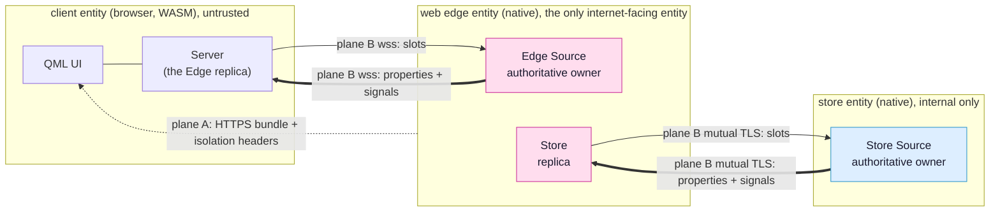
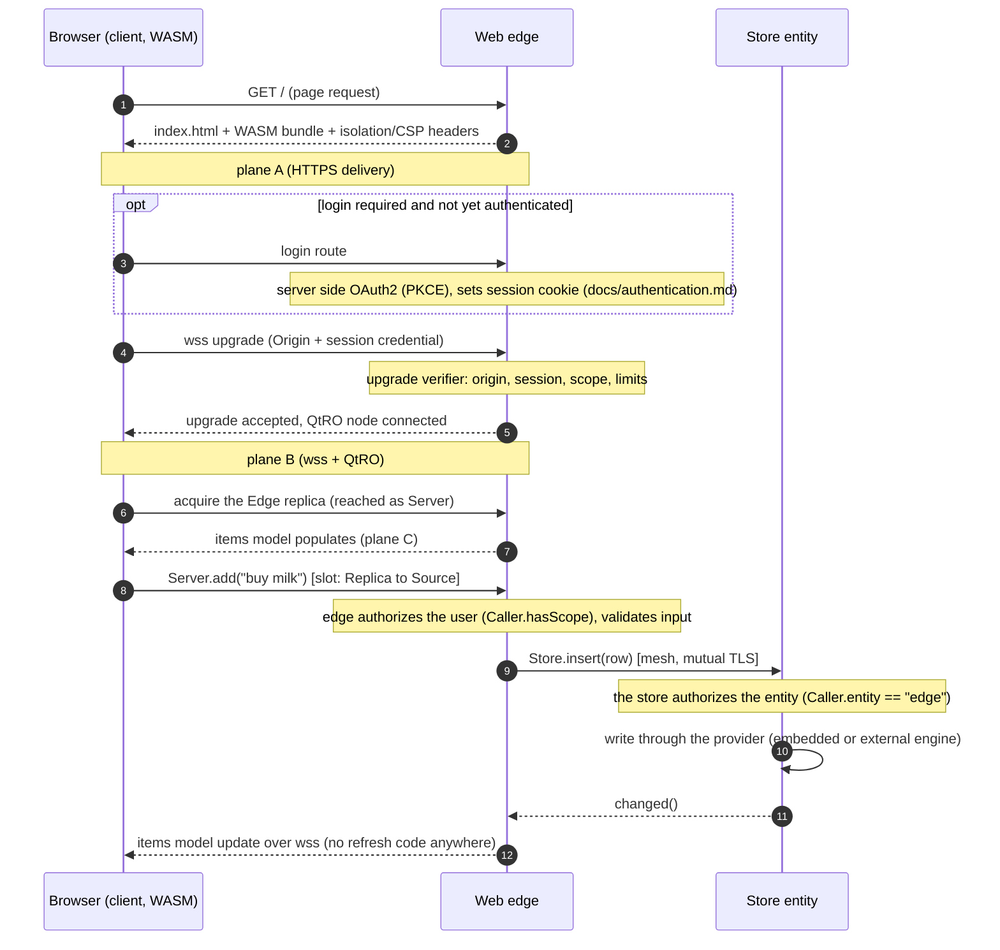

<!-- SPDX-FileCopyrightText: 2026 Alexandre 'kidev' Poumaroux -->
<!-- SPDX-License-Identifier: Apache-2.0 -->

# Architecture

This page describes how SynQt is built and why it uses each Qt technology. A SynQt
system is a set of entities connected in a small service mesh. Each decision below cites
the Qt 6.12 documentation it relies on.

## Entities

An entity is one unit of a SynQt system, with its own folder, binary, identity and
place in the topology. There are two kinds.

- **A client entity** is a Qt Quick app: QML compiled to WebAssembly and run in the
  browser. The same QML can also build as a native desktop app for Windows, macOS and
  Linux (see [desktop clients](desktop.md)). A client is untrusted. It is written for
  the browser sandbox, the tightest target, so it can only connect out, never listen,
  and a native build keeps that shape. A project has at least one client (the app
  users see) and may have more; a separate admin app is the usual second one. Each
  client gets its own bundle, and an edge's
  [`bundles:`](project-layout-and-config.md#bundles-which-scope-is-served-which-client)
  decides which scope is served which bundle.
- **A service entity** is a native binary that can listen and connect. Each service has
  a type. The most important is the web edge: an entity of `type: web_edge` serves a
  client bundle and accepts that client's connection, and it is the only type a browser
  can reach. Other services (a database, a cache, a gateway, a jobs runner, an auth
  service, or your own) are not exposed publicly. Only the entities the topology allows
  can reach them, unless one opens an HTTP surface on purpose with
  [`network.inbound`](project-layout-and-config.md#network-what-an-entity-may-reach-and-who-may-reach-it).

A classic client and server maps directly onto this model. The browser app is the
client entity, and the process that serves it and faces the internet is the web edge.
Everything else is a service entity you add when you need it.

A real system also needs durable storage, caching, scheduled work and integrations.
Cramming all of that into one server process, or handing it to third party products
with their own deployment and security models, splits the toolchain and the security
model. SynQt makes each of these components an entity, so the whole system has one
toolchain, one contract format, one transport and one security model.

## What the browser sandbox forces

A WebAssembly program built with Qt can make HTTP requests to its own origin or to a
CORS enabled server, and can open a WebSocket to any host. It cannot open a listening
socket of any kind. The Qt for WebAssembly platform notes state that QWebSocketServer
does not work in the browser, and that QtRemoteObjects runs over QtWebSockets only
through a QIODevice you supply. This fixes the direction of the client link:

- A client entity is always a connector. It reaches exactly one web edge entity
  over a WebSocket it opens itself.
- A web edge entity is always a listener for the browser link.

A native desktop build of the client keeps the same connector-only shape, so one
codebase serves both targets. It differs only on the client side: it terminates its own
TLS and is told where the edge is (see [desktop clients](desktop.md)).

Links between services are outside the browser sandbox, so they use more direct and
efficient transports, described under
[Plane B: transport](#plane-b-transport-the-secure-pipes).

## Three planes

SynQt separates its concerns into three planes. Keeping them apart lets the security
model stay strict while the programming model stays simple.

### Plane A: delivery (how the client reaches the browser)

The compiled WebAssembly client (a `.wasm` module, a loader and assets) is static
content. The web edge serves it over HTTPS with QHttpServer and adds the browser
isolation headers and the content security policy. Delivery is one way and stateless:
once the browser has the bundle, plane A is done.

QHttpServer is a small routing server: `route()` for paths,
`QHttpServerResponse::fromFile()` for assets, and `addAfterRequestHandler()` for
headers. The web edge both serves the bundle and accepts the browser connection, so
there is one port, one certificate and one origin, the simplest arrangement to reason
about (see [security](security.md)).

### Plane B: transport (the secure pipes)

Plane B has one pipe per link in the mesh.

- **Browser to web edge:** one secure WebSocket (wss), the browser's only long lived
  connection. Before accepting it, the edge verifies the request origin and the session
  credential (see [End to end data flow](#end-to-end-data-flow)). The browser side
  socket is a QWebSocket, which in WebAssembly maps onto the browser's own WebSocket.
  QtRemoteObjects does not speak WebSocket, so SynQt wraps the socket in a QIODevice
  adapter (the pattern from the QtRemoteObjects WebSockets example and the QtMqtt
  websocketiodevice example) and hands it to the QtRO node. The edge accepts upgrades
  through QHttpServer, whose base class QAbstractHttpServer offers
  `addWebSocketUpgradeVerifier()`, which sees the full request before a socket exists.
- **Service to service (the mesh default):** QtRemoteObjects over mutually
  authenticated TLS, across hosts or on one host bound to loopback. The host uses
  QSslServer and the consumer a QSslSocket. Each verifies the other against the
  project's private certificate authority with
  `QSslConfiguration::setPeerVerifyMode(QSslSocket::VerifyPeer)`. This is the QtRO SSL
  example pattern: encryption plus mutual authentication, with each entity proving its
  identity by certificate. The accepted socket goes to the QtRO node with
  `addHostSideConnection()` (host) or `addClientSideConnection()` (consumer).
- **Service to service on one host (opt in):** QtRemoteObjects over a local socket
  (QLocalServer and QLocalSocket). The socket is a filesystem object guarded by
  filesystem permissions and never touches the network. The OS controls which user may
  connect, not which entity, so on this transport the calling entity's name is trusted
  by colocation. Use it only for colocated entities you trust equally. Even on one host
  the default is mutual TLS over loopback, which keeps entity identity certificate
  authenticated everywhere (see [security](security.md)).

### Plane C: objects (the shared object tree)

You program against this plane. The owner of a connect point holds a QtRemoteObjects
Source: the authoritative QObject whose properties, signals and slots define the API.
Each consumer holds a Replica, a live proxy of that Source. Properties and signals
travel from Source to Replica, and slot calls travel from Replica to Source. A Replica
behaves like any other QObject, so in QML (or in another entity's code) it is a normal
object with bindable properties and callable methods. Code across a boundary reads like
local code, and still shows that it is asynchronous.

```mermaid
flowchart LR
  subgraph browser["client entity (browser, WASM), untrusted"]
    ui["QML UI"]
    rtodo["Server<br/>(the Edge replica)"]
    ui --- rtodo
  end

  subgraph edge["web edge entity (native), the only internet-facing entity"]
    stodo["<span style='color:#1a1a2e'>Edge Source<br/>authoritative owner</span>"]
    rusers["<span style='color:#1a1a2e'>Store<br/>replica</span>"]
  end

  subgraph db["store entity (native), internal only"]
    susers["<span style='color:#1a1a2e'>Store Source<br/>authoritative owner</span>"]
  end

  edge -.->|"plane A: HTTPS bundle + isolation headers"| ui

  stodo ==>|"plane B wss: properties + signals"| rtodo
  rtodo -->|"plane B wss: slots"| stodo
  susers ==>|"plane B mutual TLS: properties + signals"| rusers
  rusers -->|"plane B mutual TLS: slots"| susers

  style stodo fill:#fde,stroke:#c39,color:#1a1a2e
  style rusers fill:#fde,stroke:#c39,color:#1a1a2e
  style susers fill:#def,stroke:#39c,color:#1a1a2e
```

Thick arrows go from owner to consumer (properties and signals), thin arrows from
consumer to owner (slots). The browser's `Server` mirrors the edge's `Edge` Source over
wss, and the edge's `Store` mirrors the store entity's Source over mutual TLS. Only the
edge faces the internet; the store is internal.

## Runtime components

The framework has a client runtime (linked into the WebAssembly client), a service
runtime (linked into every native entity), and a thin generated layer. The names below
are C++ class names; the [C++ API reference](api-reference.md) documents their
members.

Client runtime (WebAssembly, and the same runtime linked into a native desktop
build, see [desktop clients](desktop.md)):

- `SynClient`: the entry point. Reads the runtime config delivered with the
  bundle, opens the wss connection to its edge, reconnects with backoff, and
  exposes connection state to QML. (On a native desktop build it terminates its
  own TLS and reads the edge URL from config instead of the served page.)
- `WebSocketTransport`: the QIODevice adapter over the client's QWebSocket.
- `ServerAccessor`: exposed to QML as `Server`. Holds the acquired Replica for
  each connect point the client consumes, presented by name.
- `Session` and `Router`: read only session state (`scope`, `state`, `identity`,
  `login`, `logout`) and the scope gated route table from config. The full member
  reference is in the [runtime API reference](runtime-api.md).

Service runtime (native, used by every service entity):

- `EntityRuntime`: the entry point for a service entity. Reads config, brings up
  the connect points this entity owns, opens the consumer connections this entity
  needs, and exposes consumed connect points by owner name (for example
  `Store`).
- `ConnectPointHost`: for each owned connect point, instantiates the Source
  (backed by the entity's QML) and calls `enableRemoting()`. A shared entity keeps one
  Source and gives each caller a mirror of it; under `shared: false` it creates one
  Source per caller (per session for a browser, per calling entity on the mesh).
- `MeshServer` and `MeshClient`: the two ends of a service link. By default they are a
  QSslServer and a QSslSocket that verify each other against the project CA (bound to
  loopback on one host); an opt in local link uses QLocalServer and QLocalSocket. The
  consumer keeps its link up. It retries an owner that is not up yet, or that goes away
  later, with capped exponential backoff, and re-acquires the connect point each time
  the link returns. Entities can therefore start in any order, and a deploy can restart
  one service without restarting its consumers.
- `IPersistenceProvider`, `ICacheProvider` and `IDocumentProvider` (on entities with an
  engine): the backend behind the entity's connect points, chosen by config. The default
  is an embedded engine (SQLite for persistence, in memory for cache and documents). A
  third party engine sits behind the same entity through the same interface (see
  [providers](providers.md)).
- `WebEdge` (only on a `type: web_edge` entity): owns the QHttpServer, TLS on the public
  port, static bundle serving, the header policy, the WebSocket upgrade pipeline, the
  SessionManager and the optional IdentityProvider. Under
  [`threads: N`](deploying.md#running-one-edge-on-more-than-one-core) it also owns the IO
  threads that accepted browser sockets are spread across. Only the socket moves: each
  connection's QtRO host, the Sources it acquires, the QML engine and the entity
  singleton stay on the main thread, so threading an edge changes nothing in how you
  write it.

Generated layer:

- From each connect point's `export:` block, the build generates a QtRO Source header, a
  Replica header (with repc) and the registrations each side needs. Every connect point
  gets a shape checked at compile time on both ends, so a version mismatch between two
  entities fails the build instead of failing at run time.

## Why the QtRO registry is not used

QtRemoteObjects offers a registry through which nodes discover sources and connect to
them automatically. A node that joins the registry can acquire any source on the
network, and the registry opens the connection for it. That makes the set of reachable
objects implicit and widens the attack surface of every node that can reach the
registry, so a security sensitive mesh cannot use it.

SynQt derives the topology from the declared connect points instead (each names its
owner and its allowed consumers) and opens only those connections, each mutually
authenticated. An entity reaches only what the configuration allows, with no dynamic
discovery and no ambient authority. [Security](security.md) covers this trade of
convenience for security.

## End to end data flow

One full path, from a cold page load to a database write:

```mermaid
sequenceDiagram
    autonumber
    participant B as Browser (client, WASM)
    participant E as Web edge
    participant D as Store entity
    B->>E: GET / (page request)
    E-->>B: index.html + WASM bundle + isolation/CSP headers
    Note over B,E: plane A (HTTPS delivery)
    opt login required and not yet authenticated
        B->>E: login route
        Note over E: server side OAuth2 (PKCE), sets session cookie (docs/authentication.md)
    end
    B->>E: wss upgrade (Origin + session credential)
    Note over E: upgrade verifier: origin, session, scope, limits
    E-->>B: upgrade accepted, QtRO node connected
    Note over B,E: plane B (wss + QtRO)
    B->>E: acquire the Edge replica (reached as Server)
    E-->>B: items model populates (plane C)
    B->>E: Server.add("buy milk")  [slot: Replica to Source]
    Note over E: edge authorizes the user (Caller.hasScope), validates input
    E->>D: Store.insert(row)  [mesh, mutual TLS]
    Note over D: the store authorizes the entity (Caller.entity == "edge")
    D->>D: write through the provider (embedded or external engine)
    D-->>E: changed()
    E-->>B: items model update over wss (no refresh code anywhere)
```

Two authorization checks ran at two trust boundaries: the edge authorized the user, and
the database authorized the edge.

## Technology choices and their justification

- **Client UI and logic:** QML compiled by the Qt Quick Compiler. qmlcachegen (or qmlsc
  with the commercial extensions), which `qt_add_qml_module` runs automatically, turns
  each document into a compilation unit: structure, byte code, and native C++ for the
  bindings it can lower. The shipped client is compiled ahead of time, not parsed at
  run time. qmltc (whole component compilation) is a technology preview that needs
  private Qt API and breaks binary compatibility across patch releases, so SynQt does not
  use it.
- **Client packaging:** WebAssembly through Emscripten, pinned to the version Qt selects
  (5.0.5 for 6.12.0) for reproducible, ABI compatible builds.
- **Object protocol:** QtRemoteObjects. It models the Source and Replica split,
  generates marshaling from a declarative interface (repc), and exposes Replicas as
  ordinary QObjects. Every link in the mesh uses it, browser and service links alike.
- **Browser transport:** QWebSocket bridged into QtRO with a QIODevice adapter. It is
  the only transport that works from the browser sandbox and reaches any host.
- **Mesh transport:** QtRO over QSslSocket and QSslServer, verifying both ends on every
  link by default (bound to loopback on one host), with QLocalSocket as an opt in for
  colocated, equally trusted entities. TLS gives encryption and mutual authentication by
  certificate. The local socket avoids the network entirely, but identifies the calling
  user, not the calling entity. QtRO has no security of its own, so confidentiality and
  peer authentication come from this layer.
- **Delivery and upgrade:** QHttpServer on the web edge serves the bundle, adds headers,
  and verifies WebSocket upgrades, all on one origin.
- **User identity:** Qt Network Authorization (QOAuth2AuthorizationCodeFlow) on the
  edge, with PKCE on by default since Qt 6.8. It runs on the server, so the client
  secret never reaches the browser.
- **Durable persistence** (the relational type): a provider behind the entity. The
  default is Qt SQL with the bundled SQLite driver: an in process database with no
  separate daemon and the best test coverage on every platform. A provider can put
  PostgreSQL or MySQL behind the same entity (and MongoDB behind a document entity,
  Redis behind a cache), so consumers and the security model do not change (see
  [providers](providers.md)). The
  default provider serializes writes and sets a busy timeout, because SQLite can block
  under concurrent transactions (see [entities](entities.md)).

## Threading and isolation posture

The single threaded WebAssembly client is the default. It runs in every modern browser
with no special hosting, and a client only has to draw a UI and hold a network
connection. The multi threaded client needs SharedArrayBuffer, which the browser grants
only to a cross origin isolated page (the COOP and COEP headers the edge can send); turn
it on in the configuration. Service entities are native and run their own event loops.
The database entity uses its SQLite connection only on the thread that created it, as Qt
SQL requires.

## Out of scope

- **Server delivered QML views compiled at run time.** qmlcachegen compiles the
  bundle's own views ahead of time, so it needs their QML at build time. A peripheral
  view can instead come from the edge as a [remote page](remote-pages.md), interpreted
  at run time. That keeps it out of the bundle and editable without a client rebuild.
  Being interpreted, it suits campaign and landing pages, not views redrawn every frame.
  Either way, connect points and route guards control access to data.
- **A new storage engine.** An entity type embeds its default engine (SQLite for a
  relational entity, memory for a cache or document entity) and puts a third party
  engine (PostgreSQL, MySQL, MongoDB, Redis) behind a provider. SynQt leaves durability
  to an existing engine behind a provider (see [providers](providers.md)).
- **Running several instances of a stateful entity.** A web edge does scale out
  ([running more than one edge](deploying.md#8-running-more-than-one-edge)), because a
  replicated edge is a front: it carries the session, hands each caller to the entity
  that answers for them, and holds no state itself, which `synqt check` verifies. A
  service entity that owns state runs as one process.
- **Browser to browser connections.** All traffic flows through entities, which is also
  where authorization happens.
