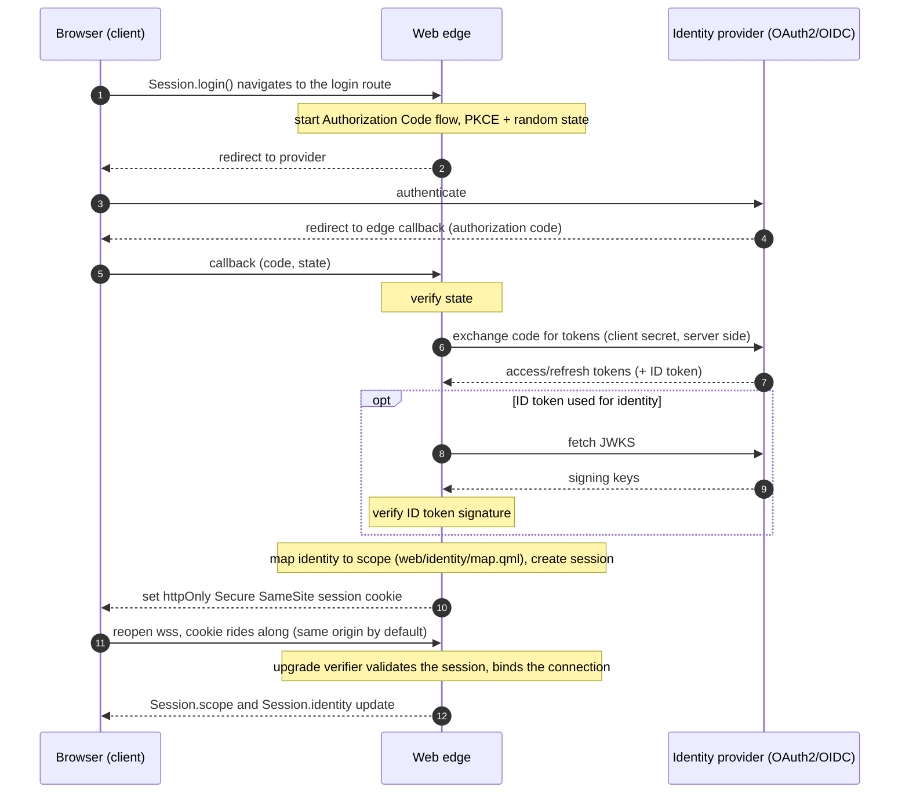

# Authentication and identity

Authentication should be easy to add and hard to get wrong. This page covers
how SynQt makes user login a one command, secure by default capability, the
reasoning behind each default, the distinction between user identity and entity
identity, and the session lifecycle. The security rationale here is the same as in
[security](security.md); this page is the practical, opinionated front door to it.

## The reflection: secure defaults, no insecure middle state

The most dangerous thing about authentication is the gap between "it works" and
"it is safe." Many systems reach a working login that is quietly insecure (a token
in local storage, a secret in the browser bundle, a missing CSRF defense, a cookie
without the right flags) and never close the gap because the demo already worked.

SynQt's stance is that the default path is the secure path, and there is no
working but insecure intermediate state to get stuck in. The single command that
adds auth produces a configuration that is already hardened. You can widen it
deliberately, but you never have to remember to add the protections, because they
are on from the first run. The reflection that shaped this: every security control
that is opt in will be forgotten by someone, so the controls that matter must be
opt out, visible, and justified when removed.

Concretely, the defaults baked in by `synqt add auth`:

- The Authorization Code flow with PKCE (on by default in Qt since 6.8), run
  entirely on the web edge. The browser never holds a client secret.
- A random state value on every authorization request (CSRF defense). The framework
  generates it itself with a cryptographic RNG and verifies it on the callback; it
  does not rely on Qt to auto generate one, because the Qt 6.11 documentation makes
  no such promise.
- A session credential delivered as an httpOnly, Secure, SameSite cookie. httpOnly
  keeps it unreadable by page script (so a cross site scripting bug cannot steal
  it); Secure keeps it on TLS only; SameSite blunts cross site request forgery.
- Access, refresh, and ID tokens kept on the edge, associated with the session,
  never sent to the browser, never logged.
- ID token signature verification against the provider JWKS when ID tokens are used
  for identity, because Qt does not verify ID tokens out of the box. Qt also has no
  JWT or JWKS API at all, so the framework performs the verification with the
  pinned `jwt-cpp` library (MIT, via vcpkg), fetching and caching the provider JWKS
  with QNetworkAccessManager; no hand rolled cryptography.
- Session expiry and rotation: a bounded lifetime, and a fresh session id when
  privilege changes, to limit the value of a stolen session and prevent session
  fixation.
- Login rate limiting and the same origin and upgrade checks the rest of the system
  uses.

None of these is something the developer has to wire by hand. They are the output
of the command.

## Adding auth: one command

```cli
synqt add auth github
```

This:

1. Writes the `identity` section and an entry under `identity.providers` for the
   named provider with the secure defaults above (see the
   [`synqt.yaml` schema](project-layout-and-config.md#the-synqtyaml-schema)).
2. Adds the provider's `client_secret` as an `env:` reference and writes a
   `.env.example` entry so the required secret is documented but unset.
3. Scaffolds the callback and login routes on the web edge.
4. Scaffolds an identity mapping hook (`web/identity/map.qml`) that returns the
   default scope, ready for you to map specific identities to higher scopes.
5. Prints exactly what you must do next (register the OAuth app with the provider,
   set the redirect URL to the edge callback, put the secret in the edge `.env`)
   and nothing else.

Supported provider templates ship for common OAuth2 and OpenID Connect providers.
A generic template lets you point at any compliant provider by URL.

To require login for the whole app rather than allow anonymous read:

```cli
synqt add auth github --required
```

which sets `identity.required: true`, so an unauthenticated browser cannot acquire
any scoped connect point and is sent to login first.

## Two identities, never conflated

SynQt has two separate identity systems. Keeping them distinct is itself a security
property.

User identity. Who the person using the browser is. Established by the OAuth2 or
OpenID Connect flow on the web edge, expressed as a session with a scope. Used to
authorize browser originated calls (`Caller.isUser`, `Caller.session`,
`Caller.scope`). This is what `synqt add auth` configures.

Entity identity. Which service is calling which over the mesh. Established by the
mutual TLS certificate each entity holds (its entity name is the certificate
subject), on every mesh link by default, same host (over loopback) or cross host.
(An opt in local socket link instead trusts colocation and is for equally trusted
co located processes only; see [security](security.md).) Used to
authorize entity originated calls (`Caller.isEntity`, `Caller.entity`). This is
configured by the mesh CA and per entity certs (see
[`[mesh]`](project-layout-and-config.md#mesh-service-to-service-security) and
[security](security.md)), not by `synqt add auth`.

A browser user is never an entity, and an entity is never a browser user. A
database slot that checks `Caller.entity === "web"` is authorizing a service, not a
person. An edge slot that checks `Caller.hasScope("admin")` is authorizing a
person, not a service. Mixing them up (for example trusting a user supplied value as
if it were an entity identity) is the kind of error the separation is designed to
prevent.

## The login flow, end to end



The browser only ever holds the opaque session cookie. Every token stays on the
edge.

## The identity object

Every authenticated session carries a normalized identity, so app code and the
mapping hook read the same fields whatever the provider:

- `identity.sub`: the stable subject. For OpenID Connect providers this is the
  verified ID token's `sub` claim; for plain OAuth2 providers the provider template
  maps the provider's stable user id into it (GitHub: the numeric `id`). Key
  durable ownership on this (as the examples do), never on an email or display
  name, which can change.
- `identity.login`: the provider username (GitHub: `login`), when the provider has
  one.
- `identity.name`: the display name, when the provider has one.
- `identity.email`: the verified email address, or null. Some providers withhold
  it: a GitHub account with a private email returns none from `/user`, so the
  GitHub template requests the `user:email` scope and falls back to the primary
  verified address from the emails endpoint, and still ends with null if the user
  granted nothing. Code and mapping hooks must tolerate a null email; prefer `sub`
  or `login` for authorization decisions.

Provider templates own this mapping, and each documents which raw provider fields
feed each normalized one. A custom provider block does the same in its
configuration.

## The identity mapping hook

`web/identity/map.qml` turns a provider identity into a SynQt scope. It runs only
on the edge, after a successful login.

```qml
import QtQuick
import SynQt

IdentityMapping {
    function scopeFor(identity) {
        const admins     = ["hello@iamki.dev"]
        const moderators = ["mod@example.com"]
        if (admins.indexOf(identity.email) !== -1)     return "admin"
        if (moderators.indexOf(identity.email) !== -1) return "moderator"
        return "user"   // any successfully authenticated user
    }
}
```

For systems where roles live in a database, the hook can consult a connect point
the edge consumes (for example `Database.roles.scopeFor(identity.sub)`), so role
assignment is data driven rather than hard coded.

## Session lifecycle

- Creation. A session is created on successful login, with a bounded lifetime
  (`identity.session.ttl_minutes`).
- Rotation. The session id is rotated when privilege changes (for example after a
  scope upgrade), preventing session fixation.
- Refresh. When the provider issues a refresh token, the edge refreshes the access
  token server side without involving the browser. Qt Network Authorization can
  signal an approaching expiry and refresh automatically.
- Expiry and revocation. A session expires at its TTL or can be revoked (logout, or
  an administrative action). A revoked or expired session fails the upgrade
  verifier; the client moves to `denied` and routes back to login rather than
  retrying.
- Logout. `Session.logout()` calls the edge logout route, which clears the session
  server side and expires the cookie.

## Where identity runs: at the edge, or as its own entity

By default identity runs in process on the web edge. This is the simplest and is
right for most systems: one edge, one place that holds tokens and issues sessions.

For larger systems with several edges or services that all need a common notion of
sessions, identity can be promoted to a dedicated auth entity by setting
`identity.provider_entity` to that entity's name. The auth entity owns the identity
and session connect points; the edges consume them over the mesh (mutually
authenticated like any mesh link). This centralizes token handling and session
state behind one internal service, and keeps the secrets in one place. The user
facing flow is unchanged; only where the session state lives moves. Promoting to an
auth entity is a configuration change, not a rewrite, because the edge already
talks to identity through a connect point boundary.

## What the developer is responsible for

The framework provides secure defaults; a few things remain the developer's job and
the scaffold says so explicitly:

- Register the OAuth application with the provider and set its redirect URL to the
  edge callback.
- Put the real client secret in the edge `.env` (never in `synqt.yaml`, never in a
  client target).
- Decide the scope mapping in the identity hook.
- Decide whether the app allows anonymous read (`identity.required: false`) or
  requires login for everything (`true`).

Everything else (PKCE, state, the cookie flags, server side token storage, ID token
verification, rotation, expiry, the origin and upgrade checks) is on by default and
does not depend on the developer remembering it.
