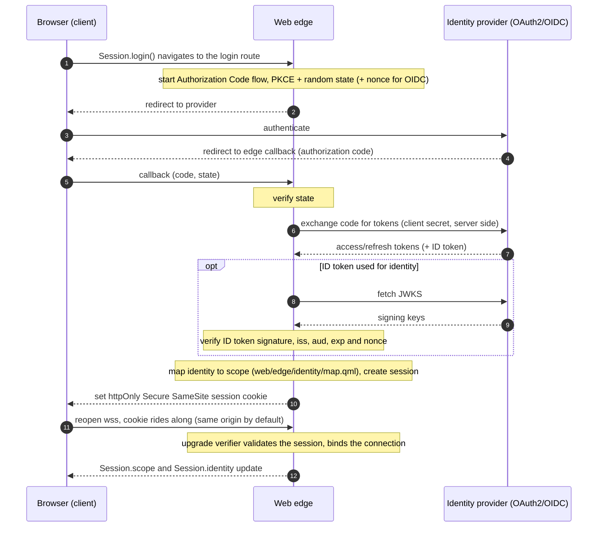

<!-- SPDX-FileCopyrightText: 2026 Alexandre 'kidev' Poumaroux -->
<!-- SPDX-License-Identifier: Apache-2.0 -->

# Authentication and identity

This page covers how one command gives you a secure user login, why each default is set,
how user identity differs from entity identity, and the session lifecycle. It is the
practical side of [security](security.md).

## Secure defaults, with no insecure state to get stuck in

A login can work long before it is safe. Many systems ship a working but insecure login
(a token in local storage, a secret in the browser bundle, no CSRF defense, a cookie
without the right flags) and never fix it, because the demo already worked.

In SynQt the default is the secure path, and no setting works while being insecure. The
command that adds auth produces a hardened configuration. You can widen it, but you never
have to remember to add protections: they are on from the first run. Someone always
forgets an optional safety control, so the controls that matter are on by default,
visible, and must be justified when removed.

The defaults `synqt add auth` sets:

- **Authorization Code flow with PKCE** (on by default in Qt since 6.8), run entirely on
  the web edge. The browser never holds a client secret.
- **A random state on every authorization request** (CSRF defense). The framework
  generates it with a cryptographic RNG and verifies it on the callback. Qt 6.12
  generates one when none is set, but the framework sets its own, because the state is
  also the key for the pending login: before the browser leaves, the framework stores the
  PKCE verifier, the OIDC nonce and the browser binding under it, and on the callback it
  looks them up by the state. A value the framework learned only after building the
  request could not be that key.
- **The session credential in an httpOnly, Secure, SameSite cookie.** httpOnly hides it
  from page script, so a cross site scripting bug cannot steal it. Secure keeps it on TLS.
  SameSite blunts cross site request forgery.
- **Access, refresh and ID tokens stay on the edge,** stored with the session, never sent
  to the browser and never logged.
- **ID token signatures verified against the provider's JWKS** when ID tokens supply the
  identity, because Qt does not verify ID tokens. Qt has no JWT or JWKS API, so the
  framework verifies with the pinned `jwt-cpp` library (MIT, through vcpkg), and fetches
  and caches the JWKS with QNetworkAccessManager. No cryptography is written by hand.
- **A nonce on every OpenID Connect authorization request,** checked against the `nonce`
  claim in the returned ID token. It binds that token to this login, so a token replayed
  from elsewhere fails. It is separate from the state: the state protects the callback,
  the nonce protects the token. Exactly one nonce is sent. Qt adds its own whenever the
  scope contains `openid`, so the framework gives Qt its random value instead of adding a
  second parameter. A request with two `nonce` parameters is malformed
  ([RFC 6749 section 3.1](https://www.rfc-editor.org/rfc/rfc6749#section-3.1)), and a
  strict provider refuses the login.
- **Session expiry and rotation:** a bounded lifetime, and a new session id when privilege
  changes, which limits what a stolen session is worth and prevents session fixation.
- **Login rate limiting,** plus the same origin and upgrade checks as the rest of the
  system.

You wire none of these by hand; the command produces them.

## Adding auth: one command

```cli
synqt add auth github
```

This:

1. Writes the `identity` section, and an entry under `identity.providers` for the named
   provider with the secure defaults above (see the
   [`synqt.yaml` schema](project-layout-and-config.md#the-synqtyaml-schema)).
2. Adds the provider's `client_secret` as an `env:` reference, and a `.env.example` entry
   that documents the required secret without setting it.
3. Scaffolds the login and callback routes on the web edge.
4. Scaffolds an identity mapping hook (`web/edge/identity/map.qml`) that returns the
   default scope, ready for you to map specific identities to higher scopes.
5. Prints exactly what you must do next (register the OAuth app with the provider, set
   the redirect URL to the edge callback, put the secret in the edge's `.env`), and
   nothing else.

Two providers have templates by name, `github` and `google`. Any other name becomes a
generic OpenID Connect entry; you fill in the issuer and endpoints.

To require login for the whole app instead of allowing anonymous reading:

```cli
synqt add auth github --required
```

This sets `identity.required: true`, so a browser that has not signed in cannot acquire
any scoped connect point and is sent to log in first.

## The development sign-in

This section and the three after it describe the development helpers.
[Developing locally](developing-locally.md) compares them and says when to use which.

Registering an OAuth app is a chore on a project's first afternoon, and until you do,
nothing scope-gated is reachable. So `synqt dev` can run its own provider:

```cli
synqt add auth dev
```

This writes one block:

```yaml
identity:
  dev_stub:
    users:
      - { sub: dev, login: dev, name: Developer, email: dev@localhost }
      - { sub: mod, login: mod, name: Moderator, email: moderator@localhost }
```

That is the whole configuration. The framework derives the provider entry, because every
field follows from where the server runs: the endpoints are its own routes on
`127.0.0.1`, the issuer is the address it answers on, and the client id is a constant.
You may want to change `port`; `synqt check` refuses a port another entity already uses.

**Only the provider is fake.** The random state, the PKCE challenge, the code exchange,
the ID token and its signature check against the JWKS, the
[mapping hook](#the-identity-mapping-hook), the session and its httpOnly cookie are the
same as with a real provider. A development sign-in that skipped part of the flow would
test something other than what ships.

That is also why a development user is an *identity*, not a scope. Sign in as one of the
people above and you get whatever your own `map.qml` returns for them; to reach
`moderator`, add someone your hook maps there. With more than one person configured, the
sign-in asks which one you are; with exactly one, it does not ask.

Independent gates keep it out of anything that ships:

- **A release build does not compile the sources.** `src/edge/CMakeLists.txt` names them
  only under `SYNQT_DEV_TOOLS`, which `synqt dev` sets and `synqt build` never does, and
  the header refuses to be included by any other build. See
  [Development code cannot ship](security.md#development-code-cannot-ship).
- **The server starts only under `--dev`.** `synqt dev` passes it; `synqt build`,
  `synqt serve`, a systemd unit and a container never do.
- **`StubIdentityServer` requires an explicit acknowledgement** to be constructed, which
  nobody writes by accident, so no other code can reach it by mistake.
- **The runtime refuses the provider entry** unless the same flag is set. An edge that
  somehow contained the server would still sign nobody in; the login route answers 403.

`synqt check --release` reports a project that has one and notes that it is inert, without
refusing the build, because leaving the block in place is normal. The development sign-in
and the real provider live side by side, and the way the edge was started decides which
one a visitor gets.

### Skipping the flow: the scope picker

The development sign-in tests the flow. Sometimes you want the opposite: skip the flow and
be a moderator for thirty seconds to see what the page looks like.

```cli
synqt dev --identity-picker
```

This replaces every sign-in in the project with one page at `/synqt/dev/identity` that
lists the scopes in `scopes.order`. Click one and you get a session at that scope, with a
synthesized identity whose `sub` is `synqt-dev:<scope>:<epoch-ms>`, so it never collides
with anything a real provider issues.

It skips OAuth entirely (no PKCE, code exchange, ID token or JWKS) and does not consult the
mapping hook, since its purpose is to pick the scope directly. So `identity.dev_stub`
stays beside it: the stub tests the flow, and the picker skips it. Use the stub to test
signing in, and the picker to see what a scope can see.

The chosen scope is still checked against `scopes.order`, so editing the form to post a
larger number does not create a scope the project never declared.

### Being somebody in particular: `.dev-identities`

Picking a scope covers "let me be an admin for a minute", but not "let me be Alice again",
which you need when working on anything tied to a person. A `.dev-identities` file at the
project root lists those people:

```yaml
- email: alice@example.com
  scope: admin
- email: bob@example.com
  scope: user
```

The picker offers each person beside the scopes, and clicking one signs you in as them.
`sub` is `synqt-dev:<email>`, stable across restarts, so a project that stores rows by
`sub` sees the same person on the next run.

Unlike scope mode, this mode consults the mapping hook, because the point of naming a
person is to see what your own rule makes of them. The picker lists the scope from the
file, and the session gets the hook's answer. When they differ, the page shows both. When
the hook refuses the identity, the picker refuses it too, since a development sign-in that
granted what your rule denies would reach a state the application never can. A project
with no mapping hook has nothing to ask, and the page says so, so the file's scope does
not look like the hook's answer.

`synqt dev` reads the file, not the edge. `synqt dev` already parses YAML and knows the
project's declared scopes, so the edge receives a checked list. The picker drops an entry
with an undeclared scope or a missing field, reports it on its page and in the terminal,
and keeps serving. A typo in the file costs you that entry, not the sign-in.

`synqt dev` adds `.dev-identities` to the project's `.gitignore` the first time it reads
one. The file names the people who work on one machine. Committing it would put a
colleague's address in the repository, and give every clone a picker full of names that
mean nothing there.

### Two tabs, two people

Tick **this tab only** and the session belongs to the tab you clicked in. You can then hold
two identities in one browser and watch them interact, such as a moderator deleting the
message a user is reading, in two tabs side by side, with no second browser profile or
private window.

This works through the cookie's name. RFC 6265 scopes a cookie to a host, not a port, so
all tabs on one host share one cookie jar, and nothing else can tell them apart: the
WebSocket subprotocol alternative is unavailable on Qt 6.12
(`tests/m5-webedge/tst_m5.cpp::theUpgradePathCannotNegotiateASubprotocol` checks that).
So choosing a single tab sends it to `/?s=<nonce>` and stores its session under
`synqt_session_<nonce>`. The edge reads `s` from the page request and the sync URL to find
this tab's cookie in the jar.

The nonce is not a credential, and nothing treats it as one. It names which cookie to
read; the cookie still holds the session id, which is what an attacker would need to
steal. The edge validates the nonce on arrival, because it becomes part of a cookie name
in a `Set-Cookie` header, and a value containing `;` or a newline would add attributes, or
a second header, that nobody intended.

## Two identities, never conflated

SynQt has two separate identity systems, and keeping them apart is itself a security
property.

- **User identity** is who the person in the browser is. The OAuth2 or OpenID Connect flow
  on the web edge establishes it, as a session with a scope. It authorizes calls from
  browsers (`Caller.isUser`, `Caller.session`, `Caller.scope`). `synqt add auth` configures
  it.
- **Entity identity** is which service calls which over the mesh. The mutual TLS
  certificate each entity holds establishes it (the entity name is the certificate
  subject), on every mesh link by default, over loopback or across hosts. (An opt in local
  socket link trusts colocation instead, and suits only equally trusted processes on one
  host; see [security](security.md).) It authorizes calls from entities
  (`Caller.isEntity`, `Caller.entity`). The mesh CA and the per entity certificates
  configure it (see
  [`[mesh]`](project-layout-and-config.md#mesh-service-to-service-security) and
  [security](security.md)); `synqt add auth` plays no part.

A browser user is never an entity, and an entity is never a browser user. A database slot
that checks `Caller.entity === "edge"` authorizes a service. An edge slot that checks
`Caller.hasScope("admin")` authorizes a person. The separation prevents mixing them up,
such as trusting a value a user supplied as an entity identity.

## The login flow, end to end


```mermaid
sequenceDiagram
    autonumber
    participant B as Browser (client)
    participant E as Web edge
    participant P as Identity provider (OAuth2/OIDC)
    B->>E: Session.login() navigates to the login route
    Note over E: start Authorization Code flow, PKCE + random state (+ nonce for OIDC)
    E-->>B: redirect to provider
    B->>P: authenticate
    P-->>B: redirect to edge callback (authorization code)
    B->>E: callback (code, state)
    Note over E: verify state
    E->>P: exchange code for tokens (client secret, server side)
    P-->>E: access/refresh tokens (+ ID token)
    opt ID token used for identity
        E->>P: fetch JWKS
        P-->>E: signing keys
        Note over E: verify ID token signature, iss, aud, exp and nonce
    end
    Note over E: map identity to scope (web/edge/identity/map.qml), create session
    E-->>B: set httpOnly Secure SameSite session cookie
    B->>E: reopen wss, cookie rides along (same origin by default)
    Note over E: upgrade verifier validates the session, binds the connection
    E-->>B: Session.scope and Session.identity update
```

The browser holds only the opaque session cookie. Every token stays on the edge.

A [native desktop client](desktop.md#signing-in) runs the same flow with one
difference at the end. It has no origin for a cookie to be set on, so the edge
redirects the system browser to a loopback port the app is listening on and hands
back a one-time claim code, which the app exchanges for the session over its own
connection. Everything before that step, including where the secret lives, is
unchanged. The edge serves that exchange at `<login route>/claim`, and only when a
client entity lists the `desktop` target.

## The identity object

Every signed-in session carries a normalized identity, so app code and the mapping hook
read the same fields whatever the provider:

- **`identity.sub`:** the stable subject. For OpenID Connect providers, it is the verified
  ID token's `sub` claim. For plain OAuth2 providers, the provider template maps the
  provider's stable user id into it (for GitHub, the numeric `id`). Key durable ownership
  on it, as the examples do, never on an email or display name, which can change.
- **`identity.login`:** the provider username (GitHub: `login`), if the provider has one.
- **`identity.name`:** the display name, if the provider has one.
- **`identity.email`:** the verified email address, or null. From an ID token it is taken
  only when the token's `email_verified` claim is true, and a token without that claim gives
  none. A profile that states `email_verified` or `verified_email` as false gives none
  either. Some providers withhold it. A GitHub account with a private email returns none
  from `/user`, so the GitHub template requests the `user:email` scope and falls back to the
  primary verified address from the emails endpoint; if the user granted nothing, it is
  still null. Code and mapping hooks must handle a null email. Prefer `sub` or `login` for
  authorization decisions.

Provider templates define this mapping and document which raw fields feed each normalized
one. A custom provider block does the same in its configuration.

## The identity mapping hook

`web/edge/identity/map.qml` turns a provider identity into a SynQt scope. It runs only on
the edge, after a successful login. A project that signs anyone in must have one and must
declare `scopes.order`; `synqt check` refuses a project missing either, because otherwise
nothing decides a session's scope and every login fails.

```qml
import SynQt

IdentityMapping {
    function scopeFor(identity): int {
        const admins     = ["owner@example.com"]
        const moderators = ["mod@example.com"]
        if (admins.indexOf(identity.email) !== -1)     return Scope.Admin
        if (moderators.indexOf(identity.email) !== -1) return Scope.Moderator
        return Scope.User   // any successfully authenticated user
    }
}
```

The return value is a member of `Scope`, an enum SynQt generates from `scopes.order`, so
the hook needs no import. A member's value is the scope's index in `scopes.order`, which is
also its rank under `scopes.hierarchical`, and the edge resolves the answer by index, not
by name. Because it is an enum and not a string, a scope the project never declared cannot
be written here, and `synqt check` refuses a member the generator would not have written,
naming the file and line. When the edge cannot place an answer (from a hook that was not
regenerated, or one that failed to load), it refuses the login and logs why. There is no
fallback scope: a login that cannot get a declared scope fails.

When roles live in a database, the hook can read a connect point the edge consumes (for
example a `prop var assignments` pushed by a roles entity, looked up as
`Store.assignments[identity.sub]`), so roles are data, not code. Read a pushed property,
not a returning slot: `scopeFor` is synchronous, because the edge needs the scope before
it can create the session, and a returning slot gives a promise instead of a value.
[An identity service of your own](tutorial-advanced-identity.md) works through this and
the customizations around it.

## Session lifecycle

- **Creation.** A successful login creates a session with a bounded lifetime
  (`identity.session.ttl_minutes`).
- **Rotation.** The edge rotates the session id when privilege changes (for example after a
  scope upgrade), which prevents session fixation.
- **Refresh.** When the provider issues a refresh token, the entity that holds the tokens
  (the edge, or the auth entity when `provider_entity` is set) renews the access token on
  the server, without the browser. Every `identity.refresh.interval_seconds` (60 by
  default), it renews any token within `identity.refresh.margin_seconds` (120) of expiry.
  Widen the margin for a provider with short lived tokens. An interval of zero or less
  turns the sweep off.
- **Unclaimed tokens.** A finished exchange keeps the provider's tokens under the login's
  state key until a session is bound to them, which normally happens next. If the caller
  who started the login disappears in between, the entity holding the tokens drops them
  five minutes later, instead of keeping and refreshing a live refresh token for someone
  who never signed in. This sweep is always on: refreshing tokens is a project's choice,
  dropping an unclaimed secret is not.
- **Expiry and revocation.** A session expires at its TTL or is revoked (logout, or an
  administrative action). A revoked or expired session fails the upgrade verifier. The
  browser does not report a handshake's status code, so the client cannot tell this from
  an edge that is down, and it retries with backoff. It reconnects with an anonymous
  session, so `Session.isAuthenticated` goes false and every scope-gated Replica is
  released; that is the signal for an app to route back to login.
- **Logout.** `Session.logout()` calls the edge's logout route, which clears the session
  on the server and expires the cookie. While revoking the session, the edge closes the
  browser connections it authorized, so nothing more reaches a signed-out tab, and the
  client returns as an anonymous visitor.

A desktop app that stays signed in between launches (`identity.desktop_session: device`)
works the same way. It keeps a single-use credential in the OS secure store, not a
session, and spends it at the next launch for a session of the same length, so the TTL,
rotation and revocation are identical. See
[storing the session](desktop.md#storing-the-session).

## Where identity runs: at the edge, or as its own entity

By default, identity runs inside the web edge process. That is the simplest setup and
right for most systems: one edge, and one place that holds tokens and issues sessions.

Larger systems, with several edges or services that need shared sessions, can move
identity to a dedicated auth entity by setting `identity.provider_entity` to that entity's
name. The auth entity owns the identity and session connect points, and the edges consume
them over the mesh, mutually authenticated like any mesh link. Token handling and session
state then live in one internal service, with the secrets in one place. Users see the same
flow; only where session state lives changes. It is a configuration change, not a
rewrite, because the edge already reaches identity through a connect point.

A [replicated edge](deploying.md#8-running-more-than-one-edge) requires it, and
`synqt check` refuses `replicas: > 1` without it. Four things move to the auth entity:

- **The session table,** so a visitor is not signed in on one replica and anonymous on
  the next.
- **The hand-off after a scope change,** so a visitor whose session `Caller.setScope`
  rotated on one replica gets the new credential on their next page load, whichever
  replica serves it, instead of a fresh anonymous session.
- **The pending login,** so whichever process the balancer sends the OAuth callback to can
  answer it, not only the one that started it.
- **The desktop claim code,** which the native client redeems over its own connection,
  independently of the browser that produced it.

Every replica presents the same entity identity, so to the auth entity they are one
consumer running as several processes.

It takes one line, because everything else is generated. Declare the entity and name it,
and `synqt build` writes the two connect points (`identity` and `sessions`, one Source per
caller so one edge's answer never reaches another), the Source QML that bridges each to
its engine, and the entity's `main.cpp` with the OAuth engine and the authoritative session
store. Their contracts ship in the runtime library, so no project writes an `export:` for
them.

```yaml
entities:
  - name: auth          # an ordinary service entity; it declares no connect points
    type: service

identity:
  provider_entity: auth
  providers:
    - name: github
      client_id: your-client-id
      client_secret: env:GITHUB_CLIENT_SECRET   # now the AUTH entity's .env, not the edge's
```

The edge then receives only provider names: no client id, provider endpoint, client
secret or token. It keeps the part that faces the browser (the login and callback routes,
the origin and session checks, the cookie) and asks the auth entity over the mesh for
every step that needs a secret. The scope mapping hook also stays on the edge: the auth
entity establishes who someone is, and each edge decides what that means in its own
system.

## What the developer is responsible for

The framework provides secure defaults. A few tasks remain yours, and the scaffold lists
them:

- Register the OAuth application with the provider, with its redirect URL set to the edge
  callback.
- Put the real client secret in the edge's `.env` (never in `synqt.yaml`, never in a client
  target).
- Decide the scope mapping in the identity hook.
- Decide whether the app allows anonymous reading (`identity.required: false`) or requires
  login for everything (`true`).

Everything else (PKCE, state, cookie flags, token storage on the server, ID token
verification, rotation, expiry, the origin and upgrade checks) is on by default, whether or
not you remember it.
