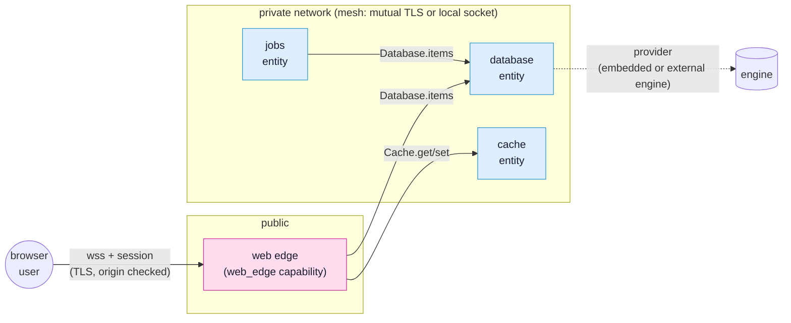

# Entities

This page is the depth reference for the entity model: what an entity is, the
kinds and capabilities, the official blueprints SynQt ships so common needs are
one command away, and how to build a custom entity. It assumes the programming
model in [programming model](programming-model.md) and the topology config in
[project layout and configuration](project-layout-and-config.md).

## What an entity is

An entity is a unit of a SynQt system with:

- a unique name (its identity in the topology and, for cross host links, the
  subject of its mesh certificate),
- a folder of its own,
- a kind (`client` or `service`) and optional capabilities,
- a binary of its own (WebAssembly for a client, native for a service),
- a set of connect points it owns and a set it consumes,
- a place in the deny by default topology and a transport binding.

Entities are how SynQt lets you build a whole system (UI, edge, storage, cache,
integrations) in one framework, one toolchain, one security model, without
standing up separate third party products. You do not configure and secure
Postgres, Redis, and a gateway as three external systems. You add three SynQt
entities, and they share the contract format, the mesh transport, and the mutual
TLS identity model.

A typical system as a topology, with the internet on the left and the internal
mesh on the right:



Only the web edge faces the internet. Every other entity is private and reachable
only over the authenticated mesh, by the entities the topology allows. A database
entity's actual engine sits behind a provider ([Official blueprints](#official-blueprints)
below and [providers](providers.md)).

## Kinds and capabilities

Kind `client`:

- Compiled to WebAssembly, runs in the browser, untrusted, connect only.
- Reaches exactly one web edge over wss. Never participates in the mesh.
- A project has at least one. Multiple client entities (for example a separate
  admin app) are a later version feature; the model already allows naming more
  than one.

Kind `service`:

- A native binary. Can listen and connect. Runs its own Qt event loop.
- Carries zero or more capabilities. The only capability defined today is
  `web_edge`: the entity serves a client bundle and accepts that client's wss
  connection. It is the only entity exposed to the internet.
- A service with no capabilities is an internal service, reachable only over the
  mesh by the entities the topology allows.

A typical system: one `client`, one `web` (web edge), and one or more internal
services (database, cache, gateway, jobs, auth).

## Official blueprints

A blueprint is a prebuilt entity template you instantiate with
`synqt add entity <name> --blueprint <kind>`. It scaffolds the entity folder, its
config block, its contracts, and its secure defaults. Blueprints are part of the
framework and are reviewed; using one does not pull in an unaudited third party.

### Persistence (the database entity)

Purpose: durable storage, owned by one entity, reachable only by the entities you
authorize.

Backend: a provider. The default provider is Qt SQL with the bundled SQLite driver
(QSQLITE), the in process database with the best test coverage and platform support
in Qt, running no separate daemon. This keeps the "no third party app" promise out
of the box: the storage is an embedded library inside a SynQt entity, not a separate
server you operate. The same entity can instead be backed by a third party engine
(PostgreSQL, MySQL, and others, or a document engine through the document blueprint)
by selecting a provider, with the connect points and every consumer unchanged. The
provider system, the available engines, and their security are the subject of
[providers](providers.md). This section describes the default embedded provider, which
is what a fresh project uses with no configuration.

The blueprint provides a `Db` helper exposed to the entity's QML for parameterized
queries (always parameterized, never string built, to prevent SQL injection). With
the SQLite provider it talks to the embedded engine; with another relational
provider it talks to that engine through the same helper. The connect point's
contract declares a model whose listed roles are all that ever reach a consumer,
and the generated Source exposes `set<Model>` to publish rows (see
[the programming model](programming-model.md#contracts-the-shape-of-what-may-cross)):

```syn
// shared/Items.syn
contract Items {
    model rows(text, author)          // only these roles cross to consumers
    slot insert(ItemRow row)
}

record ItemRow(string text, string author, string ownerSub)
```

```qml
// database/Items.qml (owner of the "items" connect point)
import QtQuick
import SynQt

ItemsSource {
    id: items

    function insert(row) {
        if (Caller.entity !== "web") return            // authorize the calling entity
        Db.exec("INSERT INTO items(text, author, owner_sub) VALUES(?, ?, ?)",
                [row.text, row.author, row.ownerSub])   // parameterized
        items.reload()
    }

    function reload() {
        const rows = Db.query("SELECT text, author FROM items ORDER BY id DESC LIMIT 200")
        items.setRows(rows)                            // set<Model> for "rows": only declared roles cross
    }
}
```

Schema: the blueprint reads `database/schema.sql` at startup and applies
migrations. Migrations are forward only and versioned; the blueprint records the
applied version in a metadata table.

Operational notes that the blueprint enforces, because they are real SQLite
constraints documented by Qt:

- Single writer. SQLite blocks under concurrent write transactions and will retry
  until a busy timeout. The blueprint serializes writes on the entity's event loop
  (which owns the connection; Qt SQL requires a connection be used only from the
  thread that created it) and sets `busy_timeout_ms` from config.
- WAL mode. `journal_mode: wal` (the default) allows concurrent readers with a
  single writer and improves throughput.
- Connection ownership. The entity owns one `QSqlDatabase` connection on its main
  thread. Heavy read work that must not block the writer can be delegated to a read
  only connection in a worker, but the blueprint keeps a single connection by default
  for simplicity and correctness.

Security: the database entity has no `web_edge` capability, binds private or local
only, authorizes the calling entity in every slot, and holds its own secrets (the
data file path, any encryption key) in its own `.env`. There is no path to it from
the browser except through an edge connect point that the edge authorizes.

Scaling note: SynQt targets one database entity process. If a future system
needs more write throughput than embedded SQLite gives, select a provider backed by
a server engine (PostgreSQL, MySQL) for the same entity, with no change to any
consumer. The contract is the stable boundary; the provider behind it is what
changes (see [providers](providers.md)).

### Cache

Purpose: fast, ephemeral key value storage (sessions of computed data, rate limit
counters, memoized results), owned by one entity, consumed by the entities that
need it.

Backend: in process memory (a bounded map with a least recently used eviction
policy, in the spirit of QCache), with optional periodic persistence to disk so a
restart does not lose everything. No separate cache server is run.

Contract shape (illustrative): `get(string key)`, `set(string key, var value, int
ttlSeconds)`, `remove(string key)`, `incr(string key)`. The cache entity authorizes
the calling entity and bounds value sizes and key counts to prevent memory
exhaustion.

When to use it over the database: the cache is for data you can afford to lose and
want fast. Anything that must survive a restart goes to the persistence entity.

### Gateway (the api entity)

Purpose: expose selected connect points to the outside world as a plain HTTP or
REST API for non SynQt consumers (mobile apps, partner integrations, webhooks), and
consume external HTTP APIs on behalf of the system.

Backend: QHttpServer for the inbound API surface (with the same TLS, origin, and
auth discipline as the web edge, plus API key or token auth for machine callers),
and QNetworkAccessManager for outbound calls to third party APIs. The blueprint
exposes outbound HTTP to the entity's QML as an `Http` helper: a promise returning
wrapper over QNetworkAccessManager (`Http.get(url).then(...)`, and the other verbs
likewise) that enforces TLS verification and refuses plaintext in release, so
gateway code never touches sockets. The gateway maps
between its public HTTP surface and the internal connect points it consumes, so the
rest of the system never speaks raw HTTP to the outside.

Security: a gateway that accepts inbound public traffic carries the `web_edge`
style exposure and must be treated like the edge (public TLS, strict input
validation, rate limiting, authentication of callers). A gateway that only makes
outbound calls is internal only. The blueprint defaults to outbound only and makes
inbound exposure an explicit, reviewed choice.

### Jobs (scheduled and background work)

Purpose: run scheduled tasks (cron style) and background jobs (email sending, data
rollups, cleanup) off the request path.

Backend: Qt timers for scheduling and a bounded work queue for background jobs. The
jobs entity consumes the connect points it needs (for example the database) and is
consumed by entities that enqueue work. It is internal only.

Security: the jobs entity authorizes who may enqueue work, bounds queue size, and
runs each job with only the connect point access its work requires.

## Building a custom entity

When no blueprint fits, `synqt add entity <name>` scaffolds a bare service entity:
a folder, a config block, an empty owned connect point, and its mesh binding. You
then:

1. Declare its contracts in `shared/`.
2. Declare its connect points in `synqt.yaml` with `owner: <name>` and a
   `consumers` allowlist.
3. Implement the owned Sources in the entity's folder, authorizing `Caller` in
   every slot.
4. List the connect points it consumes from other entities; the framework opens
   only those mesh links, mutually authenticated.

A custom entity is a full peer: it can own connect points, consume others, run any
Qt logic a native process can, and integrate any C++ library through the standard
Qt build. The only entity that cannot be custom in this way is the client, which is
constrained by the browser sandbox.

## Deploying entities

Entities are independent binaries, so deployment is flexible:

- All on one host: mesh links run their default mutual TLS over loopback, the edge
  binds the public port, everything else binds loopback only. Entities you judge
  equally trusted can be opted into local socket links (fast, no network, but the
  caller is then trusted by colocation, not authenticated by certificate; see
  [security](security.md)). Simplest, and a fine default for small systems.
- Spread across hosts: services that cross a host use mutual TLS mesh links on
  private interfaces. The edge is the only entity on a public interface. The
  database sits on its own host on a private network, reachable only by the entities
  that consume it.

Each entity is supervised by your process manager. The CLI can emit a process
manifest (the set of binaries, their order, and their health checks) so an
orchestrator brings the system up in dependency order: owners before the consumers
that need them, with consumers retrying until their owners are ready.

## Why this is safer than bolting on third party services

A conventional stack wires together a database server, a cache server, a gateway,
and a job runner, each with its own authentication, its own network exposure, its
own configuration language, and its own failure modes. Every one of those is a
separate thing to secure and a separate place to get it wrong. SynQt entities share
one identity model (mesh mutual TLS), one authorization model (`Caller` checks in
slots), one contract format, one transport, and one deny by default topology.
There are fewer moving parts, fewer credentials, and one consistent security story
to reason about and audit.
