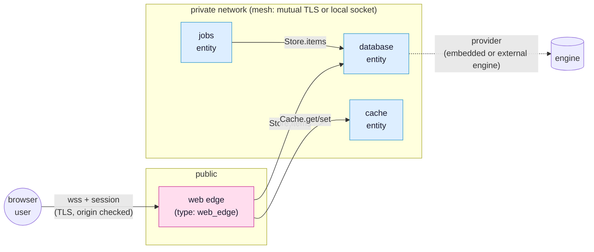

<!-- SPDX-FileCopyrightText: 2026 Alexandre 'kidev' Poumaroux -->
<!-- SPDX-License-Identifier: Apache-2.0 -->

# Entities

This page is the reference for the entity model: what an entity is, its types, the
official entity types that put common needs one command away, and how to build a custom
entity. It assumes you know the [programming model](programming-model.md) and the topology
config in [project layout and configuration](project-layout-and-config.md).

## What an entity is

An entity is a unit of a SynQt system with:

- a unique name (its identity in the topology, and the subject of its mesh
  certificate);
- its own folder;
- a type (one word saying what it is);
- its own binary (WebAssembly for a client, native for everything else);
- the connect points it owns and those it consumes;
- a place in the topology, which denies by default, and a transport binding.

Entities let you build a whole system (UI, edge, storage, cache, integrations) with one
framework, one toolchain and one security model. Postgres, Redis and a gateway become three
SynQt entities that share the contract format, the mesh transport and the mutual TLS
identity model, instead of three external systems, each configured and secured on its
own.

A typical topology, with the internet on the left and the internal mesh on the right:


```mermaid
flowchart LR
  user(("browser<br/>user"))
  user -->|"wss + session<br/>(TLS, origin checked)"| web
  subgraph internet["public"]
    web["<span style='color:#1a1a2e'>web edge<br/>(type: web_edge)</span>"]
  end
  subgraph private["private network (mesh: mutual TLS or local socket)"]
    db["<span style='color:#1a1a2e'>database<br/>entity</span>"]
    cache["<span style='color:#1a1a2e'>cache<br/>entity</span>"]
    jobs["<span style='color:#1a1a2e'>jobs<br/>entity</span>"]
  end
  web -->|"Store.items"| db
  web -->|"Cache.get/set"| cache
  jobs -->|"Store.items"| db
  db -. "provider<br/>(embedded or external engine)" .-> engine[("engine")]
  classDef pub fill:#fde,stroke:#c39,color:#1a1a2e;
  classDef priv fill:#def,stroke:#39c,color:#1a1a2e;
  class web pub;
  class db,cache,jobs priv;
```

Only the web edge faces the internet. Every other entity is private, reachable only over
the authenticated mesh by the entities the topology allows. A database entity's engine sits
behind a provider (see [official entity types](#official-entity-types) below, and
[providers](providers.md)).

## The one field: `type`

`type:` decides the entity's folder, the helper the runtime puts in its QML, whether it
faces the internet, and whether it compiles to native code or to WebAssembly. An entity
with no type is a `service`.

`type: client`:

- Compiled to WebAssembly, runs in the browser, untrusted, and only connects out.
- Reaches exactly one web edge over wss, and never joins the mesh.
- A project has at least one and may have several; a separate admin app is an ordinary
  second client. Each gets its own QML module and bundle directory
  (`build/client-<name>/`), and an edge's
  [`bundles:`](project-layout-and-config.md#bundles-which-scope-is-served-which-client)
  decides which scope gets which bundle.

`type: web_edge`:

- A native binary that serves a client bundle and accepts that client's wss connection.
  It is the type that faces the internet, and most projects have one. A project may
  declare several, each on its own public port, and `replicas:` runs one as several
  interchangeable processes (see [deploying](deploying.md#8-running-more-than-one-edge)).

Every other type is a native binary that listens and connects only on the mesh, reachable
only by the entities the topology allows. `relational`, `document` and `cache` each have an
engine behind a provider. `api` and `jobs` have a helper and no engine. `service` has
neither.

A typical system has one `client`, one `web_edge`, and one or more internal entities
(database, cache, document store, api, jobs, auth).

## Official entity types

An entity type is a prebuilt entity you create with
`synqt add entity <name> --type <type>`, which scaffolds its folder, config block,
contracts and secure defaults. The types are part of the framework and reviewed, so using
one pulls in no unaudited third party.

### Persistence (the database entity)

**Purpose:** durable storage, owned by one entity, reachable only by the entities you
authorize.

**Backend:** a provider. The default is Qt SQL with the bundled SQLite driver (QSQLITE):
an in process database with no separate daemon, and the best test coverage and platform
support in Qt. The storage is a library inside the entity, not a server to operate. By
selecting another provider, the same entity can use a third party engine (PostgreSQL,
MySQL and others, or a document engine through the document type), with its connect
points and consumers unchanged. [Providers](providers.md) covers the provider system, the
engines and their security. This section describes the embedded default, which a new
project uses with no configuration.

The type gives the entity's QML a `Db` helper for parameterized queries (always
parameterized, never built from strings, to prevent SQL injection). It talks to the
embedded engine with the SQLite provider, and to any other relational engine through the
same helper. The connect point declares a model whose listed roles are all that ever reach
a consumer, and the generated Source offers `set<Model>` to publish rows (see
[the programming model](programming-model.md#contracts-the-shape-of-what-may-cross)):

```yaml
connect_points:
  - owner: store
    consumers: [edge]
    export: |
      record ItemRow(string[280] text, string[80] author, string[64] ownerSub)
      model rows(string[280] text, string[80] author)  // only these roles cross
      slot insert(ItemRow row)
```

```qml
// db/relational/store/Store.qml (the store entity, and the Source of the point it owns)
import SynQt

Store {
    id: items

    function insert(row) {
        if (Caller.entity !== "edge") return           // authorize the calling entity
        Db.exec("INSERT INTO items(text, author, owner_sub) VALUES(?, ?, ?)",
                [row.text, row.author, row.ownerSub])   // parameterized
        items.reload()
    }

    function reload() {
        const rows = Db.query("SELECT text, author FROM items ORDER BY id DESC LIMIT 200")
        items.setRows(rows)                    // set<Model>: only declared roles cross
    }
}
```

**Schema:** the type reads `db/relational/store/schema.sql` at startup and applies
migrations, which are versioned and forward only. It records the applied version in a
metadata table. The file is split into statements at each `;` once `--` comments are
removed, so a statement cannot hold a semicolon or a `--` of its own, as a trigger body or a
string literal would.

The type enforces these real SQLite constraints, which Qt documents:

- **Single writer.** SQLite blocks concurrent write transactions and retries until a busy
  timeout. The type serializes writes on the entity's event loop, which owns the
  connection (Qt SQL requires a connection to be used only on the thread that created
  it), and sets `busy_timeout_ms` from config.
- **WAL mode.** `journal_mode: wal` (the default) allows concurrent readers alongside the
  single writer and improves throughput.
- **One connection.** The entity owns one `QSqlDatabase` connection on its main thread.
  Heavy reads that must not block the writer could use a read only connection on a
  worker, but by default the type keeps one connection, for simplicity and correctness.

**Security:** the database entity is not a `web_edge`, binds only to a private address or a
local socket, answers only the consumers its connect point lists, and keeps its own secrets
(an engine password, any encryption key) in its own `.env`. The browser can reach it only through a
connect point the edge implements and authorizes.

**Scaling:** SynQt targets one database entity process. If you need more write throughput
than embedded SQLite provides, select a server engine provider (PostgreSQL, MySQL) for the
same entity, with no change to any consumer. The contract stays the same; only the
provider behind it changes (see [providers](providers.md)).

### Cache

**Purpose:** fast, temporary key value storage (computed data, rate limit counters,
memoized results), owned by one entity and consumed by the entities that need it.

**Backend:** memory in the process: a bounded map with least recently used eviction, like
QCache. With a `file` configured, it loads that snapshot when it connects and writes one
when it disconnects, so a clean restart keeps its data. A killed process writes nothing.
No separate cache server runs.

**Contract** (illustrative): `get(string key)`, `set(string key, var value,
int ttlSeconds)`, `del(string key)`, `incr(string key)`, matching the `Cache` helper the
type provides ([runtime API](runtime-api.md#cache-ephemeral-key-value)). The cache holds at
most a fixed number of entries and evicts the least recently used one past it. Size the
values in its contract (`var[4096]`), so no caller can fill those entries with megabytes.

Prefer it to the database for data you can afford to lose and need fast. Anything that
must survive a restart goes in the relational entity.

### Document

**Purpose:** storage for records without a fixed set of columns (documents with varying
fields, nested structures, shapes that differ per tenant), owned by one entity and
reachable only by the entities you authorize.

**Backend:** a provider, as for persistence, but the default is different. The embedded
default keeps documents in the entity's own memory: nothing to install or configure, and
everything is lost when the process stops. Nothing bounds its size either, since it keeps
nothing permanently. That suits you while you work out the shape of your data, not in
front of users. The `mongodb` provider moves the same entity onto a MongoDB server, with
its connect points and consumers unchanged; switch to it before the data matters.
`synqt build` names every entity still on the embedded default. The entity's QML uses the
`Docs` helper, passing the collection, the document and the filter as maps, never as an
engine query string, so a Source keeps working across the swap.

A document store gives you freedom of shape, and gives up the relational guarantees
(joins, foreign keys, a schema the engine enforces) that the relational type provides. Use
it when records differ from each other, not to avoid writing a schema.

**Security:** the same as the relational entity: not a `web_edge`, bound only to a private
address or a local socket, answering only the consumers its connect point lists, with its
credentials in its own `.env`.

One difference has no counterpart on the persistence side. A filter map is the document
engine's query language, as a string is SQL's. `Db` cannot receive concatenated SQL, so a
parameter is always data. A filter has no such separation: a map passed through whole
from a caller can carry engine operators the Source never meant to allow. So build the
filter in the Source from the fields you accept:

```qml
function byAuthor(author) {
    return Docs.find("notes", { "author": String(author) });  // your filter, their value
}
```

not `Docs.find("notes", filterFromTheCaller)`.

### Gateway (the api entity)

**Purpose:** expose selected connect points as a plain HTTP or REST API for consumers
outside SynQt (mobile apps, partner integrations, webhooks), and call external HTTP APIs
for the system.

**Backend:** QNetworkAccessManager for outbound calls and QHttpServer for the inbound
surface. Both come as QML helpers, and the entity's
[`network:` block](project-layout-and-config.md#network-what-an-entity-may-reach-and-who-may-reach-it)
grants them, not the type. So the same two lines work on any entity, and an entity that
writes neither can neither call out nor be called.

`Http` is the outbound half: a promise returning wrapper (`Http.get(url).then(...)`, and
the same for the other verbs). It enforces TLS verification, refuses plaintext in a
release build, and refuses any URL outside the prefixes `network.outbound` lists. Gateway
code never touches a socket and never reaches a place the topology did not list.

Prefixes are matched by structure. A declared `https://api.example.com/v1` covers that
scheme, host and port, and that path or paths below it, and nothing else. It does not
cover `https://api.example.com@evil.test/v1` (whose host is evil.test),
`api.example.com.evil.test`, `http://` instead of `https://`, or `/v1evil`. This matters
beyond where a request lands: the entry's headers travel with any request that matches,
so a prefix you could escape by spelling would let someone send the API key to their own
host.

A named `network.outbound` entry is also a preset. `Http.api("github").get("user/repos")`
resolves the entry's base URL and sends its headers. That way an upstream that needs an
API key is reached without the key appearing in the QML: a header value written as
`env:GITHUB_TOKEN` is read from the entity's environment and attached by the runtime.

Outbound calls leave the host like any other server runtime's: through the proxy named in
the entity's own environment (`HTTPS_PROXY`, `HTTP_PROXY`, `ALL_PROXY`, with `NO_PROXY`
for hosts reached directly; loopback is always direct), or else directly, never through
the machine's user proxy settings. The runtime talks to a proxy in plaintext, so it
refuses an `https://` proxy URL (one reached over TLS) with a warning instead of
downgrading it, because the credential such a URL usually carries would cross the network
in the clear.

`Api` is the inbound half. The entity's own singleton declares routes on it, and each
handler is ordinary JavaScript that can validate a body, reach several connect points and
build an answer.

```qml
// api/gateway/Gateway.qml
pragma Shared

import QtQuick

QtObject {
    Component.onCompleted: {
        Api.get("/lots/:id", request => {
            Books.lot(request.params.id)
                .then(lot => request.reply(lot),
                      error => request.fail(404, error));
        });
    }
}
```

A handler that returns a value answers with it as 200. A handler that answers later
returns nothing and calls `request.reply(...)` or `request.fail(...)` when ready, as the
one above does. The connection stays open until `network.inbound.reply_timeout_ms`, then
the request fails with 504, so a handler that never answers costs one status code, not a
socket. The gateway maps its public HTTP surface to the internal connect points it
consumes, so the rest of the system never speaks raw HTTP to the outside.

**Security:** everything a public caller controls is checked before any handler runs, like
the web edge's upgrade pipeline and for the same reason. In order: the per IP rate limit,
the API key, the request origin and the body size. The framework answers a request that
fails any check, and it never reaches QML.

The keys come from the entity's own environment (`api_keys: env:GATEWAY_API_KEYS`, comma
separated, so rotating one is a deployment change). `synqt check` refuses an inbound
surface with no keys unless it also says `public: true`: forgetting a line is how an
internal API ends up answering the internet, so the omission is an error and exposure is
something you must write down. A request whose `Origin` the block does not list is
refused, so a key leaked into a page gains nothing.

`allowed_origins` is what lets a page call in at all. A browser sends a preflight before
any cross origin request with a custom header, and the key is one, so the preflight
arrives without a key. The surface answers a preflight from a listed origin, allowing the
method and headers the browser asked about, and refuses any other origin, so the real
request is never sent. The answer to a listed origin carries `Access-Control-Allow-Origin`
for that origin only, and never allows credentials: callers authenticate with the key
header, and this surface reads no cookie.

The rate limit counts one address, which depends on what sits in front. Reached directly,
it is the connecting peer. Behind a proxy, every request comes from the proxy, so name it
in `network.inbound.trusted_proxies`, and the address it forwards is counted instead.
Nothing is trusted implicitly, because any client can write a forwarding header. A
handler reads the resolved address as
[`request.client`](runtime-api.md#api-the-inbound-http-surface).

### Jobs (scheduled and background work)

**Purpose:** run scheduled tasks (like cron) and background jobs (sending email, data
rollups, cleanup) outside the request path.

**Backend:** Qt timers for scheduling and a bounded work queue for background jobs. The jobs
entity consumes the connect points it needs (for example the database), and entities that
enqueue work consume it. It is internal only.

**Security:** the jobs entity answers only the consumers its connect point lists, and its
queue is bounded: a full queue refuses the job. Every job reaches the connect points the
entity consumes, so work that needs different access belongs in an entity of its own.

### Monitor (the operations record)

**Purpose:** record what every other entity did, and serve an operator console that turns
one click into one trace through every entity it touched.

**Backend:** a bounded ring buffer in each reporting entity, drained by a writer thread;
SQLite with WAL and FTS5 on the monitor; and optional export to an OpenTelemetry collector
or a rotated JSONL file. The monitor owns one connect point, `ingest`, which every service
consumes. That link is derived from the single `monitoring.entity` line, not declared, so
no entity can be left out of the record by a forgotten line.

**Security:** the console binds `127.0.0.1`, and `synqt check` refuses any other host
without `monitoring: {public: acknowledged}`. The console has its own identity, separate
from the application's, and an anonymous visitor gets a sign-in page instead of the
console, so they cannot address the console at all. No credential, no call argument a
member did not [`capture`](programming-model.md), and nothing a browser claimed ever enters
the record.

`synqt add entity ops --type monitor` writes the entity, its console client, the sign-in
gate and the `monitoring.entity` line in one step, because any three of the four without
the fourth leave something broken or unsafe. [Monitoring](monitoring.md) covers the rest,
including raising categories during an incident without a rebuild.

### `Log` (in every entity, whatever its type)

The helpers above come with an engine, so each exists only where its engine does: `Db` in
a relational entity, `Cache` in a cache entity. `Log` is different: every entity has
something to report about itself, so every entity has `Log`.

```qml
    function placeBid(amount, bidder) {
        if (amount <= ledger.highBid) {
            Caller.emitBidRejected("Bid must beat " + ledger.highBid + ".");
            return;
        }
        ledger.highBid = amount;
        Log.info("bid accepted", { amount: amount, bidder: bidder });
    }
```

There are four levels: `Log.debug`, `Log.info`, `Log.warn`, `Log.error`. Pass a message and
a map, never a sentence with the values pasted in. Readers filter and search the record;
`Log.info("saved " + count + " rows")` turns both into a substring hunt, and
`Log.info("saved rows", { rows: count })` does not.

The framework already records what it can see: links coming up, callers refused, calls
crossing. It cannot see why an entity did something, which is usually what an operator
wants to know. [Monitoring](monitoring.md) covers where all of it goes and who may read
it.

The runtime stamps which entity logged, below anything QML can reach, so no entity can
pose as another. Logging costs nothing when nobody listens: the level check is one atomic
read, measured at 0.23 ns per call site
([the monitoring baseline](https://github.com/Kidev/SynQt/blob/main/benchmarks/README.md)).
You can test what an entity logs like anything else it does; see
[asserting on what an entity said](testing.md#asserting-on-what-an-entity-said).

## Building a custom entity

When no other type fits, `synqt add entity <name>` scaffolds a bare service entity: a
folder, a config block and the entity's QML file. Then:

1. Declare its connect point in `synqt.yaml` with `owner: <name>`, a `consumers`
   allowlist, and an `export:` block saying what crosses.
   `synqt add connect-point <name> --consumers <a,b>` writes the first two.
2. Implement the owned Source in the entity's folder, checking `Caller` in every slot.
3. List the connect points it consumes from other entities. The framework opens only
   those mesh links, mutually authenticated.

A custom entity is a full peer: it can own a connect point, consume others, run any Qt
logic a native process can, and link any C++ library through the standard Qt build. Only
the client cannot be customized this way, because of the browser sandbox.

## Deploying entities

Entities are independent binaries, so you can deploy them flexibly:

- **All on one host:** mesh links use mutual TLS over loopback, the edge binds the public
  port, and everything else binds only to loopback. Entities you trust equally can opt
  into local socket links (fast, no network, but the caller is then trusted by colocation
  instead of authenticated by certificate; see [security](security.md)). This is the
  simplest setup, and a good default for small systems.
- **Across hosts:** services on different hosts use mutual TLS mesh links on private
  interfaces. Only the edge is on a public interface. The database sits on its own host
  on a private network, reachable only by the entities that consume it.

Your process manager supervises each entity. Every build writes
`build/process-manifest.json`, which lists the binaries, the order to start them in, the
certificate and key each expects, and which bind to a public interface. The order puts
owners before the consumers that need them, though a consumer retries until its owner is
ready anyway. [Deploying a SynQt system](deploying.md) covers the rest.

## Compared with separate third party services

A conventional stack connects a database server, a cache server, a gateway and a job
runner, each with its own authentication, network exposure, configuration language and
failure modes, and each a separate thing to secure and get wrong. SynQt entities share one
identity model (mesh mutual TLS), one authorization model (`Caller` checks in slots), one
contract format, one transport and one topology that denies by default. That means fewer
credentials, and one security model to audit.
