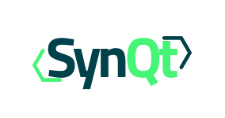

---
hide:
  - navigation
  - toc
---

<div class="synqt-home" markdown>

<div class="synqt-hero" markdown>

<div class="synqt-hero__inner" markdown>

<div class="synqt-hero__text" markdown>

<p class="synqt-eyebrow">QML · one toolchain · zero third party servers</p>

<div class="synqt-headline" markdown>
Build complete web systems with QML, with no third party servers to stand up.
</div>

SynQt (pronounced synced) is built from entities: a browser client, a web
edge, a database, and whatever else your system needs, each its own binary,
sharing one toolchain and one security model.

<div class="synqt-hero__actions" markdown>
<a class="cta" href="getting-started/" markdown="0"><span class="span">Get started</span><span class="second"><svg width="50px" height="20px" viewBox="0 0 66 43" version="1.1" xmlns="http://www.w3.org/2000/svg" xmlns:xlink="http://www.w3.org/1999/xlink"><g id="arrow" stroke="none" stroke-width="1" fill="none" fill-rule="evenodd"><path class="one" d="M40.1543933,3.89485454 L43.9763149,0.139296592 C44.1708311,-0.0518420739 44.4826329,-0.0518571125 44.6771675,0.139262789 L65.6916134,20.7848311 C66.0855801,21.1718824 66.0911863,21.8050225 65.704135,22.1989893 C65.7000188,22.2031791 65.6958657,22.2073326 65.6916762,22.2114492 L44.677098,42.8607841 C44.4825957,43.0519059 44.1708242,43.0519358 43.9762853,42.8608513 L40.1545186,39.1069479 C39.9575152,38.9134427 39.9546793,38.5968729 40.1481845,38.3998695 C40.1502893,38.3977268 40.1524132,38.395603 40.1545562,38.3934985 L56.9937789,21.8567812 C57.1908028,21.6632968 57.193672,21.3467273 57.0001876,21.1497035 C56.9980647,21.1475418 56.9959223,21.1453995 56.9937605,21.1432767 L40.1545208,4.60825197 C39.9574869,4.41477773 39.9546013,4.09820839 40.1480756,3.90117456 C40.1501626,3.89904911 40.1522686,3.89694235 40.1543933,3.89485454 Z" fill="#FFFFFF"></path><path class="two" d="M20.1543933,3.89485454 L23.9763149,0.139296592 C24.1708311,-0.0518420739 24.4826329,-0.0518571125 24.6771675,0.139262789 L45.6916134,20.7848311 C46.0855801,21.1718824 46.0911863,21.8050225 45.704135,22.1989893 C45.7000188,22.2031791 45.6958657,22.2073326 45.6916762,22.2114492 L24.677098,42.8607841 C24.4825957,43.0519059 24.1708242,43.0519358 23.9762853,42.8608513 L20.1545186,39.1069479 C19.9575152,38.9134427 19.9546793,38.5968729 20.1481845,38.3998695 C20.1502893,38.3977268 20.1524132,38.395603 20.1545562,38.3934985 L36.9937789,21.8567812 C37.1908028,21.6632968 37.193672,21.3467273 37.0001876,21.1497035 C36.9980647,21.1475418 36.9959223,21.1453995 36.9937605,21.1432767 L20.1545208,4.60825197 C19.9574869,4.41477773 19.9546013,4.09820839 20.1480756,3.90117456 C20.1501626,3.89904911 20.1522686,3.89694235 20.1543933,3.89485454 Z" fill="#FFFFFF"></path><path class="three" d="M0.154393339,3.89485454 L3.97631488,0.139296592 C4.17083111,-0.0518420739 4.48263286,-0.0518571125 4.67716753,0.139262789 L25.6916134,20.7848311 C26.0855801,21.1718824 26.0911863,21.8050225 25.704135,22.1989893 C25.7000188,22.2031791 25.6958657,22.2073326 25.6916762,22.2114492 L4.67709797,42.8607841 C4.48259567,43.0519059 4.17082418,43.0519358 3.97628526,42.8608513 L0.154518591,39.1069479 C-0.0424848215,38.9134427 -0.0453206733,38.5968729 0.148184538,38.3998695 C0.150289256,38.3977268 0.152413239,38.395603 0.154556228,38.3934985 L16.9937789,21.8567812 C17.1908028,21.6632968 17.193672,21.3467273 17.0001876,21.1497035 C16.9980647,21.1475418 16.9959223,21.1453995 16.9937605,21.1432767 L0.15452076,4.60825197 C-0.0425130651,4.41477773 -0.0453986756,4.09820839 0.148075568,3.90117456 C0.150162624,3.89904911 0.152268631,3.89694235 0.154393339,3.89485454 Z" fill="#FFFFFF"></path></g></svg></span></a>
</div>

<div class="synqt-hero__install" markdown>
:material-apple:{ .synqt-hero__install-icon }
:material-linux:{ .synqt-hero__install-icon }
```cli
curl -fsSL https://get.synqt.org/install.sh | sh
```
</div>

<div class="synqt-hero__install synqt-hero__install--stacked" markdown>
:material-microsoft-windows:{ .synqt-hero__install-icon }
```cli
irm https://get.synqt.org/install.ps1 | iex
```
</div>

</div>



</div>

</div>

<div class="synqt-section" markdown>

## Why SynQt

<div class="grid cards" markdown>

-   :material-language-markdown: __One language, front to back__

    Write the UI and the server side logic in QML. The boundary between any two
    components is a set of typed connect points, named and access controlled by
    configuration.

-   :material-flash: __Live by default__

    A value that updates across every browser the instant it changes, with no
    manual wiring and no client side polling, is a few lines of QML.

-   :material-database: __Batteries included, no third party servers__

    Add a database, cache, gateway, or jobs runner as a first party entity. Back it
    with an embedded engine, or mask PostgreSQL, MongoDB, or Redis behind it with one
    config value.

-   :material-devices: __Web and desktop, one codebase__

    The client is a Qt app. Ship it to the browser as WebAssembly and, from the same
    QML, as a native app for Windows, macOS, and Linux, against the same edge and the
    same security model.

-   :material-shield-lock: __Secure at every link__

    You never opt into security. There is no insecure connection type to reach
    for by mistake, only the one every entity already speaks.

</div>

</div>

<div class="synqt-section" markdown>

## A closer look

<div class="synqt-deepdive" markdown>

<div class="synqt-deepdive__item" markdown>

### Contracts and connect points

Two entities talk through a connect point: a named, typed, live object one entity
owns and the others see a live copy of. Properties and signals flow from the owner
out to every consumer; slots flow the other way, and the owner always decides.

[Read the programming model &rarr;](programming-model.md)

</div>

<div class="synqt-deepdive__item" markdown>

### Security by default

TLS everywhere, mutual TLS between entities, a deny by default topology, and data
minimization built into the contract format itself. There is no insecure middle
state a project can accidentally ship in.

[Read the security model &rarr;](security.md)

</div>

<div class="synqt-deepdive__item" markdown>

### One toolchain

The `synqt` CLI installs and pins the exact Qt and Emscripten versions your project
needs, builds every entity, native and WebAssembly alike, and runs them all
together with file watching and hot reload.

[Read the build system and CLI guide &rarr;](build-system-and-cli.md)

</div>

</div>

</div>

<div class="synqt-section" markdown>

## What it looks like

A finished system is a small mesh of entities. Only the web edge faces the
internet; everything else is private and reachable only by the entities you
allow. Here the browser asks for some data, the web edge checks the database
whether that caller is allowed, and only then fetches the data from the api and
sends it back. Hover (or focus) any entity to see roughly what its side of this
looks like in QML, or the connection between browser and web edge for the
contract they share.

<div class="synqt-config">
<span class="synqt-config__trigger" tabindex="0" role="button" aria-label="Show the example synqt.yaml"><svg class="synqt-config__icon" viewBox="0 0 24 24" xmlns="http://www.w3.org/2000/svg" aria-hidden="true"><path fill="currentColor" d="M12,15.5A3.5,3.5 0 0,1 8.5,12A3.5,3.5 0 0,1 12,8.5A3.5,3.5 0 0,1 15.5,12A3.5,3.5 0 0,1 12,15.5M19.43,12.97C19.47,12.65 19.5,12.33 19.5,12C19.5,11.67 19.47,11.34 19.43,11L21.54,9.37C21.73,9.22 21.78,8.95 21.66,8.73L19.66,5.27C19.54,5.05 19.27,4.96 19.05,5.05L16.56,6.05C16.04,5.66 15.5,5.32 14.87,5.07L14.5,2.42C14.46,2.18 14.25,2 14,2H10C9.75,2 9.54,2.18 9.5,2.42L9.13,5.07C8.5,5.32 7.96,5.66 7.44,6.05L4.95,5.05C4.73,4.96 4.46,5.05 4.34,5.27L2.34,8.73C2.21,8.95 2.27,9.22 2.46,9.37L4.57,11C4.53,11.34 4.5,11.67 4.5,12C4.5,12.33 4.53,12.65 4.57,12.97L2.46,14.63C2.27,14.78 2.21,15.05 2.34,15.27L4.34,18.73C4.46,18.95 4.73,19.03 4.95,18.95L7.44,17.94C7.96,18.34 8.5,18.68 9.13,18.93L9.5,21.58C9.54,21.82 9.75,22 10,22H14C14.25,22 14.46,21.82 14.5,21.58L14.87,18.93C15.5,18.67 16.04,18.34 16.56,17.94L19.05,18.95C19.27,19.03 19.54,18.95 19.66,18.73L21.66,15.27C21.78,15.05 21.73,14.78 21.54,14.63L19.43,12.97Z"/></svg><span class="synqt-config__label">synqt.yaml</span></span>
<div class="synqt-config__tooltip" markdown>

```yaml
project:
  name: my-app
  qt_version: 6.11.1          # pins Qt + Emscripten
  origin_model: same_origin

scopes:
  order: [anonymous, user, moderator, admin]
  default: anonymous

entities:
  - name: client              # browser (WASM) + optional desktop
    kind: client
    edge: web
  - name: web                 # the only internet-facing entity
    kind: service
    capabilities: [web_edge]
    public: { port: 8443, sync_route: /sync }
  - name: database            # embedded SQLite by default
    kind: service
    blueprint: persistence
  - name: api                 # outbound HTTP gateway
    kind: service
    blueprint: gateway

connect_points:
  - name: feed
    contract: Feed
    owner: web
    consumers: [client]
    scope: user               # minimum session scope
```

</div>
</div>

<div class="synqt-flow">
<div class="synqt-flow__stage">
<svg viewBox="0 0 440 300" xmlns="http://www.w3.org/2000/svg" aria-hidden="true">
  <defs>
    <filter id="synqt-flow-glow" x="-100%" y="-100%" width="300%" height="300%">
      <feGaussianBlur stdDeviation="5" result="blur"/>
      <feMerge>
        <feMergeNode in="blur"/>
        <feMergeNode in="SourceGraphic"/>
      </feMerge>
    </filter>
  </defs>

  <g class="synqt-flow__lines">
    <line x1="70" y1="150" x2="194" y2="150"/>
    <line x1="244" y1="140" x2="373" y2="87"/>
    <line x1="244" y1="160" x2="373" y2="213"/>
  </g>

  <g class="synqt-flow__edges">
    <text x="132" y="142" text-anchor="middle">request (session)</text>
    <text x="304" y="98" text-anchor="middle">check access</text>
    <text x="304" y="203" text-anchor="middle">fetch data</text>
  </g>

  <!-- Every link, browser to edge and edge to each service, is TLS: wss for
       the browser (the mesh links use mutual TLS with a private CA instead,
       see docs/security.md), never a plaintext exception. Static, not tied
       to the packet's own animation; this is true the whole time, even
       between requests. -->
  <g class="synqt-flow__locks">
    <g transform="translate(165,150) scale(0.5)" fill="none" stroke="#9a94c4" stroke-width="1.6">
      <title>wss (TLS)</title>
      <path d="M -4,-1 v -3 a 4,4 0 0 1 8,0 v 3"/>
      <rect x="-6" y="-1" width="12" height="9" rx="1.5" fill="#9a94c4" stroke="none"/>
    </g>
    <g transform="translate(270,129) scale(0.5)" fill="none" stroke="#9a94c4" stroke-width="1.6">
      <title>mutual TLS</title>
      <path d="M -4,-1 v -3 a 4,4 0 0 1 8,0 v 3"/>
      <rect x="-6" y="-1" width="12" height="9" rx="1.5" fill="#9a94c4" stroke="none"/>
    </g>
    <g transform="translate(270,171) scale(0.5)" fill="none" stroke="#9a94c4" stroke-width="1.6">
      <title>mutual TLS</title>
      <path d="M -4,-1 v -3 a 4,4 0 0 1 8,0 v 3"/>
      <rect x="-6" y="-1" width="12" height="9" rx="1.5" fill="#9a94c4" stroke="none"/>
    </g>
  </g>

  <!-- A visible affordance for the contract hotspot below (previously an
       invisible hover area over the whole line, easy to miss); a small
       neutral document glyph, not colored like either entity, since the
       contract belongs to neither side alone. -->
  <g transform="translate(132,164)" fill="none" stroke="#e5e7ff" stroke-width="1.2">
    <rect x="-4" y="-5" width="8" height="10" rx="1"/>
    <line x1="-2" y1="-1.5" x2="2" y2="-1.5"/>
    <line x1="-2" y1="1" x2="2" y2="1"/>
  </g>

  <!-- The ball travels behind the entities (this group comes before
       .synqt-flow__nodes, and SVG paints in document order), so it passes
       under each node's circle instead of drawing on top of it. -->
  <g class="synqt-flow__packets">
    <circle r="4.5" fill="#46f477">
      <animateMotion dur="7s" begin="0s" repeatCount="indefinite" calcMode="linear"
        keyPoints="0;1;1" keyTimes="0;0.8571;1"
        path="M50,150 L220,150 L390,80 L220,150 L390,220 L220,150 L50,150"/>
      <animate attributeName="fill" dur="7s" begin="0s" repeatCount="indefinite"
        values="#46f477;#46f477;#8890c0;#8890c0;#46f477;#46f477;#46f477"
        keyTimes="0;0.1355;0.1355;0.7217;0.7217;0.8571;1"/>
    </circle>
  </g>

  <g class="synqt-flow__nodes">
    <circle cx="50" cy="150" r="20" class="synqt-flow__node synqt-flow__node--user" filter="url(#synqt-flow-glow)"/>
    <circle cx="220" cy="150" r="26" class="synqt-flow__node synqt-flow__node--hub" filter="url(#synqt-flow-glow)"/>
    <circle cx="390" cy="80" r="18" class="synqt-flow__node synqt-flow__node--service" filter="url(#synqt-flow-glow)"/>
    <circle cx="390" cy="220" r="18" class="synqt-flow__node synqt-flow__node--service" filter="url(#synqt-flow-glow)"/>
  </g>

  <!-- Each entity's own permanent glyph: who they are, regardless of where
       the request currently is. Explicit fill/stroke on every shape below
       (not the CSS classes) throughout this diagram, rather than leaving
       color to inherit from a class on the wrapping <g>: SVG presentation
       attributes lose to a CSS rule that targets that same element (bit us
       before, on the very first envelope icon), so a parent <g fill="none">
       does NOT reliably keep a CSS-styled child transparent; only a
       fill/stroke attribute on the shape itself is unambiguous. -->
  <g class="synqt-flow__static-icons">
    <g transform="translate(50,150)" fill="#46f477">
      <circle cx="0" cy="-3.2" r="3.2"/>
      <path d="M -6,7.5 a 6,6.5 0 0 1 12,0 z"/>
    </g>
    <g transform="translate(390,80)" fill="none" stroke="#8890c0" stroke-width="1.4">
      <ellipse cx="0" cy="-4.5" rx="6.5" ry="2.2" fill="#8890c0" stroke="none"/>
      <path d="M -6.5,-4.5 V 4.5 A 6.5,2.2 0 0 0 6.5,4.5 V -4.5"/>
      <path d="M -6.5,0 A 6.5,2.2 0 0 0 6.5,0"/>
    </g>
    <g transform="translate(390,220)" fill="none" stroke="#8890c0" stroke-width="1.7" stroke-linecap="round" stroke-linejoin="round">
      <path d="M -2,-6 L -6,0 L -2,6"/>
      <path d="M 2,-6 L 6,0 L 2,6"/>
    </g>
  </g>

  <!-- The web edge's own state through one request cycle: nothing at first,
       then a silhouette with a question mark once the browser's request
       first arrives (t 0.1355), the question mark swapping for a tick once
       the database grants the caller access (t 0.4286), joined by an envelope
       once the trip to api and back actually has data on it (t 0.7217).
       Timings match the packet's own path/color keyTimes above exactly, so
       every change happens the instant the packet arrives at (or back at) a
       node. -->
  <g class="synqt-flow__hub-icons">
    <g transform="translate(216,150)" fill="#46f477" opacity="0">
      <circle cx="0" cy="-3.2" r="3.2"/>
      <path d="M -6,7.5 a 6,6.5 0 0 1 12,0 z"/>
      <animate attributeName="opacity" dur="7s" begin="0s" repeatCount="indefinite"
        values="0;0;1;1" keyTimes="0;0.1355;0.1355;1"/>
    </g>
    <g transform="translate(230,141)" fill="#46f477" opacity="0">
      <text font-size="10" font-weight="700" text-anchor="middle" dominant-baseline="middle">?</text>
      <animate attributeName="opacity" dur="7s" begin="0s" repeatCount="indefinite"
        values="0;0;1;1;0;0" keyTimes="0;0.1355;0.1355;0.4286;0.4286;1"/>
    </g>
    <g transform="translate(230,141)" fill="none" stroke="#46f477" stroke-width="1.8" stroke-linecap="round" stroke-linejoin="round" opacity="0">
      <path d="M -4,0 L -1,3 L 4,-4"/>
      <animate attributeName="opacity" dur="7s" begin="0s" repeatCount="indefinite"
        values="0;0;1;1" keyTimes="0;0.4286;0.4286;1"/>
    </g>
    <g transform="translate(230,160) scale(0.8)" fill="none" stroke="#46f477" stroke-width="1.3" opacity="0">
      <rect x="-5" y="-3.5" width="10" height="7" rx="1"/>
      <path d="M -5,-3 L 0,1 L 5,-3"/>
      <animate attributeName="opacity" dur="7s" begin="0s" repeatCount="indefinite"
        values="0;0;1;1" keyTimes="0;0.7217;0.7217;1"/>
    </g>
  </g>

  <!-- Badges that land on database and api the instant the packet reaches
       them, and stay for the rest of the cycle. -->
  <g transform="translate(399,89)" fill="none" stroke="#46f477" stroke-width="1.8" stroke-linecap="round" stroke-linejoin="round" opacity="0">
    <path d="M -4,0 L -1,3 L 4,-4"/>
    <animate attributeName="opacity" dur="7s" begin="0s" repeatCount="indefinite"
      values="0;0;1;1" keyTimes="0;0.2821;0.2821;1"/>
  </g>
  <g transform="translate(399,212) scale(0.8)" fill="none" stroke="#46f477" stroke-width="1.3" opacity="0">
    <rect x="-5" y="-3.5" width="10" height="7" rx="1"/>
    <path d="M -5,-3 L 0,1 L 5,-3"/>
    <animate attributeName="opacity" dur="7s" begin="0s" repeatCount="indefinite"
      values="0;0;1;1" keyTimes="0;0.5753;0.5753;1"/>
  </g>

  <g class="synqt-flow__labels">
    <text x="50" y="182" text-anchor="middle">browser</text>
    <text x="220" y="190" text-anchor="middle">web edge</text>
    <text x="390" y="112" text-anchor="middle">database</text>
    <text x="390" y="252" text-anchor="middle">api</text>
  </g>
</svg>

<div class="synqt-flow__hotspot synqt-flow__hotspot--user" tabindex="0">
  <div class="synqt-flow__tooltip">
    <strong>browser</strong>
    <div class="highlight"><pre><code><span class="nx">Button</span> <span class="p">{</span>
    <span class="nx">onClicked</span><span class="o">:</span> <span class="nx">Server</span><span class="p">.</span><span class="nx">feed</span><span class="p">.</span><span class="nx">load</span><span class="p">()</span>
<span class="p">}</span>
<span class="nx">Feed</span><span class="p">.</span><span class="nx">onLoaded</span><span class="o">:</span> <span class="nx">rows</span> <span class="p">=&gt;</span> <span class="nx">list</span><span class="p">.</span><span class="nx">model</span> <span class="o">=</span> <span class="nx">rows</span>
<span class="nx">Feed</span><span class="p">.</span><span class="nx">onDenied</span><span class="o">:</span> <span class="nx">reason</span> <span class="p">=&gt;</span> <span class="nx">banner</span><span class="p">.</span><span class="nx">show</span><span class="p">(</span><span class="nx">reason</span><span class="p">)</span></code></pre></div>
  </div>
</div>

<div class="synqt-flow__hotspot synqt-flow__hotspot--hub" tabindex="0">
  <div class="synqt-flow__tooltip">
    <strong>web edge</strong>
    <div class="highlight"><pre><code><span class="kd">function</span> <span class="nx">load</span><span class="p">()</span> <span class="p">{</span>
    <span class="kd">let</span> <span class="nx">sub</span> <span class="o">=</span> <span class="nx">Caller</span><span class="p">.</span><span class="nx">identity</span><span class="p">.</span><span class="nx">sub</span>
    <span class="nx">Database</span><span class="p">.</span><span class="nx">access</span><span class="p">.</span><span class="nx">allows</span><span class="p">(</span><span class="nx">sub</span><span class="p">).</span><span class="nx">then</span><span class="p">(</span><span class="nx">ok</span> <span class="p">=&gt;</span> <span class="p">{</span>
        <span class="k">if</span> <span class="p">(</span><span class="o">!</span><span class="nx">ok</span><span class="p">)</span>
            <span class="k">return</span> <span class="nx">Caller</span><span class="p">.</span><span class="nx">emitDenied</span><span class="p">(</span><span class="s2">&quot;Not allowed.&quot;</span><span class="p">)</span>
        <span class="nx">Api</span><span class="p">.</span><span class="nx">feed</span><span class="p">.</span><span class="nx">fetch</span><span class="p">()</span>
            <span class="p">.</span><span class="nx">then</span><span class="p">(</span><span class="nx">rows</span> <span class="p">=&gt;</span> <span class="nx">Caller</span><span class="p">.</span><span class="nx">emitLoaded</span><span class="p">(</span><span class="nx">rows</span><span class="p">))</span>
    <span class="p">})</span>
<span class="p">}</span></code></pre></div>
  </div>
</div>

<div class="synqt-flow__hotspot synqt-flow__hotspot--contract" tabindex="0">
  <div class="synqt-flow__tooltip">
    <strong>Feed.syn</strong>
    <div class="highlight"><pre><code><span class="k">contract</span> <span class="nc">Feed</span> <span class="p">{</span>
    <span class="k">slot</span> <span class="n">load</span><span class="p">()</span>
    <span class="k">signal</span> <span class="n">loaded</span><span class="p">(</span><span class="kt">var</span> <span class="n">rows</span><span class="p">)</span>
    <span class="k">signal</span> <span class="n">denied</span><span class="p">(</span><span class="kt">string</span> <span class="n">reason</span><span class="p">)</span>
<span class="p">}</span></code></pre></div>
  </div>
</div>

<div class="synqt-flow__hotspot synqt-flow__hotspot--database" tabindex="0">
  <div class="synqt-flow__tooltip">
    <strong>database</strong>
    <div class="highlight"><pre><code><span class="kd">function</span> <span class="nx">allows</span><span class="p">(</span><span class="nx">sub</span><span class="p">)</span> <span class="p">{</span>
    <span class="k">if</span> <span class="p">(</span><span class="nx">Caller</span><span class="p">.</span><span class="nx">entity</span> <span class="o">!==</span> <span class="s2">&quot;web&quot;</span><span class="p">)</span> <span class="k">return</span> <span class="kc">false</span>
    <span class="kd">let</span> <span class="nx">rows</span> <span class="o">=</span> <span class="nx">Db</span><span class="p">.</span><span class="nx">query</span><span class="p">(</span>
        <span class="s2">&quot;SELECT 1 FROM grants WHERE sub = ?&quot;</span><span class="p">,</span> <span class="p">[</span><span class="nx">sub</span><span class="p">])</span>
    <span class="k">return</span> <span class="nx">rows</span><span class="p">.</span><span class="nx">length</span> <span class="o">&gt;</span> <span class="mf">0</span>
<span class="p">}</span></code></pre></div>
  </div>
</div>

<div class="synqt-flow__hotspot synqt-flow__hotspot--api" tabindex="0">
  <div class="synqt-flow__tooltip">
    <strong>api</strong>
    <div class="highlight"><pre><code><span class="kd">function</span> <span class="nx">fetch</span><span class="p">()</span> <span class="p">{</span>
    <span class="k">if</span> <span class="p">(</span><span class="nx">Caller</span><span class="p">.</span><span class="nx">entity</span> <span class="o">!==</span> <span class="s2">&quot;web&quot;</span><span class="p">)</span> <span class="k">return</span> <span class="p">[]</span>
    <span class="k">return</span> <span class="nx">Http</span><span class="p">.</span><span class="nx">get</span><span class="p">(</span><span class="s2">&quot;https://data.example/feed&quot;</span><span class="p">)</span>
        <span class="p">.</span><span class="nx">then</span><span class="p">(</span><span class="nx">res</span> <span class="p">=&gt;</span> <span class="nx">res</span><span class="p">.</span><span class="nx">rows</span><span class="p">)</span>
<span class="p">}</span></code></pre></div>
  </div>
</div>

</div>

</div>

</div>

<div class="synqt-section" markdown>

## Where to go next

- [Getting started](getting-started.md): install `synqt` and run your first
  project.
- [Framework](architecture.md): the full reference, from the entity model to the
  security design.
- [Examples](examples.md): complete worked systems.
- [Contributing](development.md): the codebase map, for working on SynQt itself.
- [C++ reference](/api/index.html): the generated class and member reference for the
  runtime.

</div>

</div>
