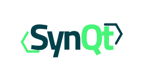

---
hide:
  - navigation
  - toc
---

<!-- SPDX-FileCopyrightText: 2026 Alexandre 'kidev' Poumaroux -->
<!-- SPDX-License-Identifier: Apache-2.0 -->

<div class="synqt-home" markdown>

<div class="synqt-hero" markdown>

<div class="synqt-hero__inner" markdown>

<div class="synqt-hero__text" markdown>

<p class="synqt-eyebrow">QML / one toolchain / zero third party servers</p>

<div class="synqt-headline" markdown>
Build complete web systems with QML, with no third party servers to stand up.
</div>

SynQt (pronounced synced) builds a system from entities: a browser client, a web edge,
a database, and whatever else you need. Each entity is its own binary, and all of them
share one toolchain and one security model.

<div class="synqt-hero__actions synqt-actions">
<a class="cta" href="quick-start/" markdown="0"><span class="span">Get started</span><span class="second"><svg width="50px" height="20px" viewBox="0 0 66 43" version="1.1" xmlns="http://www.w3.org/2000/svg" xmlns:xlink="http://www.w3.org/1999/xlink"><g id="arrow" stroke="none" stroke-width="1" fill="none" fill-rule="evenodd"><path class="one" d="M40.1543933,3.89485454 L43.9763149,0.139296592 C44.1708311,-0.0518420739 44.4826329,-0.0518571125 44.6771675,0.139262789 L65.6916134,20.7848311 C66.0855801,21.1718824 66.0911863,21.8050225 65.704135,22.1989893 C65.7000188,22.2031791 65.6958657,22.2073326 65.6916762,22.2114492 L44.677098,42.8607841 C44.4825957,43.0519059 44.1708242,43.0519358 43.9762853,42.8608513 L40.1545186,39.1069479 C39.9575152,38.9134427 39.9546793,38.5968729 40.1481845,38.3998695 C40.1502893,38.3977268 40.1524132,38.395603 40.1545562,38.3934985 L56.9937789,21.8567812 C57.1908028,21.6632968 57.193672,21.3467273 57.0001876,21.1497035 C56.9980647,21.1475418 56.9959223,21.1453995 56.9937605,21.1432767 L40.1545208,4.60825197 C39.9574869,4.41477773 39.9546013,4.09820839 40.1480756,3.90117456 C40.1501626,3.89904911 40.1522686,3.89694235 40.1543933,3.89485454 Z" fill="#FFFFFF"></path><path class="two" d="M20.1543933,3.89485454 L23.9763149,0.139296592 C24.1708311,-0.0518420739 24.4826329,-0.0518571125 24.6771675,0.139262789 L45.6916134,20.7848311 C46.0855801,21.1718824 46.0911863,21.8050225 45.704135,22.1989893 C45.7000188,22.2031791 45.6958657,22.2073326 45.6916762,22.2114492 L24.677098,42.8607841 C24.4825957,43.0519059 24.1708242,43.0519358 23.9762853,42.8608513 L20.1545186,39.1069479 C19.9575152,38.9134427 19.9546793,38.5968729 20.1481845,38.3998695 C20.1502893,38.3977268 20.1524132,38.395603 20.1545562,38.3934985 L36.9937789,21.8567812 C37.1908028,21.6632968 37.193672,21.3467273 37.0001876,21.1497035 C36.9980647,21.1475418 36.9959223,21.1453995 36.9937605,21.1432767 L20.1545208,4.60825197 C19.9574869,4.41477773 19.9546013,4.09820839 20.1480756,3.90117456 C20.1501626,3.89904911 20.1522686,3.89694235 20.1543933,3.89485454 Z" fill="#FFFFFF"></path><path class="three" d="M0.154393339,3.89485454 L3.97631488,0.139296592 C4.17083111,-0.0518420739 4.48263286,-0.0518571125 4.67716753,0.139262789 L25.6916134,20.7848311 C26.0855801,21.1718824 26.0911863,21.8050225 25.704135,22.1989893 C25.7000188,22.2031791 25.6958657,22.2073326 25.6916762,22.2114492 L4.67709797,42.8607841 C4.48259567,43.0519059 4.17082418,43.0519358 3.97628526,42.8608513 L0.154518591,39.1069479 C-0.0424848215,38.9134427 -0.0453206733,38.5968729 0.148184538,38.3998695 C0.150289256,38.3977268 0.152413239,38.395603 0.154556228,38.3934985 L16.9937789,21.8567812 C17.1908028,21.6632968 17.193672,21.3467273 17.0001876,21.1497035 C16.9980647,21.1475418 16.9959223,21.1453995 16.9937605,21.1432767 L0.15452076,4.60825197 C-0.0425130651,4.41477773 -0.0453986756,4.09820839 0.148075568,3.90117456 C0.150162624,3.89904911 0.152268631,3.89694235 0.154393339,3.89485454 Z" fill="#FFFFFF"></path></g></svg></span></a>
<a class="cta cta--quiet" href="#what-it-looks-like" markdown="0"><span class="span">What it looks like</span></a>
</div>

<div class="synqt-hero__install" markdown>

<p class="synqt-hero__install-icons" markdown="span">:material-apple:{ .synqt-hero__install-icon }:material-linux:{ .synqt-hero__install-icon }</p>

```cli
curl -fsSL https://get.synqt.org/install.sh | sh
```

</div>

<div class="synqt-hero__install synqt-hero__install--stacked" markdown>

<p class="synqt-hero__install-icons" markdown="span">:material-microsoft-windows:{ .synqt-hero__install-icon }</p>

```cli
irm https://get.synqt.org/install.ps1 | iex
```

</div>

<div class="synqt-hero__install synqt-hero__install--stacked" markdown>

<p class="synqt-hero__install-icons" markdown="span">:material-language-python:{ .synqt-hero__install-icon }</p>

```cli
pipx install synqt
```

</div>

</div>



</div>

</div>

<div class="synqt-section" markdown>

## Why SynQt

<div class="grid cards" markdown>

-   :material-language-markdown: __One language, front to back__

    Write the UI and the server logic in QML. Two entities talk through typed connect
    points, which the configuration names and guards.

-   :material-flash: __Live by default__

    A few lines of QML give you a value that updates in every browser the moment it
    changes, with no wiring to write and nothing polling.

-   :material-database: __Batteries included, no third party servers__

    Add a database, a cache, a document store, a gateway or a jobs runner as an entity.
    It runs an embedded engine, or puts PostgreSQL, MongoDB or Redis behind the same
    interface with one config value.

-   :material-devices: __Web and desktop, one codebase__

    The client is a Qt app. Ship it to the browser as WebAssembly, and build the same
    QML as a native app for Windows, macOS and Linux. Both talk to the same edge under
    the same security model.

-   :material-shield-lock: __Secure at every link__

    Every mesh link is mutual TLS unless you opt it into a local socket by name, and a
    release build refuses to serve the browser without TLS. `synqt check` flags every
    exception.

-   :material-radar: __One click, one trace__

    Add a monitor and every entity reports to it. A click in the browser becomes one
    trace through every entity it touched. Recording starts when you add a monitor,
    and raising a category's level during an incident takes a restart, not a rebuild.

</div>

</div>

<div class="synqt-section" markdown>

## A closer look

<div class="synqt-deepdive" markdown>

<div class="synqt-deepdive__item" markdown>

### Contracts and connect points

Two entities talk through a connect point: a typed, live object that one entity owns
and the others mirror. Properties and signals flow from the owner to every consumer.
Slot calls flow the other way, and the owner decides whether to honor them.

[Read the programming model&nbsp;&rarr;](programming-model.md)

</div>

<div class="synqt-deepdive__item" markdown>

### Security by default

TLS everywhere, mutual TLS between entities, a topology that denies by default, and a
contract format that sends only what it declares. A project has no insecure setting to
ship by accident.

[Read the security model&nbsp;&rarr;](security.md)

</div>

<div class="synqt-deepdive__item" markdown>

### One toolchain

The `synqt` CLI pins the exact Qt and Emscripten versions your project needs and prints
the commands that install them. It builds every entity, native and WebAssembly, and runs
them together with file watching and hot reload.

[Read the build system and CLI guide&nbsp;&rarr;](build-system-and-cli.md)

</div>

</div>

</div>

<div class="synqt-section" markdown>

## What it looks like

The example is a chat room. A line typed in one window appears in every window that has the
room open, on any machine.

The drawing below is this project, drawn by the design editor's own code. The boxes show
which side of the network each entity is on, and each line carries the contract its two ends
share. Only the web edge faces the internet. The database sits in the mesh, and only the
edge can reach it.

A visitor who has not signed in sees a sign-in page. The room's connect point is gated
`scope: user`, so a signed-out session never acquires it and has nothing to get past.
Signing in fills the same window with the room. The sign-in runs on the edge, at the door
mark on its rim; hover the mark to read what it does. A moderator gets one extra member,
`erase`, and only the contract can grant it.

Nine files make the whole system: `synqt.yaml`, which says what crosses each link, one QML
file per entity, three more QML files the client's window opens, the edge's sign-in mapping,
and the database table.

- **Open a file.** Hover or focus an entity, a contract mark, or a row of the project tree.
  The file stays open until you pick another.
- **List an entity's files.** Hover the entity in the drawing. Its files appear under its
  name.
- **Read a note.** A line marked on its left has a note: hover it. A line ending in an arrow
  links to the page that covers it, in this guide or in the C++ reference.

The button under the drawing opens the same project in the
[online designer](visual-editor.md). It runs in the browser with nothing installed and draws
with the same code. Move the entities, add one, and export the result as a project.

<div class="synqt-explorer">

<div class="synqt-mesh">

<div class="synqt-flow">
<!-- Drawn by the design editor's own code, from the project the editor opens at
     /designer/#example=demo: docs/javascripts/home-flow.js imports /designer/canvas.js,
     reads the document out of /designer/examples.json and hands both to `draw`.

     `data-files` says which file each part of the drawing opens. It lives here because it
     names the panes below, keyed on the drawing's own names (an entity, a connect point). -->
<div class="synqt-flow__stage" id="synqt-flow-stage" data-example="demo"
     data-files='{"entity:app": "client", "entity:edge": "edge",
                  "entity:store": "database",
                  "contract:edge": "config", "contract:store": "config"}'>
</div>
</div>

</div>

<div class="synqt-explorer__view">
<div class="synqt-tree">
<span class="synqt-tree__title">Project tree</span>
<ul class="synqt-tree__list">
<li class="synqt-tree__leaf"><span class="synqt-tree__file" data-file="config" tabindex="0" role="button" aria-label="Show synqt.yaml">synqt.yaml</span></li>
<li class="synqt-tree__dir"><span class="synqt-tree__folder" data-file="client" tabindex="0" role="button" aria-label="Show the client entity">client</span></li>
<li class="synqt-tree__dir synqt-tree__dir--nested"><span class="synqt-tree__folder" data-file="client" tabindex="0" role="button" aria-label="Show client/app/Main.qml">app</span></li>
<li class="synqt-tree__leaf synqt-tree__leaf--deep"><span class="synqt-tree__file" data-file="client" tabindex="0" role="button" aria-label="Show client/app/Main.qml">Main.qml</span></li>
<li class="synqt-tree__leaf synqt-tree__leaf--deep"><span class="synqt-tree__file" data-file="user" tabindex="0" role="button" aria-label="Show client/app/User.qml">User.qml</span></li>
<li class="synqt-tree__leaf synqt-tree__leaf--deep"><span class="synqt-tree__file" data-file="message" tabindex="0" role="button" aria-label="Show client/app/Message.qml">Message.qml</span></li>
<li class="synqt-tree__leaf synqt-tree__leaf--deep"><span class="synqt-tree__file" data-file="admin" tabindex="0" role="button" aria-label="Show client/app/Admin.qml">Admin.qml</span></li>
<li class="synqt-tree__dir"><span class="synqt-tree__folder" data-file="edge" tabindex="0" role="button" aria-label="Show the web edge entity">web</span></li>
<li class="synqt-tree__dir synqt-tree__dir--nested"><span class="synqt-tree__folder" data-file="edge" tabindex="0" role="button" aria-label="Show web/edge/Edge.qml">edge</span></li>
<li class="synqt-tree__leaf synqt-tree__leaf--deep"><span class="synqt-tree__file" data-file="edge" tabindex="0" role="button" aria-label="Show web/edge/Edge.qml">Edge.qml</span></li>
<li class="synqt-tree__leaf synqt-tree__leaf--deep"><span class="synqt-tree__file" data-file="mapping" tabindex="0" role="button" aria-label="Show web/edge/identity/map.qml">identity/map.qml</span></li>
<li class="synqt-tree__dir"><span class="synqt-tree__folder" data-file="database" tabindex="0" role="button" aria-label="Show the relational entity">db/relational</span></li>
<li class="synqt-tree__dir synqt-tree__dir--nested"><span class="synqt-tree__folder" data-file="database" tabindex="0" role="button" aria-label="Show db/relational/store/Store.qml">store</span></li>
<li class="synqt-tree__leaf synqt-tree__leaf--deep"><span class="synqt-tree__file" data-file="database" tabindex="0" role="button" aria-label="Show db/relational/store/Store.qml">Store.qml</span></li>
<li class="synqt-tree__leaf synqt-tree__leaf--deep"><span class="synqt-tree__file" data-file="schema" tabindex="0" role="button" aria-label="Show db/relational/store/schema.sql">schema.sql</span></li>
</ul>
</div>


<div class="synqt-explorer__files">

<div class="synqt-file" data-file="config" markdown>
<span class="synqt-file__name"><strong>configuration</strong><span class="synqt-flow__path">synqt.yaml</span></span>

```yaml
project:
  name: chat
  qt_version: 6.12.0

scopes: { order: [anonymous, user, admin], default: anonymous }

identity:
  providers: [{ name: github, client_id: ..., client_secret: env:SECRET }]
  mapping: web/edge/identity/map.qml

entities:
  - { name: app, type: client }
  - name: edge
    type: web_edge
    identity: true
    public: { port: 8443, sync_route: /sync }
  - { name: store, type: relational, provider: { name: sqlite } }

connect_points:
  - owner: edge
    consumers: [app]
    scope: user
    export: |
      model messages(int id, string[40] who, string[280] body, bool staff)
      slot say(string[280] body)
      <admin> slot erase(int id)
  - owner: store
    consumers: [edge]
    export: |
      prop var[24000] lines
      slot say(string[40] who, string[280] body, bool staff)
      slot erase(int id)
```

<ul class="synqt-flow__glossary" hidden>
<li data-code="qt_version" data-href="build-system-and-cli/">One version pins the whole toolchain: Qt, the Emscripten it builds with, and every entity.</li>
<li data-code="order: [anonymous" data-href="security/">The scope ladder. Every session sits on one rung, and a connect point can require a minimum.</li>
<li data-code="mapping: web/edge/identity/map.qml" data-href="authentication/">The one place that decides who is a moderator. It turns a verified login into a scope, and the rest of the system reads that answer.</li>
<li data-code="name: app, type: client" data-href="desktop/">The room, built to WebAssembly. The same QML also builds as a native app for Windows, macOS and Linux, against the same edge.</li>
<li data-code="type: web_edge" data-href="entities/">The only entity that faces the internet, on the only public port.</li>
<li data-code="identity: true" data-href="authentication/">This edge runs the OAuth exchange and keeps the sessions. `Session.login()` in the client lands here.</li>
<li data-code="type: relational" data-href="providers/">A database entity. It embeds SQLite by default. One config value puts PostgreSQL or MySQL behind the same interface.</li>
<li data-code="scope: user" data-href="programming-model/">The gate on the whole point. A session that has not signed in never acquires it.</li>
<li data-code="consumers: [app]" data-href="project-layout-and-config/">The browser's only way in. An entity missing from this list cannot open the connect point.</li>
<li data-code="&lt;admin&gt; slot erase(int id)" data-href="security/">The gate is on the member. A caller without `&lt;admin&gt;` does not have the slot, so the edge refuses the call before it runs. The QML behind it needs no check.</li>
<li data-code="model messages(int id" data-href="programming-model/">These roles are all a message can carry to a browser. `said_at` is in the table and not here, so it never leaves the mesh.</li>
<li data-code="consumers: [edge]" data-href="entities/">Only the edge can reach the database. The browser is on no list here, so it has no request to make.</li>
<li data-code="prop var[24000] lines" data-href="programming-model/">The room, held by the database and mirrored by the edge. The number in brackets is the size limit the owner enforces, in bytes on the wire.</li>
</ul>

</div>

<div class="synqt-file" data-file="client" markdown>
<span class="synqt-file__name"><strong>app</strong><span class="synqt-flow__path">client/app/Main.qml</span></span>

```qml
import SynQt
import QtQuick.Controls
import QtQuick.Layouts

ApplicationWindow {
    id: window

    visible: true
    title: qsTr("The chat room")

    ColumnLayout {
        anchors.centerIn: parent
        visible: !Session.hasScope("user")
        spacing: 24

        Label {
            Layout.alignment: Qt.AlignHCenter
            font.pixelSize: 32
            text: qsTr("One room. Everybody in it sees the same thing.")
        }

        Button {
            Layout.alignment: Qt.AlignHCenter
            text: qsTr("Sign in with GitHub")
            onClicked: Session.login()
        }
    }

    User {
        anchors.fill: parent
        visible: Session.hasScope("user")
    }
}
```

<ul class="synqt-flow__glossary" hidden>
<li data-code="import SynQt" data-href="runtime-api/">Brings in the runtime accessors (`Server`, `Session`, `Router`) and the contracts this entity consumes.</li>
<li data-code="ApplicationWindow {" data-href="programming-model/">One window. Signing in swaps what it shows, with no second page or redirect: a signed-out session has no `Server.messages` to reach.</li>
<li data-code="visible: !Session.hasScope(&quot;user&quot;)" data-href="runtime-api/">The sign-in page, which is all a signed-out visitor sees. It is a binding, so it hides itself as soon as the session holds `&lt;user&gt;`.</li>
<li data-code="onClicked: Session.login()" data-href="authentication/">The flow runs on the edge. The browser never sees a token or a secret, and ends up holding only a session cookie.</li>
<li data-code="User {" data-href="programming-model/">The room, in `User.qml` next to this file. Every `*.qml` beside `Main.qml` is a type named after its file. `synqt build` compiles them into the entity's QML module, so there is nothing to import or register.</li>
</ul>

</div>

<div class="synqt-file" data-file="user" markdown>
<span class="synqt-file__name"><strong>the room</strong><span class="synqt-flow__path">client/app/User.qml</span></span>

```qml
import SynQt
import QtQuick.Controls
import QtQuick.Layouts

ColumnLayout {
    ListView {
        id: messages

        Layout.fillHeight: true
        Layout.fillWidth: true
        clip: true
        model: Server.messages

        delegate: Message {
            width: messages.width
        }
    }

    TextField {
        id: draft

        Layout.fillWidth: true
        placeholderText: qsTr("Say something")
        onAccepted: {
            Server.say(draft.text);
            draft.clear();
        }
    }
}
```

<ul class="synqt-flow__glossary" hidden>
<li data-code="model: Server.messages" data-href="programming-model/">A live model, and the whole of the sync. When the owner replaces the rows, every open tab redraws, with no polling.</li>
<li data-code="delegate: Message {" data-href="programming-model/">One row per message, drawn by `Message.qml`.</li>
<li data-code="Server.say(draft.text)" data-href="api/?p=classSynQt_1_1ServerAccessor.html">Runs on the owner, which may refuse it. The browser sends the text and nothing else.</li>
</ul>

</div>

<div class="synqt-file" data-file="message" markdown>
<span class="synqt-file__name"><strong>one message</strong><span class="synqt-flow__path">client/app/Message.qml</span></span>

```qml
import SynQt
import QtQuick.Controls

Item {
    id: line

    required property var model

    height: 26

    Label {
        x: 8
        y: (line.height - height) / 2
        width: 132
        elide: Text.ElideRight
        color: line.model.staff ? "#d0342c" : line.palette.windowText
        text: line.model.who
    }

    Label {
        x: 148
        y: (line.height - height) / 2
        width: line.width - 148 - 88
        elide: Text.ElideRight
        text: line.model.body
    }

    Admin {
        x: line.width - width - 8
        height: line.height
        messageId: line.model.id
    }
}
```

<ul class="synqt-flow__glossary" hidden>
<li data-code="required property var model" data-href="programming-model/">A delegate is recycled, so it keeps no state of its own. It takes `var model` instead of one property per role, because one role is `id`, a QML keyword.</li>
<li data-code="line.model.staff ?" data-href="security/">A moderator's line is red. The edge sets `staff` from the session it verified and is its only writer. The browser has no say.</li>
<li data-code="Admin {" data-href="programming-model/">The moderator's Erase button, in `Admin.qml`.</li>
</ul>

</div>

<div class="synqt-file" data-file="admin" markdown>
<span class="synqt-file__name"><strong>the moderator's button</strong><span class="synqt-flow__path">client/app/Admin.qml</span></span>

```qml
import SynQt
import QtQuick.Controls

Button {
    id: control

    required property int messageId

    visible: Session.hasScope("admin")
    text: qsTr("Erase")
    onClicked: Server.erase(control.messageId)
}
```

<ul class="synqt-flow__glossary" hidden>
<li data-code="required property int messageId" data-href="programming-model/">The message this button erases, passed in by the row. A recycled delegate cannot know which line it sits on.</li>
<li data-code="visible: Session.hasScope(&quot;admin&quot;)" data-href="runtime-api/">A courtesy. An ordinary session never acquired `erase`, so hiding the button only avoids offering it.</li>
<li data-code="Server.erase(control.messageId)" data-href="security/">The contract declares `&lt;admin&gt; slot erase`. An ordinary session never acquired it, so it has nothing to call.</li>
</ul>

</div>

<div class="synqt-file" data-file="edge" markdown>
<span class="synqt-file__name"><strong>edge</strong><span class="synqt-flow__path">web/edge/Edge.qml</span></span>

```qml
import SynQt

Edge {
    messagesRows: Store.lines

    function say(body) {
        Store.say(Caller.identity.login, body, Caller.hasScope("admin"));
    }

    function erase(id) {
        Store.erase(id);
    }
}
```

<ul class="synqt-flow__glossary" hidden>
<li data-code="Edge {" data-href="programming-model/">The Source of the point this entity owns. The edge decides everything about a message except its text. The type is the entity's name capitalised, because the owner names the point.</li>
<li data-code="messagesRows: Store.lines" data-href="programming-model/">Bind the model once and the room is live. Every browser mirrors it, so when the database reassigns the list, every browser redraws, with no broadcast to write.</li>
<li data-code="Caller.identity.login" data-href="api/?p=classSynQt_1_1Caller.html">The caller, taken from the session this edge verified. A browser cannot read or set this value, so `say` takes only a line of text.</li>
<li data-code="Caller.hasScope(&quot;admin&quot;)" data-href="security/">The only place that can mark a message as staff. The argument comes from the verified session alone, so asking cannot make anyone a moderator.</li>
<li data-code="function erase(id)" data-href="programming-model/">Only a caller holding `&lt;admin&gt;` reaches this, because the contract says so. The function needs no check.</li>
</ul>

</div>

<div class="synqt-file" data-file="mapping" markdown>
<span class="synqt-file__name"><strong>who is a moderator</strong><span class="synqt-flow__path">web/edge/identity/map.qml</span></span>

```qml
import SynQt

IdentityMapping {
    id: mapping

    readonly property var moderators: ["octocat"]

    function scopeFor(identity): int {
        return mapping.moderators.indexOf(identity.login) >= 0
            ? Scope.Admin : Scope.User;
    }
}
```

<ul class="synqt-flow__glossary" hidden>
<li data-code="IdentityMapping {" data-href="authentication/#the-identity-mapping-hook">Runs on the edge after each sign-in, with the identity the provider verified. Its answer is the session's scope.</li>
<li data-code="readonly property var moderators" data-href="authentication/#the-identity-object">Keyed on `identity.login`. A GitHub account can keep `identity.email` private, so email is never the key.</li>
<li data-code="Scope.Admin : Scope.User" data-href="security/">`Scope` is generated from `scopes.order` in `synqt.yaml`. A scope the project never declared cannot be written here.</li>
</ul>

</div>

<div class="synqt-file" data-file="database" markdown>
<span class="synqt-file__name"><strong>database</strong><span class="synqt-flow__path">db/relational/store/Store.qml</span></span>

```qml
import SynQt

Store {
    id: log

    function say(who, body, staff) {
        Db.exec("INSERT INTO messages (who, body, staff, said_at) "
                + "VALUES (?, ?, ?, datetime('now'))",
                [who, body, staff ? 1 : 0]);
        log.refresh();
    }

    function erase(id) {
        Db.exec("UPDATE messages SET body = 'deleted by a moderator' WHERE id = ?",
                [id]);
        log.refresh();
    }

    function refresh() {
        const rows = Db.query("SELECT id, who, body, staff FROM messages "
                              + "ORDER BY id DESC LIMIT 50");
        log.lines = rows.map(row => ({ id: row.id, who: row.who, body: row.body,
                                       staff: row.staff !== 0 }));
    }

    lines: []

    Component.onCompleted: log.refresh()
}
```

<ul class="synqt-flow__glossary" hidden>
<li data-code="Store {" data-href="programming-model/">The Source of the point the database owns, and its only surface. The conversation lives here, and it is the only part of the system that survives a restart.</li>
<li data-code="Db.exec" data-href="providers/">Always parameterized. The values travel beside the statement, so an apostrophe in a message stays an apostrophe. Writes are serialized on this entity's event loop.</li>
<li data-code="UPDATE messages SET body" data-href="programming-model/">Erasing keeps the line in place and says it was deleted, so the conversation has no hole in it.</li>
<li data-code="function refresh()" data-href="programming-model/">Reads the room and publishes it in one step. It runs after every write and once at startup, so the room changes by one path only.</li>
<li data-code="Db.query" data-href="providers/">`said_at` is in the table but not in this SELECT or in the contract. The boundary keeps the declared roles and drops the rest.</li>
<li data-code="lines: []" data-href="programming-model/">The room, held once and reassigned whole. That reassignment is the synchronisation.</li>
</ul>

</div>

<div class="synqt-file" data-file="schema" markdown>
<span class="synqt-file__name"><strong>table</strong><span class="synqt-flow__path">db/relational/store/schema.sql</span></span>

```sql
CREATE TABLE IF NOT EXISTS messages (
    id      INTEGER PRIMARY KEY AUTOINCREMENT,
    who     TEXT NOT NULL,
    body    TEXT NOT NULL,
    staff   INTEGER NOT NULL DEFAULT 0,
    said_at TEXT NOT NULL
);

CREATE INDEX IF NOT EXISTS messages_by_time
    ON messages (said_at);
```

<ul class="synqt-flow__glossary" hidden>
<li data-code="CREATE TABLE IF NOT EXISTS" data-href="providers/">Applied at startup, forward only. A migration adds a file and leaves this one as it is.</li>
<li data-code="said_at" data-href="security/">In the table and not in the contract, so it stays inside the mesh. A browser never receives a column it is not told about.</li>
</ul>

</div>

<p class="synqt-flow__hint" aria-live="polite"></p>
<p class="synqt-flow__note">Hover a marked line to read its note. A line ending in an arrow opens the page that covers it.</p>

</div>


</div>

</div>

<div class="synqt-actions">
<a class="cta cta--quiet" href="/designer/#example=demo" markdown="0"><span class="span">Open this project in the online designer</span></a>
</div>

</div>

<div class="synqt-section" markdown>

## Where to go next

- [Getting started](getting-started.md): install `synqt` and run your first project.
- [Framework](architecture.md): the full reference, from the entity model to the
  security design.
- [Examples](examples.md): complete systems.
- [Contributing](development.md): a map of the codebase, for working on SynQt itself.
- [C++ reference](api.md): the class and member reference for the runtime.

</div>

</div>
