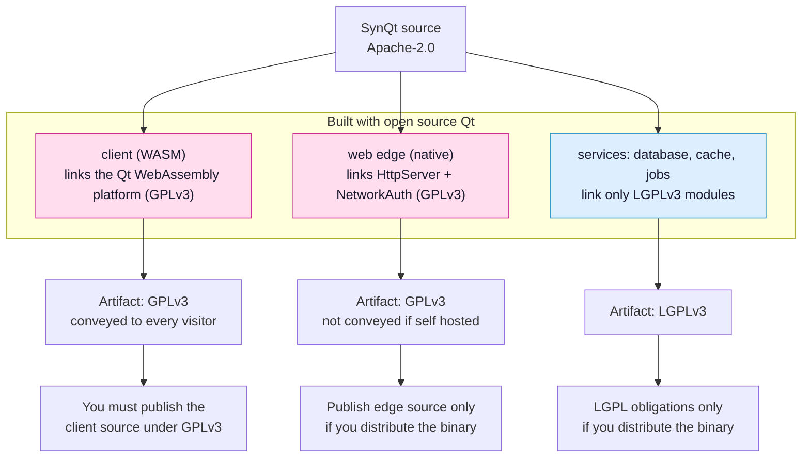
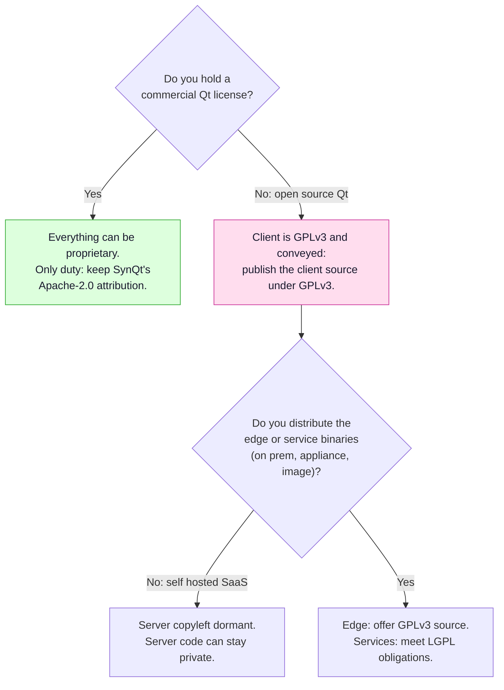

# Licensing

This page explains SynQt's licensing and the reasoning behind it, based
on the Qt 6.11 documentation linked below. If you are making a distribution
decision, confirm the current pages and consult legal counsel; this is analysis,
not legal advice.

Sources (Qt 6.11 docs):

- Qt licensing overview: <https://doc.qt.io/qt-6/licensing.html>
- Qt for WebAssembly (platform license): <https://doc.qt.io/qt-6/wasm.html>
- Qt HTTP Server: <https://doc.qt.io/qt-6/qthttpserver-index.html>
- Qt Network Authorization: <https://doc.qt.io/qt-6/qtnetworkauth-index.html>
- Qt Remote Objects: <https://doc.qt.io/qt-6/qtremoteobjects-index.html>
- Qt WebSockets: <https://doc.qt.io/qt-6/qtwebsockets-index.html>
- Qt Quick 3D (GPL only, a representative GPL-only add-on):
  <https://doc.qt.io/qt-6/qtquick3d-index.html>
- KDE Free Qt Foundation (the LGPL guarantee and its platform list):
  <https://kde.org/community/whatiskde/kdefreeqtfoundation/>

## At a glance

SynQt's own code is Apache-2.0. Each built artifact's license is inherited from the
Qt build used, not from SynQt. Under open source Qt, this is the picture:

The client is the strict case: it is downloaded and run by every visitor, which is
conveying, so its GPLv3 source obligation always applies under open source Qt. The
edge and services stay on your servers, so their copyleft is dormant unless you hand
the binaries to someone. A commercial Qt license removes all of this and lets every
artifact be proprietary.

Decision path for a developer building an app:

The rest of this page is the detail behind these two diagrams.

## The decision

SynQt's own source code is licensed under Apache License 2.0.

The license of each built artifact is not decided by SynQt. It is inherited from
the Qt build a developer uses. SynQt being Apache-2.0 composes with all of them:
it is one-way compatible with GPLv3 (so it drops into the GPLv3 client and edge),
it adds no copyleft of its own (so commercial Qt users can ship proprietary
builds), and it carries a patent grant.

Take the LGPLv3 (or v3) option, never the GPLv2 option, for any module that offers
a choice, because Apache-2.0 is compatible with GPLv3 but not GPLv2.

## Per-module licenses (open source Qt)

LGPLv3 (also available under GPL and commercial):

- Core, Gui, Network, Qml, Quick, Quick Controls, Quick Layouts, QmlModels
- WebSockets, RemoteObjects (both also under GPLv2)
- Sql, Concurrent

GPLv3 only (or commercial), no LGPL:

- HTTP Server
- Network Authorization
- Qt Quick 3D and Qt Quick 3D Physics (the 3D and physics stack; no SynQt tutorial
  requires them, but a client that adds 3D would link them)
- The Qt for WebAssembly platform port itself

The lists above cover the modules SynQt itself links and the ones its tutorials
add. Other Qt add ons may also be GPL only; check a module's own page before
linking it into an entity whose artifact you want to keep LGPLv3.

The WebAssembly point is the one most people miss. Individual modules like Core or
Quick are LGPLv3 as modules, but the WebAssembly platform build of Qt is offered
for open source only under GPLv3. The KDE Free Qt Foundation agreement (linked in
the sources above) guarantees LGPL on X11 and Android as core platforms, plus
Windows, macOS, and iOS as additional ones; WebAssembly is not on that list, so
the port is GPLv3 or commercial.

## Per-entity artifact license (open source Qt)

| Entity | What it links | Artifact license | Conveyed to third parties |
| --- | --- | --- | --- |
| client (WASM) | WebAssembly platform (GPLv3) plus LGPL modules | GPLv3 | Yes, downloaded and run by every visitor |
| web edge (native) | HTTP Server and Network Authorization (GPLv3) plus LGPL | GPLv3 | Usually no (self hosted) |
| database, cache, jobs (native) | only LGPL modules | LGPLv3 | Usually no |

The services row holds only while a service links nothing beyond the LGPL modules
listed above. Linking any GPL only module into a service (Qt Quick 3D for a
rendering service, HTTP Server for a custom inbound surface) makes that service's
artifact GPLv3. The generated THIRD-PARTY-LICENSES file reflects what each entity
actually links, which is why it is derived from the build rather than hand
written.

With a commercial Qt license, none of the GPL terms apply and every entity can be
proprietary.

## Conveying versus network use (why the client is the hard case)

GPLv3 copyleft is triggered by conveying (distributing) a binary, not by letting
people use it over a network. GPLv3 Section 0 defines it: to convey is any
propagation that enables other parties to make or receive copies, and "mere
interaction with a user through a computer network, with no transfer of a copy, is
not conveying." The deciding phrase is "with no transfer of a copy."

- The web edge and the services normally stay on your servers. You do not hand the
  binary to anyone and no copy is transferred, so you are not conveying, and the
  GPL source obligation stays dormant for a self hosted deployment. This is why a
  GPL edge is fine for SaaS.
- The client is different. The WASM binary is downloaded to and executed on every
  visitor's machine. A copy is transferred, so that is conveying a GPLv3 work to
  each visitor, and the copyleft applies: you must offer the corresponding source
  of the client (your compiled QML plus Qt) under GPLv3, or hold a commercial Qt
  license.

A common hope is that serving WASM counts as network use rather than distribution,
so the GPL would not trigger. It does not survive the text. Network use without a
copy transfer is the AGPL gap, and it applies to programs that run on the server.
WASM always transfers a copy to the browser, so plain GPLv3 conveying already
covers it, and GPL versus AGPL makes no difference for the client. This is also why
Qt offers the WebAssembly port under GPL or commercial only and recommends a
commercial license for a closed WASM app.

Practical consequence: an open source SynQt app publishes its client source under
GPLv3. A closed source client requires a commercial Qt license. This is a property
of Qt for WebAssembly, not of SynQt, and it would apply to any Qt WASM app.

### Remote pages are conveyed too

A [remote page](remote-pages.md) is QML the web edge delivers to a visitor at
navigation time rather than compiling into the bundle. The delivery is still a
transfer of a copy to the visitor's machine, so under open source Qt a remote page is
conveyed exactly as the bundle is, and it falls under the same GPLv3 source obligation
as the rest of the client. Keeping a page off most visitors' machines, by not
compiling it in, or behind a `scope`, is a confidentiality and weight measure, not a
way around conveyance: the visitors who do receive the page receive a copy, and that
copy carries the obligation. Include a remote page's source in the client source you
offer under GPLv3, the same as any compiled-in view.

## If you distribute the edge or services

If you ship the edge or a service binary to others (an on premise edition, an
appliance, a container image handed to customers, a self host download), then you
are conveying it and its license applies at that point:

- The edge is GPLv3, so you offer its source under GPLv3 or use commercial Qt.
- A pure service is LGPLv3, so you meet the LGPL obligations (below) or use
  commercial Qt.

## Obligations checklist

For LGPLv3 parts (services, and the LGPL modules inside any entity):

- Provide the complete corresponding source of the Qt libraries you used, including
  any modifications, or a written offer for it, under your own control (a link to
  Qt's site is not sufficient).
- Allow the user to relink against a modified, interface compatible Qt. Static
  linking is allowed, but then you must provide relinkable objects or equivalent.
  Native services can instead link Qt dynamically, which is the simpler path.
- Give prominent notice that the software uses Qt under LGPLv3, and include the
  LGPLv3 and GPLv3 license texts.
- No tivoization: the user must be able to run the relinked binary.

For GPLv3 parts (the client always, the edge if conveyed):

- Offer the complete corresponding source of the conveyed work under GPLv3,
  including your application code compiled into it.
- Include the GPLv3 text and prominent notices.

For SynQt's own code (Apache-2.0):

- Keep the Apache-2.0 LICENSE and NOTICE files, and preserve attribution and any
  NOTICE contents in redistributions.

## Provider client libraries (non Qt)

If a persistence or cache entity uses a third party engine through a provider, that
engine's client library has its own license, separate from Qt:

- SQLite: public domain. MongoDB C driver: Apache-2.0. hiredis (Redis): BSD.
  libpq (PostgreSQL): permissive PostgreSQL License.
- MySQL client library (libmysqlclient): GPLv2 only. LGPLv3 (the Qt modules) and
  Apache-2.0 (SynQt's own
  code) can each be combined into a GPLv3 work but not into a GPLv2 one, so an
  entity that links libmysqlclient alongside them is license incompatible
  and cannot be conveyed at all under open source Qt. Oracle's FOSS License
  Exception does not cover a proprietary or GPLv3 combined work. Self hosting
  triggers nothing, since nothing is conveyed, but do not ship such a binary.
  SynQt's
  mysql provider therefore builds the QMYSQL plugin against MariaDB Connector/C
  (LGPLv2.1), which composes cleanly, and never against libmysqlclient.

## What each kind of user must do

Open source users (building on open source, GPL, Qt):

- Release the client under GPLv3 and make its complete corresponding source
  available to everyone who loads the app, including their own client QML and C++,
  because it is one combined work with Qt. A visible link to a repository with the
  full client source and build instructions, under their control, is the usual way.
- Accept that their client application code is therefore public under GPLv3. Open
  source Qt offers no way to keep client code closed.
- Ship the GPLv3 text and the required Qt copyright and usage notices with the
  client, and add no restriction that defeats GPL freedoms (no tivoization or DRM
  lockout).
- Edge and services: dormant if only self hosted (nothing conveyed, so that code
  can stay private). If those binaries are distributed, the edge carries a GPLv3
  source offer and pure services carry LGPLv3 obligations (allow relinking, provide
  the Qt source used, notices), where a service's own code may stay proprietary.
- Comply with Apache-2.0 for SynQt itself (keep LICENSE and NOTICE, attribution).
- Avoid GPL only provider client libraries entirely: a conveyed entity that links
  libmysqlclient (GPLv2 only) is license incompatible with the LGPLv3 Qt inside
  it and cannot be distributed. SynQt's mysql provider uses MariaDB
  Connector/C instead, and libpq, the Mongo C driver, and hiredis are all
  permissive.

Short version: open source your client under GPLv3; the server side can stay
private as long as you only host it yourself.

Commercial Qt users (holding a commercial Qt license):

- Hold a valid commercial Qt license and develop under it. Qt's terms do not allow
  silently starting on open source and later switching without arranging it.
- Comply with the commercial agreement (developer seats, distribution terms). It is
  compatible with closed source distribution and app stores.
- Disclose no source: client, edge, and services may all be proprietary. The GPL
  and LGPL obligations do not apply, because the linked Qt is under the commercial
  license.
- Comply with Apache-2.0 for SynQt (retain LICENSE and NOTICE, attribution). That
  is the only obligation SynQt itself imposes.
- Honor the licenses of any third party provider client libraries they link.

Short version: pay for commercial Qt, keep everything closed, and the only thing
SynQt asks is Apache-2.0 attribution.

## The license files in your project

Two sets of files carry licenses, from two different sources. Keep them separate.

### The ones SynQt itself carries

SynQt ships LICENSE (the Apache-2.0 text covering SynQt's own code) and NOTICE
(attribution, and a pointer to this page). If you redistribute SynQt, or code
derived from it, Apache-2.0 asks you to keep both.

### The ones `synqt build` generates for your application

Which Qt modules an application pulls in depends on its topology, so it cannot be
written once and reused. `synqt build` derives it from your own `synqt.yaml` on
every build:

- THIRD-PARTY-LICENSES, one per built target, listing the Qt modules that target
  actually links and the license of each. It stays accurate as you add or remove
  entities, which is why it is generated rather than maintained by hand. A client
  entity built for both the browser and the desktop gets one file per target,
  because the two link different Qt modules.
- The notices and license texts the client surfaces to its own end users (the
  people visiting your application), as the obligations above require. The build
  places these in the client bundle.

Neither file is something you write. What you do have to do is honor what they
list, and publish the client's source when you build against open source Qt.
