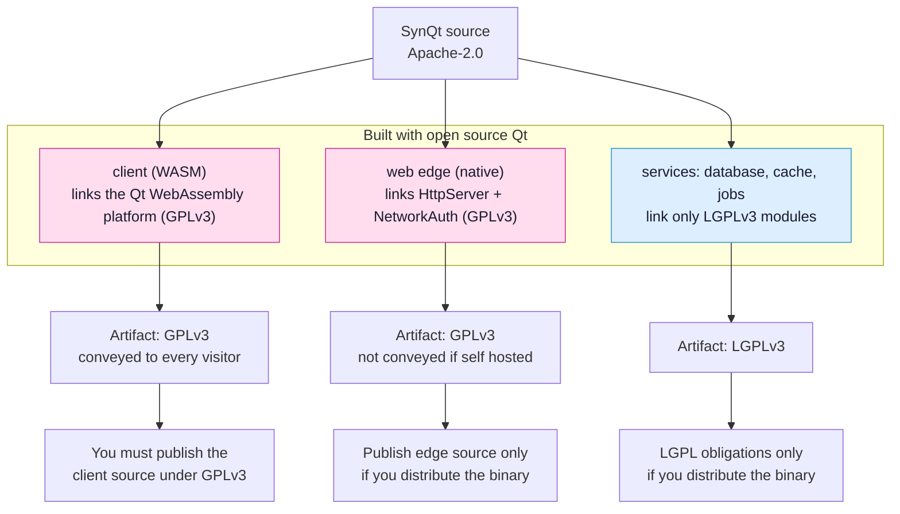
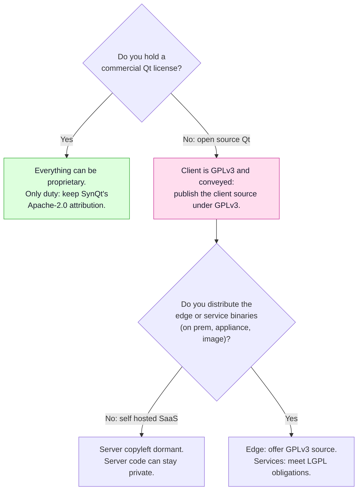

<!-- SPDX-FileCopyrightText: 2026 Alexandre 'kidev' Poumaroux -->
<!-- SPDX-License-Identifier: Apache-2.0 -->

# Licensing

This page explains SynQt's licensing and the reasoning behind it, based on the Qt 6.12
documentation linked below. It is analysis, not legal advice: before a distribution
decision, check the current pages and consult a lawyer.

Sources (Qt 6.12 docs):

- Qt licensing overview: <https://doc.qt.io/qt-6/licensing.html>
- Qt for WebAssembly (platform license): <https://doc.qt.io/qt-6/wasm.html>
- Qt HTTP Server: <https://doc.qt.io/qt-6/qthttpserver-index.html>
- Qt Network Authorization: <https://doc.qt.io/qt-6/qtnetworkauth-index.html>
- Qt Remote Objects: <https://doc.qt.io/qt-6/qtremoteobjects-index.html>
- Qt WebSockets: <https://doc.qt.io/qt-6/qtwebsockets-index.html>
- Qt Quick 3D (GPL only, a representative GPL-only add-on):
  <https://doc.qt.io/qt-6/qtquick3d-index.html>
- KDE Free Qt Foundation (the LGPL guarantee and its platform list):
  <https://kde.org/community/whatiskde/kdefreeqtfoundation/>

## At a glance

SynQt's own code is Apache-2.0. Each built artifact takes its license from the Qt build
used, not from SynQt. Under open source Qt:

```mermaid
flowchart TB
  synqt["SynQt source<br/>Apache-2.0"]
  synqt --> client
  synqt --> edge
  synqt --> svc
  subgraph osqt["Built with open source Qt"]
    client["<span style='color:#1a1a2e'>client (WASM)<br/>links the Qt WebAssembly platform (GPLv3)</span>"]:::warn
    edge["<span style='color:#1a1a2e'>web edge (native)<br/>links HttpServer + NetworkAuth (GPLv3)</span>"]:::warn
    svc["<span style='color:#1a1a2e'>services: database, cache, jobs<br/>link only LGPLv3 modules</span>"]:::info
  end
  client --> cl["Artifact: GPLv3<br/>conveyed to every visitor"]
  edge --> el["Artifact: GPLv3<br/>not conveyed if self hosted"]
  svc --> sl["Artifact: LGPLv3"]
  cl --> co["You must publish the<br/>client source under GPLv3"]
  el --> eo["Publish edge source only<br/>if you distribute the binary"]
  sl --> so["LGPL obligations only<br/>if you distribute the binary"]
  classDef warn fill:#fde,stroke:#c39,color:#1a1a2e
  classDef info fill:#def,stroke:#39c,color:#1a1a2e
```

The client is the strict case. Every visitor downloads and runs it, which counts as
conveying, so its GPLv3 source obligation always applies under open source Qt. The edge
and services stay on your servers, so their copyleft stays dormant unless you give the
binaries to someone. A commercial Qt license removes all of this and lets every artifact
be proprietary.

The decision path for an app:

```mermaid
flowchart TD
  q1{"Do you hold a<br/>commercial Qt license?"}
  q1 -->|"Yes"| comm["<span style='color:#1a1a2e'>Everything can be proprietary.<br/>Only duty: keep SynQt's<br/>Apache-2.0 attribution.</span>"]:::ok
  q1 -->|"No: open source Qt"| c1["<span style='color:#1a1a2e'>Client is GPLv3 and conveyed:<br/>publish the client source under GPLv3.</span>"]:::warn
  c1 --> q2{"Do you distribute the<br/>edge or service binaries<br/>(on prem, appliance, image)?"}
  q2 -->|"No: self hosted SaaS"| s1["Server copyleft dormant.<br/>Server code can stay private."]
  q2 -->|"Yes"| s2["Edge: offer GPLv3 source.<br/>Services: meet LGPL obligations."]
  classDef ok fill:#dfd,stroke:#3a3,color:#1a1a2e
  classDef warn fill:#fde,stroke:#c39,color:#1a1a2e
```

The rest of this page explains these two diagrams.

## The decision

SynQt's own source code is licensed under Apache License 2.0.

Each artifact takes its license from the Qt build you use. Apache-2.0 works with all of
them: it is one way compatible with GPLv3 (so it fits
into the GPLv3 client and edge), adds no copyleft (so commercial Qt users can ship
proprietary builds), and includes a patent grant.

For any module that offers a choice, take the LGPLv3 or GPLv3 option, never GPLv2, because
Apache-2.0 is compatible with GPLv3 but not with GPLv2.

## Per-module licenses (open source Qt)

LGPLv3 (also available under GPL and commercial):

- Core, Gui, Network, Qml, Quick, Quick Controls, Quick Layouts, QmlModels
- WebSockets, RemoteObjects (both also under GPLv2)
- Sql, Concurrent

GPLv3 only (or commercial), no LGPL:

- HTTP Server
- Network Authorization
- Qt Quick 3D and Qt Quick 3D Physics (the 3D and physics stack). A client links them when
  its QML imports them, as [the 3D plaza](tutorial-plaza.md) does, and that client is then
  GPLv3 as a native desktop build as well as in the browser
- The Qt for WebAssembly platform port itself

These lists cover the modules SynQt links and the ones its tutorials add. Other Qt add-ons
may also be GPL only; check a module's page before linking it into an entity you want to
keep LGPLv3.

Modules like Core or Quick are LGPLv3, but Qt's
WebAssembly platform build is offered as open source only under GPLv3. The KDE Free Qt
Foundation agreement (linked above) guarantees LGPL on X11 and Android as core platforms,
plus Windows, macOS and iOS. WebAssembly is not on that list, so the port is GPLv3 or
commercial.

## Per-entity artifact license (open source Qt)

| Entity | What it links | Artifact license | Conveyed to third parties |
| --- | --- | --- | --- |
| client (WASM) | WebAssembly platform (GPLv3) plus LGPL modules | GPLv3 | Yes, downloaded and run by every visitor |
| web edge (native) | HTTP Server and Network Authorization (GPLv3) plus LGPL | GPLv3 | Usually no (self hosted) |
| auth entity (native) | Network Authorization (GPLv3) plus LGPL | GPLv3 | Usually no |
| api entity with `network.inbound` (native) | HTTP Server (GPLv3) plus LGPL | GPLv3 | Usually no |
| monitor (native) | HTTP Server and Network Authorization (GPLv3) plus LGPL | GPLv3 | Usually no |
| database, cache, jobs (native) | only LGPL modules | LGPLv3 | Usually no |

The build enforces the last row by structure, not by discipline. The framework ships five
service libraries:

- `SynQtService` (mesh, entity runtime, sessions, Caller) links only LGPL modules.
- `SynQtIdentity` adds Network Authorization.
- `SynQtEdge` adds HTTP Server.
- `SynQtGateway` adds HTTP Server, for an entity that serves its own inbound API.
- `SynQtMonitor` is `SynQtEdge` plus a history, for the operator console.

A database, cache, document, jobs or plain service entity links only the first, so its
binary contains no GPLv3-only module, and a topology without the other four kinds of
entity does not even need those libraries installed.

The table describes only what SynQt links for you. Linking a GPL-only module into a service
yourself (Qt Quick 3D for a rendering service, HTTP Server for a custom inbound surface)
makes that service GPLv3. The generated THIRD-PARTY-LICENSES file follows what each entity
actually links, which is why it is derived from the build: the same function that picks an
entity's runtime library writes its module list.

With a commercial Qt license, none of the GPL terms apply and every entity can be
proprietary.

## Conveying versus network use (why the client is the hard case)

Conveying (distributing) a binary triggers GPLv3 copyleft; letting people use it over a
network does not. GPLv3 Section 0 defines conveying as any propagation that lets others
make or receive copies, and says "mere interaction with a user through a computer network,
with no transfer of a copy, is not conveying." The key words are "with no transfer of a
copy".

- **The edge and services normally stay on your servers.** You give the binary to no one,
  and no copy is transferred, so you are not conveying, and the GPL source obligation
  stays dormant for a self hosted deployment. That is why a GPL edge is fine for SaaS.
- **The client is different.** Every visitor's machine downloads and runs the WASM binary.
  A copy is transferred, so you convey a GPLv3 work to each visitor, and the copyleft
  applies: offer the client's corresponding source (your compiled QML plus Qt) under
  GPLv3, or hold a commercial Qt license.

Serving WASM is distribution, not network use. Network use without transferring a copy is the gap the AGPL covers, for
programs that run on the server. WASM always transfers a copy to the browser, so plain
GPLv3 conveying already applies, and GPL versus AGPL makes no difference for the client.
That is also why Qt offers the WebAssembly port only under GPL or commercial terms, and
recommends a commercial license for a closed WASM app.

In practice: an open source SynQt app publishes its client source under GPLv3, and a
closed source client needs a commercial Qt license. This comes from Qt for WebAssembly, not
from SynQt, and applies to any Qt WASM app.

### Remote pages are conveyed too

A [remote page](remote-pages.md) is QML the web edge delivers when a visitor navigates to
it, instead of compiling it into the bundle. Delivery still transfers a copy to the
visitor's machine, so under open source Qt a remote page is conveyed like the bundle and
carries the same GPLv3 source obligation. Keeping a page off most visitors' machines (by
not compiling it in, or behind a `scope`) protects confidentiality and saves weight, but
does not avoid conveying: visitors who receive the page receive a copy. Include remote
pages in the client source you offer under GPLv3, like any compiled-in view.

## If you distribute the edge or services

If you give the edge or a service binary to others (an on-premise edition, an appliance,
a container image for customers, a self hosting download), you convey it, and its license
applies:

- The edge is GPLv3, so you offer its source under GPLv3 or use commercial Qt.
- A pure service is LGPLv3, so you meet the LGPL obligations (below) or use
  commercial Qt.

## Obligations checklist

For LGPLv3 parts (services, and the LGPL modules inside any entity):

- Provide the complete corresponding source of the Qt libraries you used, including
  any modifications, or a written offer for it, under your own control (a link to
  Qt's site is not sufficient).
- Allow the user to relink against a modified, interface compatible Qt. Static
  linking is allowed, but then you must provide relinkable objects or equivalent.
  Native services can instead link Qt dynamically, which is the simpler path.
- Give prominent notice that the software uses Qt under LGPLv3, and include the
  LGPLv3 and GPLv3 license texts.
- The user must be able to run the relinked binary (no tivoization).

For GPLv3 parts (the client always, the edge if conveyed):

- Offer the complete corresponding source of the conveyed work under GPLv3,
  including your application code compiled into it.
- Include the GPLv3 text and prominent notices.

For SynQt's own code (Apache-2.0):

- Keep the Apache-2.0 LICENSE and NOTICE files, and preserve attribution and any
  NOTICE contents in redistributions.

## Provider client libraries (non Qt)

When a persistence or cache entity uses a third party engine through a provider, that
engine's client library has its own license, separate from Qt. The Redis and MongoDB
clients are compiled into SynQt's providers library whenever the build machine has them
installed, and every service entity links that library, so on such a machine every service
entity carries them, whatever its own provider. The configure step records what it linked,
and each service's THIRD-PARTY-LICENSES lists it.

- SQLite: public domain. MongoDB C driver: Apache-2.0. hiredis (Redis): BSD.
  libpq (PostgreSQL): permissive PostgreSQL License.
- MySQL client library (libmysqlclient): GPLv2 only. LGPLv3 (the Qt modules) and
  Apache-2.0 (SynQt's code) can each be combined into a GPLv3 work but not a GPLv2 one, so
  an entity linking libmysqlclient with them is license incompatible and cannot be
  conveyed at all under open source Qt. Oracle's FOSS License Exception does not cover a
  proprietary or GPLv3 combined work. Self hosting triggers nothing, since nothing is
  conveyed, but never ship such a binary. That is why SynQt's mysql provider builds the
  QMYSQL plugin against MariaDB Connector/C (LGPLv2.1), which combines cleanly, never
  against libmysqlclient.

## What each kind of user must do

Open source users (building on open source, GPL, Qt):

- **Release the client under GPLv3,** and make its complete corresponding source available
  to everyone who loads the app, including your own client QML and C++, since it forms one
  combined work with Qt. The usual way is a visible link to a repository you control, with
  the full client source and build instructions.
- **Your client code is public under GPLv3.** Open source Qt offers no way to keep it
  closed.
- **Ship the GPLv3 text and Qt's required copyright and usage notices** with the client,
  and add no restriction that defeats GPL freedoms (no tivoization or DRM lockout).
- **Edge and services:** dormant if you only self host (nothing is conveyed, so that code
  can stay private). If you distribute those binaries, the edge needs a GPLv3 source offer,
  and pure services carry LGPLv3 obligations (allow relinking, provide the Qt source used,
  notices), while a service's own code may stay proprietary.
- **Comply with Apache-2.0 for SynQt** (keep LICENSE and NOTICE, and the attribution).
- **Avoid GPL-only provider client libraries.** A conveyed entity linking libmysqlclient
  (GPLv2 only) is incompatible with the LGPLv3 Qt inside it and cannot be distributed.
  SynQt's mysql provider uses MariaDB Connector/C instead, and libpq, the Mongo C driver and
  hiredis are all permissive.

In short: publish your client under GPLv3. The server side can stay private as long as
you only host it yourself.

Commercial Qt users (holding a commercial Qt license):

- **Hold a valid commercial Qt license and develop under it.** Qt's terms do not allow
  starting on open source and switching later without arranging it with Qt.
- **Follow the commercial agreement** (developer seats, distribution terms). It allows
  closed source distribution and app stores.
- **Disclose no source.** Client, edge and services may all be proprietary; the GPL and LGPL
  obligations do not apply, because the linked Qt is under the commercial license.
- **Comply with Apache-2.0 for SynQt** (keep LICENSE and NOTICE, and the attribution). That
  is SynQt's only obligation.
- **Honor the licenses of any third party provider client libraries** you link.

In short: pay for commercial Qt, keep everything closed, and SynQt asks only for
Apache-2.0 attribution.

## The license files in your project

Two sets of license files come from two different sources. Keep them separate.

### The ones SynQt itself carries

SynQt ships LICENSE (the Apache-2.0 text for SynQt's code) and NOTICE (attribution, and a
pointer to this page). If you redistribute SynQt or code derived from it, Apache-2.0 asks
you to keep both.

### The ones `synqt build` generates for your application

Which Qt modules an application uses depends on its topology, so `synqt build` derives
the list from your `synqt.yaml` on every build:

- **THIRD-PARTY-LICENSES,** one per built target, listing the Qt modules the target links
  with each license, and the libraries from outside Qt it links. Being generated, it stays
  accurate as you add or remove entities. A client built for both the browser and the
  desktop gets one file per target, because the two link different Qt modules.
- **The notices and license texts the client shows its end users** (the people visiting your
  application), as the obligations above require. The build puts them in the client
  bundle.

The build writes both. You honor what they list, and publish the client's source when you
build with open source Qt.
