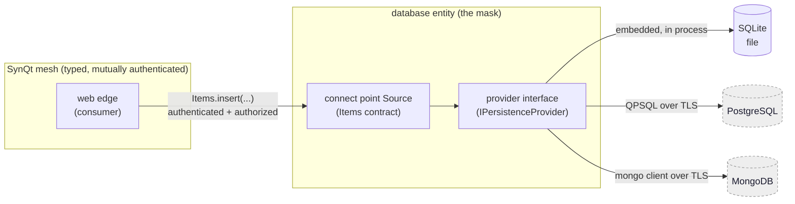
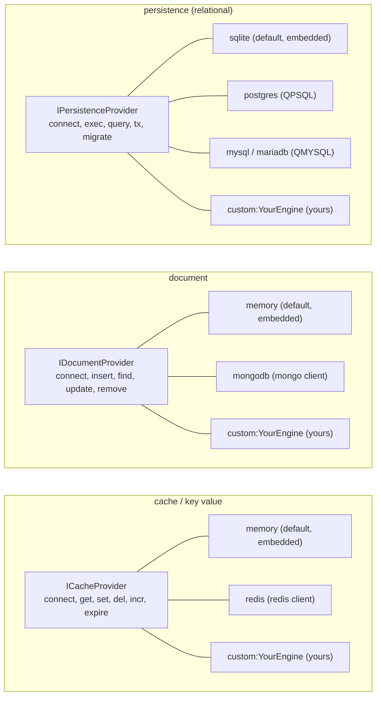
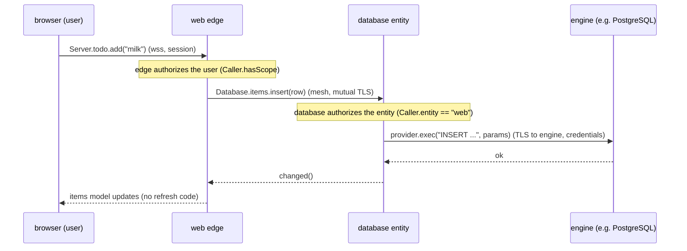

# Providers (backing entities with first party or third party engines)

An entity already hides its backend behind a typed connect point: consumers call
`Database.items.insert(...)` and never know or touch what stores the data. This
document makes that backend pluggable. A blueprint defines a small backend facing
interface; a provider implements it for a specific engine. The default provider is
SynQt's own embedded engine and needs no configuration. A third party engine
(PostgreSQL, MySQL, MongoDB, Redis, or your own) is selected by one config value
and masked behind the same entity, so the rest of the system, and its security
model, do not change.

This embodies the framework principle: simple by default, expandable by
configuration. A database entity is one line. A database entity backed by a managed
PostgreSQL cluster over verified TLS with a connection pool is a few more lines, in
the same place, with nothing else in the system aware of the difference.

## The two faces of an entity

Every service entity has two faces.



The mesh face (inward) is the connect point: the typed contract other entities
consume, carried over the authenticated mesh, authorized in every slot through
`Caller`. This face never changes when you swap engines.

The backend face (outward) is the provider: how the entity actually fulfills its
connect points. The provider is the only part that knows the engine. It is the only
holder of backend credentials and the only opener of a connection to an external
engine.

Because the entity sits between them, the engine is masked. A consumer cannot reach
the engine, cannot see its credentials, and cannot bypass the `Caller` checks the
entity enforces before any provider call. Swapping SQLite for MongoDB changes the
provider and its config, and nothing else.

## Blueprints define a provider family and interface

Each blueprint targets a family of engines and defines one backend interface that
every provider in that family implements. A provider declares which family it
serves.



The interface is small, native, and the same for every provider in the family. The
generic lifecycle (connect, disconnect, health) plus the family operations are all
a provider must implement. The connect point Source calls the interface, never a
specific engine, so the same `Items.qml` works whether the provider is SQLite or
PostgreSQL.

Family interfaces (illustrative shapes; the exact C++ signatures live in the
framework headers):

- Persistence (relational): `connect()`, `health()`, `query(sql, params) -> rows`,
  `exec(sql, params) -> affected/id`, `begin()/commit()/rollback()`,
  `migrate(steps)`. Always parameterized; the interface takes parameters
  separately so a provider can never be handed concatenated SQL.
- Document: `connect()`, `health()`, `insert(collection, doc)`,
  `find(collection, filter, options) -> docs`, `update(collection, filter, change)`,
  `remove(collection, filter)`.
- Cache: `connect()`, `health()`, `get(key)`, `set(key, value, ttl)`, `del(key)`,
  `incr(key)`, `expire(key, ttl)`.

## Bundled providers, and how honest each one is

SynQt bundles providers across the families. They differ in how they reach the
engine, and the documentation is explicit about it because it affects the build and
the trust model.

Relational providers map onto Qt SQL driver plugins. Qt ships driver plugins for
PostgreSQL (QPSQL), MySQL and MariaDB (QMYSQL), Oracle (QOCI), ODBC (QODBC), DB2
(QDB2), InterBase and Firebird (QIBASE), Mimer (QMIMER), and SQLite (QSQLITE). Two
facts from the Qt SQL driver documentation drive SynQt's defaults:

- SQLite is the in process database with the best test coverage and support on all
  platforms, and its plugin is the only one shipped with binary Qt builds (Windows
  binaries also include ODBC and PostgreSQL). So SQLite is the default persistence
  provider: zero configuration, no external engine, no extra build step.
- The other relational drivers need the engine's client library present and the
  driver plugin built (Qt ships the sources). The SynQt build automates this when
  you select such a provider, but it is a real dependency, so it is opt in. For
  MySQL the build uses MariaDB Connector/C (LGPLv2.1) as the client library, never
  Oracle's GPLv2 only libmysqlclient, which would be license incompatible with the
  LGPLv3 Qt modules in the same entity the moment the binary is conveyed (see
  [licensing](licensing.md)).

Document and cache providers wrap an external client library, because Qt has no
official MongoDB or Redis module. The MongoDB provider wraps the MongoDB C client;
the Redis provider wraps a Redis client (or speaks RESP over Qt Network). These
client libraries are pulled through the pinned vcpkg baseline and reviewed. This is
the honest position: SynQt wraps a maintained client behind the entity rather than
reimplementing the engine, so you get a Mongo backed entity without your
system speaking Mongo anywhere but inside that entity.

The embedded defaults (SQLite for persistence, in memory for cache) need no engine
and no extra build, which is why they are the defaults and why a fresh project runs
with none of this configured.

## Selecting a provider: graduated configuration

Default. A persistence entity with no provider line uses the embedded SQLite
provider. This is the common case and needs nothing more.

```yaml
entities:
  - name: database
    kind: service
    blueprint: persistence         # provider defaults to sqlite (embedded)
    settings:
      file: database/data/app.db
      journal_mode: wal
      busy_timeout_ms: 5000
```

Expanded, third party relational. Point the same entity at PostgreSQL. The connect
points, the contracts, and every consumer stay identical.

```yaml
entities:
  - name: database
    kind: service
    blueprint: persistence
    provider:
      name: postgres
      host: db.internal            # a private address, not public
      port: 5432
      database: app
      user: app
      password: env:DB_PASSWORD    # entity .env only, never the client, never logged
      sslmode: verify-full         # the entity verifies the engine's certificate
      ca_cert: certs/db-ca.pem     # the CA that signed the engine's certificate
      pool_size: 8
```

Expanded, document engine. A different blueprint, a third party engine, same
masking.

```yaml
entities:
  - name: docs
    kind: service
    blueprint: document
    provider:
      name: mongodb
      uri: env:MONGODB_URI         # full connection string with credentials, from env
      tls: true
      ca_cert: certs/mongo-ca.pem
```

Expanded, cache engine.

```yaml
entities:
  - name: cache
    kind: service
    blueprint: cache
    provider:
      name: redis
      host: cache.internal
      port: 6379
      password: env:REDIS_PASSWORD
      tls: true
      ca_cert: certs/redis-ca.pem
```

The pattern is uniform: `provider.name` names the engine, the rest of the
`provider` section carries the connection, secrets are `env:` references resolved
only on that entity.
Going from the default to a managed third party engine touches one entity block and
nothing else in the system.

## The request path through a provider

Nothing about the mesh, the authorization, or the contract changes when a provider
sits behind the entity. The provider is an internal call after the entity has
already authenticated and authorized the caller.



Two SynQt authorizations happen before the provider is ever called. The provider
call to the engine is the entity's own authenticated, encrypted connection, with
credentials only the entity holds.

## Writing a custom provider

When no bundled provider fits (a niche engine, an in house store, a SaaS data API),
implement the family interface yourself. This is the expandability escape hatch and
keeps the framework open ended.

`synqt add provider MyEngine --family persistence` writes the whole shape below into
`providers/custom/myengineprovider.cpp`; the three steps are what it wrote and why.

1. Implement the family interface (for example `IPersistenceProvider`) in a small
   native module in the entity, including the lifecycle (connect, disconnect,
   health), the operations, and the error mapping the interface expects.
2. Register it under a name, with the macro for its family. This is what makes the
   name selectable, and it runs at static initialization, so linking the file into
   the entity is all it takes:

   ```cpp
   SYNQT_REGISTER_PERSISTENCE_PROVIDER("MyEngine", MyEngineProvider)
   ```

   (`SYNQT_REGISTER_CACHE_PROVIDER` and `SYNQT_REGISTER_DOCUMENT_PROVIDER` for the
   other two families.) The name here is the bare one: no `custom:` prefix.
3. Compile the file into the entity's target, and select it:
   `provider.name: custom:MyEngine`, with the rest of the `provider` section carrying
   settings your provider reads from its `ProviderConfig`.

`custom:` is a namespace, not decoration. Only a name carrying it is looked up among
your registrations, so a custom provider can never shadow a bundled one: `sqlite`
always means the bundled SQLite provider, whatever you register. If the name selects
nothing, the entity refuses to start and says which providers the family does have,
rather than starting with a connect point whose every call would fail.

The contract your provider must honor is documented with the interface: parameters
are passed separately (never concatenate), errors are reported through the
interface's error type (not thrown across the boundary), and `health()` reports
readiness so the entity can report not ready and retry rather than crash. A custom
provider is your code, so it is reviewed like any entity code; the framework does
not weaken its boundary for it.

## CLI support

```cli
synqt providers                           # List available providers per family.
synqt add entity db --blueprint persistence --provider postgres
                                           # Scaffold an entity with a chosen provider,
                                           # a provider config stub, and .env.example
                                           # entries for its secrets.
synqt add provider <name> --family <fam>  # Scaffold a custom provider skeleton that
                                           # implements a family interface.
```

When you select a provider that needs a native client library or a Qt SQL driver
plugin, the build resolves it: for a relational provider it builds or locates the
matching Qt SQL driver plugin (SQLite needs nothing, it is bundled); for a document
or cache provider it adds the pinned vcpkg client library. `synqt doctor` reports
any provider whose engine client or driver plugin is missing, before you run.

## Security of third party backends

Adding an external engine adds a connection that leaves the entity, so the security
model extends to cover it. The full treatment is in [security](security.md); the
provider specific points:

- The entity is the trust boundary, and masking is a security property. The engine
  is reachable only through the entity, which enforces every `Caller` check before
  any provider call. An engine with coarser authorization than SynQt is fronted by
  the entity's fine grained checks. No mesh consumer, and certainly no browser, ever
  reaches the engine or its credentials.
- Credentials are `env:` only, on that entity only, never in `synqt.yaml`, never in
  a client target, never logged. The build rejects a client target that references a
  provider secret.
- The connection to an external engine uses TLS with verification. Relational
  providers set the engine's verify mode to full (`sslmode: verify-full` or the
  driver equivalent) against a configured CA. Document and cache providers enable
  TLS and verify the engine certificate. An unverified or plaintext connection to an
  external engine is allowed only in dev on localhost, and the build refuses it in
  release.
- The engine is segmented like any sensitive entity: a private address reachable
  only by its entity, never public, never the mesh's job to expose.
- Provider client libraries are pinned through vcpkg and reviewed, part of the
  supply chain discipline. A custom provider is reviewed as entity code.

## Why this design

The entity model already promised that the contract is the stable boundary and the
backend can change without touching consumers. Providers make that concrete: the
same `database` entity can be SynQt's embedded SQLite during early development and a
managed PostgreSQL or a MongoDB cluster in production, decided by one config value,
with the mesh authentication, the `Caller` authorization, the data minimization, and
the deny by default topology all unchanged. Simple by default, because the embedded
provider needs no configuration. Expandable by configuration, because a third party
engine is a provider selection and a connection block, masked behind an entity that
keeps the whole system's security model intact.
