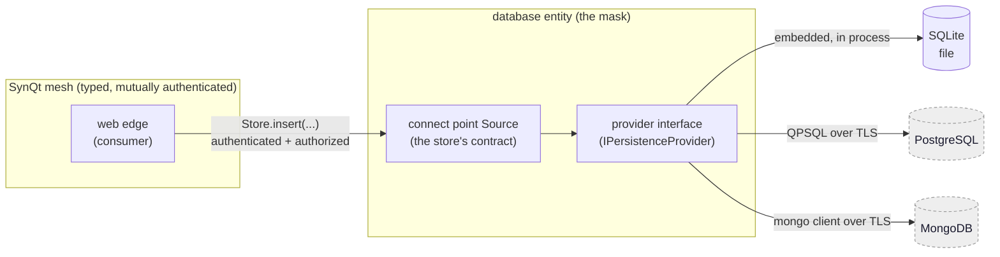
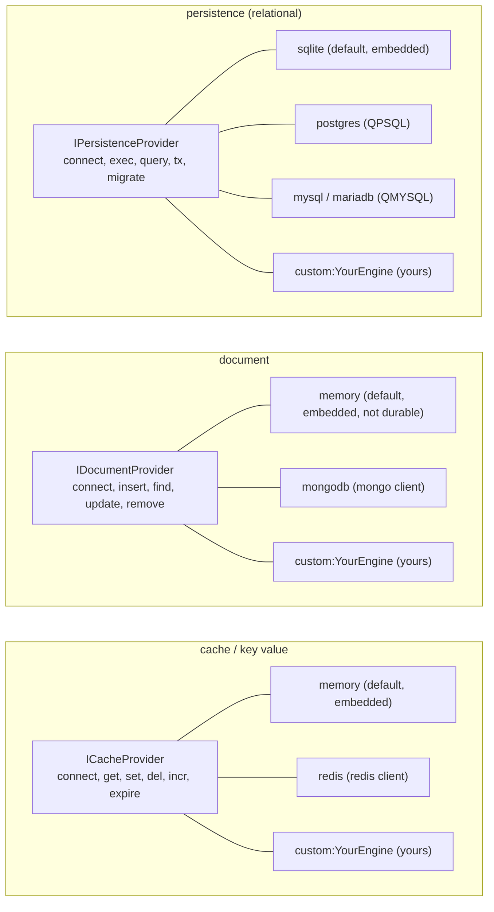
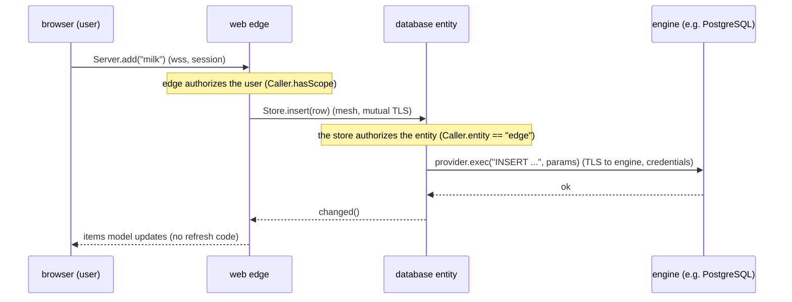

<!-- SPDX-FileCopyrightText: 2026 Alexandre 'kidev' Poumaroux -->
<!-- SPDX-License-Identifier: Apache-2.0 -->

# Providers

An entity hides its backend behind a typed connect point: consumers call
`Store.insert(...)` and never see what stores the data. Providers make that backend
pluggable. An entity type defines a small interface toward its backend, and a provider
implements it for one engine. The default provider is an embedded engine that needs no
configuration. One config value selects a third party engine (PostgreSQL, MySQL, MongoDB,
Redis, or your own) behind the same entity, and the rest of the system and its security
model stay the same.

A database entity takes one line. A database entity backed by a managed PostgreSQL cluster
over verified TLS with a connection pool takes a few more lines in the same place, and
nothing else in the system notices.

## The two faces of an entity

Every service entity has two faces: the one its consumers call, and the one that talks to
an engine.


```mermaid
flowchart LR
  subgraph mesh["SynQt mesh (typed, mutually authenticated)"]
    W["web edge<br/>(consumer)"]
  end
  subgraph ent["database entity (the mask)"]
    direction TB
    CP["connect point Source<br/>(the store's contract)"]
    PI["provider interface<br/>(IPersistenceProvider)"]
    CP --> PI
  end
  W -->|"Store.insert(...)<br/>authenticated + authorized"| CP
  PI -->|"embedded, in process"| SQLITE[("SQLite<br/>file")]
  PI -->|"QPSQL over TLS"| PG[("<span style='color:#1a1a2e'>PostgreSQL</span>")]
  PI -->|"mongo client over TLS"| MG[("<span style='color:#1a1a2e'>MongoDB</span>")]
  classDef ext fill:#eee,stroke:#999,color:#1a1a2e,stroke-dasharray:4 3;
  class PG,MG ext;
```

- **The mesh face** is the connect point: the typed contract other entities consume,
  carried over the authenticated mesh and authorized in every slot through `Caller`. It
  never changes when you swap engines.
- **The backend face** is the provider, which fulfills the connect point. Only the provider
  knows the engine, holds the backend credentials, and opens a connection to an external
  engine.

The entity sits between the two, so the engine stays hidden. A consumer cannot reach the
engine, see its credentials, or bypass the `Caller` checks the entity runs before any
provider call. Swapping SQLite for PostgreSQL changes the provider and its config, and
nothing else.

## Entity types define a provider family and interface

Each entity type with an engine targets a family of engines, and defines one interface
that every provider in the family implements. A provider declares which family it
serves.


```mermaid
flowchart TB
  subgraph fam1["persistence (relational)"]
    IP["IPersistenceProvider<br/>connect, exec, query, tx, migrate"]
    IP --- sqlite["sqlite (default, embedded)"]
    IP --- postgres["postgres (QPSQL)"]
    IP --- mysql["mysql / mariadb (QMYSQL)"]
    IP --- custom1["custom:YourEngine (yours)"]
  end
  subgraph fam2["document"]
    ID["IDocumentProvider<br/>connect, insert, find, update, remove"]
    ID --- memdoc["memory (default, embedded, not durable)"]
    ID --- mongodb["mongodb (mongo client)"]
    ID --- custom2["custom:YourEngine (yours)"]
  end
  subgraph fam3["cache / key value"]
    IC["ICacheProvider<br/>connect, get, set, del, incr, expire"]
    IC --- memory["memory (default, embedded)"]
    IC --- redis["redis (redis client)"]
    IC --- custom3["custom:YourEngine (yours)"]
  end
  fam1 ~~~ fam2
  fam2 ~~~ fam3
```

The interface is small, native C++, and the same for every provider in the family. A
provider implements the lifecycle (connect, disconnect, health) and the family's
operations, nothing more. The connect point Source calls the interface, never a specific
engine, so the same `Store.qml` works with SQLite or PostgreSQL.

The family interfaces (illustrative; the exact C++ signatures are in the framework
headers):

- **Persistence (relational):** `connect()`, `health()`, `query(sql, params) -> rows`,
  `exec(sql, params) -> affected/id`, `begin()/commit()/rollback()`, `migrate(steps)`.
  Always parameterized: parameters arrive separately, so a provider never receives
  concatenated SQL.
- **Document:** `connect()`, `health()`, `insert(collection, doc)`,
  `find(collection, filter, options) -> docs`, `update(collection, filter, change)`,
  `remove(collection, filter)`.
- **Cache:** `connect()`, `health()`, `get(key)`, `set(key, value, ttl)`, `del(key)`,
  `incr(key, by)`, `expire(key, ttl)`. A TTL of zero or less means no expiry, for `expire` as
  well as `set`. This is spelled out because engines disagree: Redis treats
  `EXPIRE key 0` as "already expired" and deletes the key, so a Redis provider must send
  `PERSIST` instead. Otherwise the same line of QML would keep a value forever behind one
  engine and drop it behind another, which swapping a provider must never do.

The entity's QML never holds the interface. The runtime gives every owned connect point
Source one helper per type: `Db` for persistence, `Docs` for documents, `Cache` for
caches, and, outside the provider families, `Jobs` for a jobs entity. The helper forwards
to whichever provider the config selected, so the Source never names an engine. (`Http`
and `Api` are helpers too, but the entity's
[`network:` block](project-layout-and-config.md#network-what-an-entity-may-reach-and-who-may-reach-it)
grants them, not its type, because what an entity may reach is a deployment decision.)
[The type helpers](runtime-api.md#service-the-type-helpers) lists every member of every
helper.

## Bundled providers and how each reaches its engine

SynQt bundles providers for every family. They reach their engines in different ways,
which affects the build and the trust model, so this section spells it out.

Relational providers use Qt SQL driver plugins. Qt ships plugins for PostgreSQL (QPSQL),
MySQL and MariaDB (QMYSQL), Oracle (QOCI), ODBC (QODBC), DB2 (QDB2), InterBase and Firebird
(QIBASE), Mimer (QMIMER) and SQLite (QSQLITE). Two facts from the Qt SQL driver
documentation set SynQt's defaults:

- **SQLite always works.** It is the in process database with the best test coverage and
  platform support, and the only driver that always works straight from a binary Qt
  build. So it is the default relational provider: no configuration, no external engine,
  no extra build step.
- **Every other driver needs a client library and a matching plugin.** SynQt cannot supply
  the engine's client library on the machine, or a plugin that loads against it. A binary
  Qt build ships more plugin files than SQLite (the pinned Linux kit also has QPSQL,
  QMYSQL, QODBC, QOCI, QIBASE and QMIMER), but a plugin file that exists may still fail to
  load, because each is bound to the client library it was built against. PostgreSQL
  usually works, because the shipped QPSQL loads against a normal libpq install. MySQL
  does not, for licensing reasons.

Qt's prebuilt QMYSQL links against Oracle's `libmysqlclient` and uses its versioned
symbols. SynQt cannot use that plugin, for two reasons:

- **It cannot be distributed.** `libmysqlclient` is GPLv2 only, which is incompatible with
  the LGPLv3 Qt modules in the same entity, so an entity linking both cannot legally be
  distributed at all (see [licensing](licensing.md)).
- **It would not work anyway.** It imports Oracle's versioned symbols, which MariaDB
  Connector/C does not export, so pointing the shipped plugin at Connector/C fails to
  load. Qt then reports only `Driver not loaded`, without naming the cause.

So a `mysql` provider needs the QMYSQL plugin rebuilt against MariaDB Connector/C
(LGPLv2.1), the client whose license lets a SynQt deployment ship it. It is a one time
step per machine, outside `synqt build`, done by
[`tools/qmysql-plugin/build-qmysql-plugin.sh`](https://github.com/Kidev/SynQt/blob/main/tools/qmysql-plugin/build-qmysql-plugin.sh)
in the SynQt repository:

```sh
tools/qmysql-plugin/build-qmysql-plugin.sh
export QT_PLUGIN_PATH="$HOME/.cache/synqt-qmysql"
```

The script needs the Qt sources for your pinned version (the installer's Sources
component) and Connector/C's headers and library. It refuses to build against Oracle's
client, and checks the result's linkage before installing it. `synqt doctor` reports the
plugin state for every SQL backed entity in your project.

That build decides how the `mysql` provider requests TLS. A Connector/C plugin has no SSL
mode option (Qt compiles it out for that client); naming a CA is what turns TLS on. So any
`sslmode` other than `disable` needs `ca_cert`, and without it the provider refuses to
connect instead of silently opening a plaintext connection. The certificate check the CA
enables also covers the host name, so `verify-ca` is at least as strict as `verify-full`,
never looser.

The document and cache providers request TLS in their engine's own terms, and each checks
that it got it:

- **`redis`:** `tls: true` upgrades the connection before anything is sent, verifying the
  server against `ca_cert` (or the system trust store when no CA is named) and checking
  that its certificate names the `host` you wrote, as a DNS name or, for an address, an IP
  entry. A build without `hiredis_ssl`, or a server that offers no TLS, gets a refused
  connection with a reason, never a plaintext one. `tls` defaults to true, so only a
  development engine on your machine without a certificate needs a line: write
  `tls: false`, which a release build accepts only for a loopback host.
- **`mongodb`:** `tls: true` is checked against the connection string handed to the
  driver. A `uri` that does not enable TLS is refused, and so is one that turns off the
  certificate check with `tlsInsecure`, `tlsAllowInvalidCertificates` or
  `tlsAllowInvalidHostnames`.

In both cases, what the entity claims must match what goes on the wire.

Document and cache providers wrap an external client library, because Qt has no official
MongoDB or Redis module. The MongoDB provider wraps the MongoDB C client, and the Redis
provider wraps hiredis. Both come from the system's packages, and each provider is built
only when its library is found. SynQt wraps a maintained client behind
the entity instead of reimplementing the engine, so the rest of the system never speaks
Mongo.

The embedded defaults (SQLite for persistence, memory for the cache and for documents)
need no engine and no extra build. That is why they are the defaults, and why a new
project runs with none of this configured.

They promise different things. SQLite writes a file, so a relational entity on the
default keeps its data across a restart. The other two keep data in the entity's memory.
The cache is bounded and meant to forget. The document store is unbounded, keeps
everything until the process stops, then loses it all. Move a document entity onto
`mongodb` before its data matters. `synqt build` names every entity still on the embedded
default.

## Selecting a provider: graduated configuration

**Default.** A relational entity with no provider line uses the embedded SQLite provider.
This is the common case and needs nothing more. With no `settings.file`, the entity opens
`<entity dir>/data/app.db`, the path `synqt add entity` writes, and creates the directory
on its first start.

```yaml
entities:
  - name: store
    type: relational              # provider defaults to sqlite (embedded)
    settings:
      file: db/relational/store/data/app.db
      journal_mode: wal
      busy_timeout_ms: 5000
```

**A third party relational engine.** Point the same entity at PostgreSQL. The connect
point, the contract and every consumer stay the same.

```yaml
entities:
  - name: store
    type: relational
    provider:
      name: postgres
      host: db.internal            # a private address, never public
      port: 5432
      database: app
      user: app
      password: env:DB_PASSWORD    # entity .env only, never the client, never logged
      sslmode: verify-full         # the entity verifies the engine's certificate
      ca_cert: certs/db-ca.pem     # the CA that signed the engine's certificate
      pool_size: 8
```

**A document engine.** A different type and a third party engine, hidden the same way.

```yaml
entities:
  - name: docs
    type: document
    provider:
      name: mongodb
      uri: env:MONGODB_URI         # full connection string with credentials, from env
      tls: true
      ca_cert: certs/mongo-ca.pem
```

**A cache engine.**

```yaml
entities:
  - name: cache
    type: cache
    provider:
      name: redis
      host: cache.internal
      port: 6379
      password: env:REDIS_PASSWORD
      tls: true
      ca_cert: certs/redis-ca.pem
```

The pattern is always the same: `provider.name` names the engine, the rest of the
`provider` section holds the connection, and secrets are `env:` references resolved only
on that entity. Moving from the default to a managed third party engine changes one
entity block and nothing else.

## The request path through a provider

A provider behind the entity changes nothing about the mesh, the authorization or the
contract. The entity calls the provider internally, after it has authenticated and
authorized the caller.


```mermaid
sequenceDiagram
  participant B as browser (user)
  participant E as web edge
  participant D as database entity
  participant G as engine (e.g. PostgreSQL)
  B->>E: Server.add("milk")  (wss, session)
  Note over E: edge authorizes the user (Caller.hasScope)
  E->>D: Store.insert(row)  (mesh, mutual TLS)
  Note over D: the store authorizes the entity (Caller.entity == "edge")
  D->>G: provider.exec("INSERT ...", params)  (TLS to engine, credentials)
  G-->>D: ok
  D-->>E: changed()
  E-->>B: items model updates (no refresh code)
```

Two SynQt authorizations happen before the provider is called. The provider then reaches
the engine over the entity's own authenticated, encrypted connection, with credentials
only the entity holds.

## Writing a custom provider

When no bundled provider fits (a niche engine, an in-house store, a SaaS data API),
implement the family interface yourself.

> [!TIP]
> This section is the reference. For a step by step version with two complete adaptors,
> see the [Advanced tutorials](tutorial-advanced.md):
> [a database of your own](tutorial-advanced-database.md) puts a relational entity in front
> of an engine reached through a Qt SQL driver, and
> [a cache of your own](tutorial-advanced-cache.md) implements an engine's wire protocol by
> hand where Qt has no driver.
> [An identity service of your own](tutorial-advanced-identity.md) covers the one
> customization that is not a provider.

`synqt add provider MyEngine --family relational` writes the skeleton below into
`providers/custom/myengineprovider.cpp`. The three steps explain what it wrote and why.

1. Implement the family interface (for example `IPersistenceProvider`) in a small native
   module in the entity: the lifecycle (connect, disconnect, health), the operations, and
   the error mapping the interface expects.
2. Register it under a name with its family's macro. Registration makes the name
   selectable, and it runs during static initialization, so linking the file into the
   entity is enough:

   ```cpp
   SYNQT_REGISTER_PERSISTENCE_PROVIDER("MyEngine", MyEngineProvider)
   ```

   (`SYNQT_REGISTER_CACHE_PROVIDER` and `SYNQT_REGISTER_DOCUMENT_PROVIDER` for the other
   two families.) Register the bare name, without the `custom:` prefix.
3. Select it with `provider.name: custom:MyEngine`. The rest of the `provider` section
   holds settings your provider reads from its `ProviderConfig`. That selection also
   compiles `providers/custom/` into the entity, so the registration runs. The build
   writes `generated/synqt.cmake` from the topology every time, and the project's root
   `CMakeLists.txt` only includes it, so there is no CMake to edit.

`custom:` is a namespace: only names that carry it are looked up among your
registrations, so a custom provider can never shadow a bundled one. `sqlite` always means
the bundled SQLite provider, whatever you register. If the name selects nothing, the
entity refuses to start and lists the providers the family has, instead of starting with a
connect point whose every call would fail.

The interface documents the contract your provider must follow: parameters are passed
separately (never concatenate), errors go through the interface's error type (never
thrown across the boundary), and `health()` reports readiness, so the entity can report
not ready and retry instead of crashing. A custom provider is your code, so review it
like any entity code; the framework does not weaken its boundary for it.

## CLI support

```cli
synqt providers                           # List available providers per family.
synqt add entity db --type relational --provider postgres
                                           # Scaffold an entity with a chosen provider,
                                           # a provider config stub, and .env.example
                                           # entries for its secrets.
synqt add provider <name> --family <fam>  # Scaffold a custom provider skeleton that
                                           # implements a family interface.
```

A relational provider loads its Qt SQL driver plugin from the kit at run time: SQLite needs
nothing, and `mysql` needs the plugin build described above. For a document or cache
provider, the build links the client library it finds on the system, and compiles the
provider out when there is none. `synqt doctor` reports any provider whose engine client or
driver plugin is missing, before you run.

## Security of third party backends

An external engine adds a connection that leaves the entity, so the security model covers
it too. [Security](security.md) has the full treatment. For providers:

- **The entity is the trust boundary, and hiding the engine is a security property.** Only
  the entity reaches the engine, and it runs every `Caller` check before any provider
  call, so its fine grained checks sit in front of an engine whose own authorization may
  be coarser. Mesh consumers and browsers never reach the engine or its credentials.
- **Credentials are `env:` only,** on that entity only: never in `synqt.yaml`, never in a
  client target, never logged. The build rejects a client target that references a
  provider secret.
- **The connection to an external engine uses verified TLS.** Relational providers set the
  engine's verify mode to full (`sslmode: verify-full` or the driver's equivalent) against
  a configured CA. Document and cache providers enable TLS and verify the engine
  certificate. An unverified or plaintext connection is allowed only in dev on localhost;
  a release build refuses it.
- **The engine sits on a private address** that only its entity can reach, like any
  sensitive entity. It is never public, and the mesh never exposes it.
- **Provider client libraries are maintained upstream clients,** taken from the system's
  packages: the MongoDB C driver and hiredis, never a reimplementation of an engine's
  protocol. A custom provider is reviewed like entity code.

## Why this design

In the entity model, the contract is the stable boundary, and the backend can change
without touching consumers. Providers deliver on that. The same `store` entity can run on
embedded SQLite during early development and on a managed PostgreSQL or MySQL server in
production, chosen by one config value. The mesh authentication, the `Caller`
authorization, the contract's data minimization and the topology that denies by default
all stay the same. The embedded provider needs no configuration; a third party engine
needs a provider selection and a connection block, hidden behind an entity that keeps the
security model intact.
