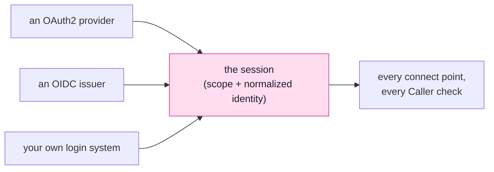
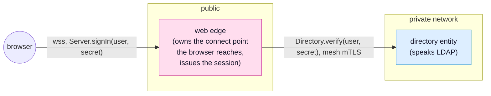

<!-- SPDX-FileCopyrightText: 2026 Alexandre 'kidev' Poumaroux -->
<!-- SPDX-License-Identifier: Apache-2.0 -->

# An identity service of your own

The first two pages of this track each implemented an interface. This one does not,
because there is no `IIdentityProvider`.

A database provider can be swapped because every relational engine does the same job: take
a statement and its parameters, return rows. Authentication has no common job. Login
systems differ in what they make the browser do, what they sign, what they verify, and
what the resulting claim means. One interface for all of them would either be so wide it
guarantees nothing, or so narrow it fits only its author's case.

So SynQt draws the line at the session, not at the login system. A session is a bounded,
revocable record held on the server, carrying a scope and a normalized identity. Anything
before that record can vary; nothing after it does. That is why a connect point's
`scope:` and a slot's `Caller.hasScope()` work the same whoever signed the user in.



So customizing identity means deciding how far up that diagram you must go. There are
three levels, and most systems that think they need the third need only the first.

## Level 1: A provider SynQt has no template for

If your login system speaks OAuth2 or OpenID Connect, as almost every corporate one does,
you write down its endpoints instead of code.

`synqt add auth <name>` scaffolds a generic OpenID Connect block for any issuer. Fill it in
from the issuer's discovery document:

```yaml
identity:
  providers:
    - name: staffsso
      authorize_url: https://sso.internal.example/oauth2/authorize
      token_url: https://sso.internal.example/oauth2/token
      jwks_url: https://sso.internal.example/.well-known/jwks.json
      issuer: https://sso.internal.example
      audience: synqt-app                 # defaults to client_id when omitted
      use_id_token: true                  # identity comes from the verified ID token
      scopes: [openid, email, profile]
      client_id: synqt-app
      client_secret: env:STAFFSSO_SECRET  # edge .env only, never synqt.yaml
```

Note `use_id_token: true`. With it, the identity comes from the ID token, and the edge
verifies the token's signature against the issuer's JWKS before reading any claim. It also
checks the issuer, the audience, and the two claims a session needs, `exp` and `sub`. A
token missing either is refused, never treated as one that never expires or as a visitor
with no name. That is why `issuer` is required with `use_id_token`: without it there is
nothing to compare `iss` against, so the edge refuses the login instead of silently
skipping that check.

Without `use_id_token`, the identity comes from a userinfo endpoint, and you say which raw
field feeds each normalized one:

```yaml
      userinfo_url: https://sso.internal.example/oauth2/userinfo
      sub_field: employee_id              # stable, and never an email
      login_field: username
      name_field: display_name
      email_field: mail
```

Choose `sub_field` carefully. It becomes `identity.sub`, the key for durable data, so it
must survive a rename, a marriage, a department transfer and an email change. If the only
stable value your provider returns is an opaque number, use it instead of a friendlier
field.

The rest of the flow (PKCE, the state parameter, the token exchange, the httpOnly cookie)
is unchanged, and an unusual provider does not make any of it your problem. See
[authentication](authentication.md) for the whole flow.

## Level 2: Your own rules about who someone is

The provider says who signed in. It does not say what they may do here, and should not,
because a scope belongs to your system. The mapping hook translates one into the other,
and most real customization happens there.

`web/edge/identity/map.qml`:

```qml
import SynQt

IdentityMapping {
    // Roles live in the staff directory rather than in this file, so granting someone
    // moderator is a change to data rather than a deploy. `assignments` is a pushed
    // property on a connect point the edge consumes. The directory owns it, the edge
    // already holds the current value, and reading it here costs nothing.
    function scopeFor(identity): int {
        const role = Directory.assignments[identity.sub] ?? "";
        if (role === "owner") {
            return Scope.Admin;
        }
        if (role === "support") {
            return Scope.Moderator;
        }
        // Authenticated, and nothing more. A provider saying who someone is has never
        // been the same as this system saying what they may do.
        return Scope.User;
    }
}
```

Four points about this hook:

- **It runs on the edge after a successful login, and nowhere else.** No browser can reach
  it, and the edge writes its return value into a session record on the server, which the
  browser only sees as an opaque cookie.
- **It is synchronous, which limits how it reads data.** The edge needs a scope before it
  can create the session, so `scopeFor` returns a value and cannot wait. A slot call over
  the mesh does not work: a returning slot gives a promise, and a promise is not a scope.
  A pushed `prop` does work, because a consumer holds its current value locally. Declare
  the role table as `prop var assignments` on the directory's connect point, and let the
  directory replace it when it changes; the edge's copy stays current and the hook is a
  lookup. If a scope needs a round trip, make it in the slot that needs the scope, and
  raise the session there with `Caller.setScope()`.
- **It must handle a missing field.** `identity.email` can be null, because a provider may
  not return one. A hook that authorizes by email grants the wrong scope the day someone
  signs up without one.
- **It returns a member, not a name.** `Scope` is generated from `scopes.order`, so the
  function can only return a scope the project declared. If a directory answers
  `"supervisor"` for a role the project never declared, the hook cannot turn it into a
  scope, so a change in someone else's data cannot change this system's authorization.

## Level 3: A login system that is not OAuth2 at all

The remaining cases have no authorization endpoint, no ID token and nothing to
configure: a staff directory that checks a username and password over LDAP, a hardware
token service, a legacy ticket system.

Treat it as an ordinary entity. Build the login system as an entity with a connect point,
and let the edge consume it. What the entity does inside is not the framework's concern,
just like a database entity's engine.



What the edge exports to the browser carries no secrets and no roles:

```yaml
connect_points:
  - owner: edge
    consumers: [app]
    export: |
      prop bool ready
      slot signIn(string[64] username, string[128] secret)
      signal signedIn()
      signal refused(string[120] reason)
```

`signIn` returns nothing and answers with a signal, because verifying a credential takes
a mesh call, and a mesh call returns a promise. As in the auction, a consumer asks, and the
owner answers when it can.

The directory entity's own point talks to LDAP, and only the edge is on its consumer
list:

```yaml
  - owner: directory
    consumers: [edge]
    export: |
      slot var verify(string[64] username, string[128] secret)
```

The edge that answers this says `shared: false`:

```yaml
entities:
  - name: edge
    type: web_edge
    shared: false     # one Source per session
```

On a shared entity, `Caller` is whoever is calling at that moment, and the answer below
arrives later, after a mesh round trip. Two overlapping sign-ins would raise the scope of
whichever session happened to be calling when the reply arrived. One Source per session
gives the callback a `Caller` that cannot change underneath it.

The edge's Source issues the session:

```qml
import SynQt

Edge {
    id: auth

    ready: true

    function signIn(username, secret) {
        // The credential goes straight to the entity that can check it, and nowhere
        // else. It is not stored, not logged, and not put on a property. The only thing
        // that outlives this call is the session.
        Directory.verify(username, secret).then(person => {
            if (!person.ok) {
                // One message for a bad username and a bad password alike. Two messages
                // is an account enumeration feature.
                Caller.emitRefused("Sign in failed.");
                return;
            }
            // This is the seam. Whatever happened above, the system's state afterwards
            // is a session with a scope and a normalized identity, exactly as an OAuth2
            // login would have left it, so every connect point and every Caller check
            // behaves the same from here.
            Caller.setScope(person.role === "support" ? "moderator" : "user",
                            { sub: person.employeeId, login: username,
                              name: person.displayName, email: person.email });
            Caller.emitSignedIn();
        });
    }
}
```

`Caller.setScope()` rotates the session id as it raises the scope, which prevents session
fixation: the token someone held before signing in is not the one they hold after. The
open connection continues with the new id. The browser still holds the old id in a cookie
no slot can rewrite, so the edge hands it the new one on the next page load; you write
nothing for this. A visitor whose scope you raised keeps it across a refresh, and the old
id is refused as soon as it is rotated away.

Four rules apply, all of them ones SynQt already follows:

- **The owner checks.** `signIn` is a slot on the edge, so it runs on the edge. A client
  cannot call `setScope` and cannot reach `Directory`, whose consumer list has one entry:
  the edge.
- **The identity is normalized.** Fill `sub`, `login`, `name` and `email`, which every hook,
  slot and example reads. `sub` must be stable: an employee number, not a username someone
  will change.
- **The credential is not data.** It arrives as a slot argument, goes to the one entity
  that can verify it, and is never written anywhere: not to a property, a model, a log
  line or a cache key.
- **Rate limiting is your job here.** An OAuth2 provider absorbed brute force attempts for
  you; a `signIn` slot does not. Count failures per session and per address on the edge,
  and refuse past a threshold in the same slot, before the mesh call.

> [!IMPORTANT]
> A password passed to a slot crosses the wire, so this design is acceptable only over
> the `wss` link SynQt requires, to the edge, the one entity facing the internet. That is
> the default; do not make an exception for development convenience. `synqt dev` issues
> real certificates so you never need to.

## Where identity runs

One line moves all of this off the edge and into an entity of its own:

```yaml
identity:
  provider_entity: auth
```

The auth entity then owns the identity and session connect points, and every edge
consumes them over the mesh. Tokens and secrets live in one internal service instead of in
each edge, and all edges share the sessions. Users see no change and no QML changes,
because the edge already reached identity through a connect point. Do this once you have
more than one edge, not before.

## Try it, then think

> [!QUESTION]
> A colleague proposes skipping the edge: the client calls `Directory.verify()` itself and
> sets its own scope from the answer, saving a hop. Two things make this impossible, not
> just unwise. What are they?

<details class="solution" markdown>
<summary>Solution</summary>

**The topology.** Adding `app` to the directory's consumer list fails `synqt check`: a web
edge must own any connect point a client consumes, and the directory is not a web edge. No
configuration lets a browser reach that entity, so the saved hop does not exist.

**A caller does not hold its scope.** A scope is a field on a session record on the
server, set and read by code on the owner. A client that decided its own scope would only
edit a copy. The session the edge consults stays the same, and every scoped connect point
keeps refusing it. The client has no copy of authorization to corrupt, so no smaller
version of this attack works either.

Both come from the same design: the browser is a consumer, and a consumer asks.

</details>

## What you learned

- Identity has no provider interface. In SynQt the session is what stays fixed, not the
  login system, because every other rule is written against the session.
- Most custom authentication is configuration: an OIDC issuer's endpoints, and
  `use_id_token: true` so claims are verified against its JWKS before they are read.
- `sub_field` picks the identifier your data is keyed on for good. Choose the stable one,
  not the readable one.
- The mapping hook holds your rules. It runs only on the edge, may read a connect point
  so roles are data, and must survive a null email.
- A login system that is not OAuth2 is an ordinary entity with an ordinary connect point.
  It plugs into `Caller.setScope()`, which rotates the session as it raises it.
- Either way, the credential never becomes data, the owner checks, and the browser reaches
  exactly one entity.

Go back to [the overview](tutorial-advanced.md), or read [providers](providers.md), the
reference behind the two interfaces this track implemented.
