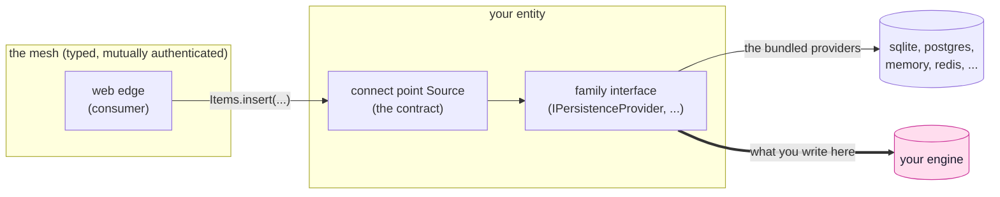

<!-- SPDX-FileCopyrightText: 2026 Alexandre 'kidev' Poumaroux -->
<!-- SPDX-License-Identifier: Apache-2.0 -->

# Adaptors of your own

The other tutorials build apps. This one builds what sits underneath, for when your
system must reach something SynQt does not support: an in-house key value store, a
warehouse database three teams depend on, or your company's single sign-on service.

SynQt has one narrow place for this. An entity has two faces. Facing the system, it is a
connect point: a typed contract, carried over the authenticated mesh and authorized in
every slot. Facing its storage, it is a provider: the only part of the entity that knows
what stores the data. Consumers see only the first face, so the second can be anything,
including code you write.

An adaptor is the lower box: a class that implements one family interface, is registered
under a name, and is selected by one line of configuration. Everything above it stays the
same. The `Items.qml` that ran against SQLite runs against your engine, with the same
`Caller` checks, the same topology that denies by default, and the same guarantee that no
consumer can reach past the entity to its engine.

## What you will learn

- **The boundary:** where a provider sits, why it is the only extension point, and what a
  provider may and may not decide.
- **A full implementation:** a family interface end to end, for both kinds of engine: one
  that speaks SQL through a Qt driver, and one with its own protocol over a socket.
- **Registration:** how `provider.name: custom:YourEngine` finds your adaptor, why
  `custom:` is a namespace, and what happens when a name selects nothing.
- **The provider contract:** parameters passed separately, errors returned instead of
  thrown, credentials only from the entity environment, and a verified connection or none.
- **Engines that do not fit:** some have no transactions, no TLS, or no atomic counters.
  Each case has a right answer, and pretending the engine can do it is never it.
- **Identity:** why authentication is not a provider, and how to integrate a login service
  that is not a standard OAuth2 provider.

## Before you start

Do [the auction](tutorial.md) first, at least through
[a permanent Hall of Fame](tutorial-hall-of-fame.md), so an entity with a database behind
it is familiar. Read [providers](providers.md) for the system you are extending. This track
is C++, not QML, so you should be comfortable reading a class. You need not be a Qt expert;
every Qt type used here links to its documentation.

Following along needs no project. Each page is a complete adaptor you could paste
into an entity, and you can read it without running anything. To run one, use any project
from an earlier tutorial that has a database entity.

## The three parts

1. [A database of your own](tutorial-advanced-database.md): the persistence family, end to
   end, against Microsoft SQL Server through Qt's ODBC driver: connection, verified TLS,
   parameterized statements, transactions and forward only migrations.
2. [A cache of your own](tutorial-advanced-cache.md): the cache family, against Memcached,
   which Qt has no driver for. A wire protocol written by hand, and how to handle an
   engine whose `incr` will not create a counter.
3. [An identity service of your own](tutorial-advanced-identity.md): why authentication
   has no provider interface, the three levels of customization it offers instead, and how
   to put an unfamiliar login system behind the same session and scope model.

> [!NOTE]
> The references are [providers](providers.md) for the families and the selection syntax,
> [entities](entities.md) for what an entity may be,
> [authentication](authentication.md) for the identity model, and
> [security](security.md) for the rules every adaptor inherits.

## When yours works, send it

Someone else will need the same engine, and you have already written the file they need.
Please open a pull request against [the SynQt repository](https://github.com/Kidev/SynQt)
so your adaptor becomes a bundled provider.

That is how the provider list grows. A contributed provider sits beside `postgres` and
`redis`: CI builds it, it is kept working across Qt releases, and `synqt providers` lists
it.

To be accepted, a provider does what this track teaches: it implements the family
interface and nothing more, takes parameters separately, returns errors instead of
throwing, keeps credentials in the entity environment, refuses an unverified connection in
release, and documents what its engine cannot do. The framework adds two rules:

- **A wrapped client library is maintained and license compatible.** It is an upstream
  client the build finds on the system, and its license must be compatible with the other
  modules in the entity.
  That is why the bundled MySQL provider uses MariaDB Connector/C and never Oracle's client;
  [licensing](licensing.md) explains why.
- **It comes with a test.** Every bundled provider has one. Without a test, a provider
  silently breaks on the next Qt release.

The code style and contribution terms, including the CLA, are in
[`CONTRIBUTING.md`](https://github.com/Kidev/SynQt/blob/main/CONTRIBUTING.md). If you are
unsure whether an engine is wanted, open an issue and ask first.
