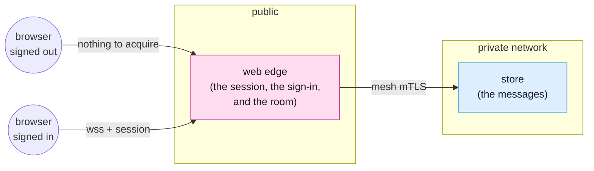

<!-- SPDX-FileCopyrightText: 2026 Alexandre 'kidev' Poumaroux -->
<!-- SPDX-License-Identifier: Apache-2.0 -->

# The simple chat

A line typed in one window appears in every window that has the room open, on any
machine. The live part is one binding, with no polling and no broadcast to write.

Do this tutorial first: it is the whole model in miniature. An owner decides, a consumer
asks, a contract says what may cross, and the browser has no way to reach the database.

## What you will build

A chat room. A visitor who has not signed in sees a sign-in page, and signing in fills
the same window with the room. A moderator can erase a message, and their name shows in
red. The client checks neither of these.



The finished app is
[`examples/chat`](https://github.com/Kidev/SynQt/tree/main/examples/chat). Read it at any
point, or run it if a step goes wrong. The [front page](index.md) shows the same project
file by file.

[Open it in the designer](/designer/#example=demo) to see the finished system before you
build it: the three entities, the lines between them, and the contract on each line. The
designer runs in the browser and changes nothing on your disk.

## What you will learn

- **What a contract carries, and so what it refuses:** a model every consumer mirrors, a
  slot a consumer calls, and a size limit the owner enforces on every value.
- **A model is the whole synchronisation:** reassign the rows on the owner and every
  browser in the room redraws.
- **`Caller`:** the edge decides who said a message and whether they said it as staff.
  The browser never sends either.
- **Two gates outside the client:** a scope on the whole connect point, and a scope on one
  of its members.
- **Columns outside the contract:** a column in the table but not in the contract never
  leaves the mesh.

## Before you start

Install the CLI and the toolchain first; the [quick start](quick-start.md) covers both.
Then create the project:

```cli
synqt new chat --auth github
```

`--auth github` makes the edge the entity that signs people in. The room is behind a
scope, and a scope comes from signing in.

```cli
cd chat
synqt add auth github
synqt add entity store --type relational
synqt dev
```

`synqt add auth` writes the flow, the `identity:` block, the mapping hook at
`web/edge/identity/map.qml`, and the `.env.example` entry. Then it prints the steps only
you can do: register an OAuth app with GitHub, put its client id in `synqt.yaml`, and put
its secret in `web/edge/.env`. See [authentication](authentication.md) for details.

> [!IMPORTANT]
> Keep `synqt dev` running in this terminal for the whole tutorial. It watches your files,
> rebuilds what changed, and issues the development mesh certificates, so the entities
> talk over mutual TLS with no setup.

## Step 1: say what crosses

Open `synqt.yaml`. A connect point has one owner and a list of consumers, and its
`export:` block is everything that crosses it. Start with the point the browser reaches:

```yaml
connect_points:
  - owner: edge
    consumers: [app]
    scope: user
    export: |
      model messages(int id, string[40] who, string[280] body, bool staff)
      slot say(string[280] body)
      <admin> slot erase(int id)
```

Three members:

- **`model messages`** is the room. Its four roles are everything a message can carry to a
  browser.
- **`slot say`** is a request from the browser. `string[280]` is a limit the owner
  enforces at the boundary, not a hint for the text field. The browser sends a line of
  text and nothing else. Who said it is left out of the arguments, because the browser
  does not get to say.
- **`<admin> slot erase`** is a request with a gate on the member. A caller without that
  scope does not have the slot, and the edge refuses the call before it runs, so the QML
  behind it needs no check.

`scope: user` gates the whole point. A session that has not signed in never acquires it,
so it has nothing to reach and nothing to call.

The database stores the room. Add the point it owns:

```yaml
  - owner: store
    consumers: [edge]
    export: |
      prop var[24000] lines
      slot say(string[40] who, string[280] body, bool staff)
      slot erase(int id)
```

`prop lines` is pushed from owner to consumers: the edge can read it but never set it. The
browser is on no consumer list anywhere in this file, and that is why a tab cannot reach
the database. A list does this, not a firewall rule.

## Step 2: the log

Open `db/relational/store/Store.qml`. The type is the entity's name, capitalised.

```qml
import SynQt

// The conversation, and the only thing here that survives a restart.
Store {
    id: log

    function say(who, body, staff) {
        Db.exec("INSERT INTO messages (who, body, staff, said_at) "
                + "VALUES (?, ?, ?, datetime('now'))",
                [who, body, staff ? 1 : 0]);
        log.refresh();
    }

    function erase(id) {
        Db.exec("UPDATE messages SET body = 'deleted by a moderator' WHERE id = ?",
                [id]);
        log.refresh();
    }

    // `said_at` is in the table and in neither the SELECT nor the contract, so it
    // never leaves the mesh. Reassigning `lines` is the whole of the synchronisation.
    function refresh() {
        const rows = Db.query("SELECT id, who, body, staff FROM messages "
                              + "ORDER BY id DESC LIMIT 50");
        log.lines = rows.map(row => ({ id: row.id, who: row.who, body: row.body,
                                       staff: row.staff !== 0 }));
    }

    lines: []

    Component.onCompleted: log.refresh()
}
```

Every value goes in as a parameter, never as part of a string, so an injection attempt
does nothing: the driver receives a query and a list of values, and never parses a value
as SQL.

The code reassigns `log.lines` in one step, and that reassignment is the synchronisation.
The edge mirrors the property, and every browser in the room mirrors what the edge
publishes. It needs no `emit`, no subscriber list, and nothing to remember to call.

Erasing keeps the line in place and says who wrote it and that it was deleted, so the
conversation has no hole in it.

And `db/relational/store/schema.sql`:

```sql
CREATE TABLE IF NOT EXISTS messages (
    id      INTEGER PRIMARY KEY AUTOINCREMENT,
    who     TEXT NOT NULL,
    body    TEXT NOT NULL,
    staff   INTEGER NOT NULL DEFAULT 0,
    said_at TEXT NOT NULL
);

CREATE INDEX IF NOT EXISTS messages_by_time
    ON messages (said_at);
```

`said_at` is in the table but not in the contract: `model messages(...)` lists four roles,
and `said_at` is not one of them. The browser never receives a column it is not told
about, and has no way to ask for it.

## Step 3: the edge

The edge owns the point the browser reaches, so it makes every decision about a message.
Open `web/edge/Edge.qml`:

```qml
import SynQt

// Everything about a message except its text is decided here.
Edge {
    messagesRows: Store.lines

    function say(body) {
        Store.say(Caller.identity.login, body, Caller.hasScope("admin"));
    }

    function erase(id) {
        Store.erase(id);
    }
}
```

`messagesRows: Store.lines` is the live part. Bind the model once and the room is live in
every window: the database reassigns its list, the edge mirrors it, and every browser
redraws.

`Caller` is whoever made this request, taken from the session the edge verified. A browser
cannot read or set it, so `say` takes a line of text and no name. The edge supplies the
other two facts a message needs from something the caller cannot reach.

`Caller.hasScope("admin")` is why a moderator's name shows in red and nobody else's can.
That argument comes from the verified session alone, so an ordinary user cannot speak as a
moderator.

`erase` needs no check: the contract gates the member, so a caller without `<admin>` does
not have it.

## Step 4: the window

The client has four files, split so each stays short. Open `client/app/Main.qml`: one
window, whose content depends on the session:

```qml
import SynQt
import QtQuick.Controls
import QtQuick.Layouts

// One window, and two things in it, the sign-in a signed-out visitor gets, and the room
// everybody else does. Neither is a page and neither is a route, because the room's connect
// point is gated `scope: user` and a signed-out session never acquires it.
ApplicationWindow {
    id: window

    visible: true
    title: qsTr("The chat room")

    ColumnLayout {
        anchors.centerIn: parent
        visible: !Session.hasScope("user")
        spacing: 24

        Label {
            Layout.alignment: Qt.AlignHCenter
            font.pixelSize: 32
            text: qsTr("One room. Everybody in it sees the same thing.")
        }

        Button {
            Layout.alignment: Qt.AlignHCenter
            text: qsTr("Sign in with GitHub")
            onClicked: Session.login()
        }
    }

    User {
        anchors.fill: parent
        visible: Session.hasScope("user")
    }
}
```

`User.qml`, beside it, is the room: the messages and a line to add one.

```qml
import SynQt
import QtQuick.Controls
import QtQuick.Layouts

// The room: everything a signed-in caller has. Each row is a Message.
ColumnLayout {
    ListView {
        id: messages

        Layout.fillHeight: true
        Layout.fillWidth: true
        clip: true
        model: Server.messages

        delegate: Message {
            width: messages.width
        }
    }

    TextField {
        id: draft

        Layout.fillWidth: true
        placeholderText: qsTr("Say something")
        onAccepted: {
            Server.say(draft.text);
            draft.clear();
        }
    }
}
```

`Message.qml` draws one row: who said it, what they said, and the moderator's button.

```qml
import SynQt
import QtQuick.Controls

Item {
    id: line

    // The row rather than its roles, because `id` cannot be a property of its own.
    required property var model

    height: 26

    Label {
        x: 8
        y: (line.height - height) / 2
        width: 132
        elide: Text.ElideRight
        color: line.model.staff ? "#d0342c" : line.palette.windowText
        text: line.model.who
    }

    Label {
        x: 148
        y: (line.height - height) / 2
        width: line.width - 148 - 88
        elide: Text.ElideRight
        text: line.model.body
    }

    Admin {
        x: line.width - width - 8
        height: line.height
        messageId: line.model.id
    }
}
```

`Admin.qml` is the one control a moderator has and nobody else does:

```qml
import SynQt
import QtQuick.Controls

Button {
    id: control

    // Which message this erases. The row hands it down. A delegate is recycled, so the
    // button cannot know on its own which line it is sitting on.
    required property int messageId

    visible: Session.hasScope("admin")
    text: qsTr("Erase")
    onClicked: Server.erase(control.messageId)
}
```

Each file beside `Main.qml` is a type named after it, with nothing to import or register.
`synqt build` compiles every `*.qml` in the client entity's directory into one QML module,
so `User`, `Message` and `Admin` are available as soon as the files exist.

`Server` is the client's name for its edge. `Server.messages` is the model, passed straight
to a `ListView`. `Session.hasScope(...)` is an ordinary binding, so the moment the session
is elevated the sign-in part disappears and the room appears, with no reload and no
navigation to write.

The delegate reads its row through `required property var model` instead of one property
per role, because one role is called `id`, which QML reserves for the object's own id.

The two `hasScope` lines (in `Main.qml` and `Admin.qml`) are courtesies, not gates. A
signed-out visitor is stopped because their session never acquired the point. An ordinary
user cannot erase because `erase` is not a member of the surface they acquired. Delete
both lines and neither fact changes.

Last, decide who is a moderator. Open `web/edge/identity/map.qml`, the only place in the
project that decides it:

```qml
import SynQt

IdentityMapping {
    id: mapping

    readonly property var moderators: ["octocat"]

    function scopeFor(identity): int {
        return mapping.moderators.indexOf(identity.login) >= 0
            ? Scope.Admin : Scope.User;
    }
}
```

Put your own GitHub login in that list, sign in, and your name in the room turns red.

## Three things to try

Each takes a minute and shows a boundary at work.

**A line that is too long.** Open the browser's console on the room and call
`Server.say("x".repeat(500))`. The contract says `string[280]`, so the owner's boundary
refuses the value instead of truncating it. Nothing reaches the table.

**Erasing as an ordinary user.** Sign in as somebody not in the `moderators` list, open the
console, and call `Server.erase(1)`. `Server.erase` is undefined: the contract gates
`erase` with `<admin>`, so it is not a member of the surface this session acquired.

**The browser reaching the database.** Add `app` to the `store` point's consumers:

```yaml
  - owner: store
    consumers: [edge, app]
```

Then run:

```cli
synqt check
```

It fails: a web edge must own any connect point a browser consumes, because a browser can
reach nothing else. Remove `app` from the list before you continue.

## Where to go next

- [The auction](tutorial.md) is the next tutorial: the same shape, with a rule the owner
  enforces, more scopes, and a permanent Hall of Fame.
- [Programming model](programming-model.md) is the reference behind this page: connect
  points, contracts, `Caller`, and each kind of member. It also covers `behind:`, which
  hands each caller to a different entity by scope, so the code behind a privileged
  action can live in a binary ordinary callers never reach.
- [Security](security.md) covers the two identity systems, the delivery gate that serves a
  signed-out visitor a different application, and why neither the browser nor the
  internet can reach the database.
- [The visual editor](visual-editor.md) is the designer linked at the top. Open the chat
  there, add an entity, and export the result as a project.
