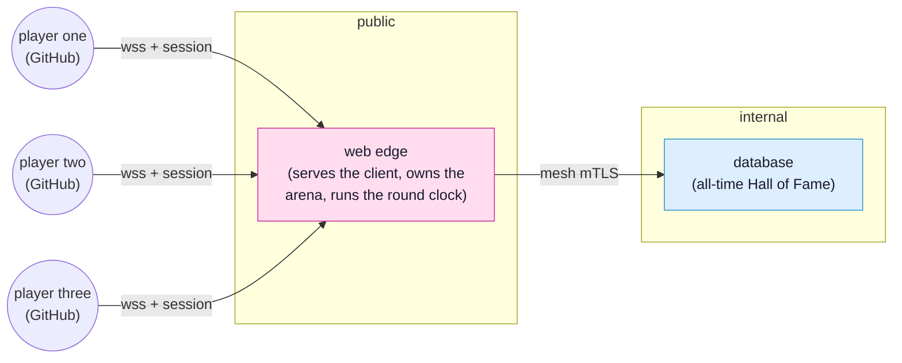

# A multiplayer game

In [the auction](tutorial.md) you shared a few live values between a browser and a
web edge. A multiplayer game is the same idea at a larger scale: many browsers, one
shared world, everyone seeing everyone else move in real time. You already know the pieces
(a contract, a connect point, `Caller`, sign in, scopes, a database); this tutorial
puts them under a live arena.

Goal: build a small [agar.io](https://agar.io)-style game. Every signed in player is
a blob on a shared map. You drift around eating scattered pellets to grow, and you
can swallow any player smaller than you. A live scoreboard shows the biggest blobs on
the map right now. Every ten minutes the round resets, and whoever was biggest earns
one permanent point in an all-time Hall of Fame that survives restarts. And you
cannot cheat your way across the map: the edge owns every blob's position and moves
it itself, so a hostile client can neither teleport nor outrun its own size.

> [!NOTE]
> A 2D blob world is simple enough that the edge can be the **real** authority over
> movement rather than an approximation. The client never sends its position; it sends
> only where it would *like* to go, and the edge advances every blob itself at the
> speed that blob's mass allows. That rules out an entire category of cheats:
> there is no position to forge, because the client never reports one. And because the
> view is a window onto the arena rather than the whole map, this tutorial builds the
> three techniques that make a networked game feel right and scale: **client-side
> prediction** so your own blob tracks your cursor instantly, **entity interpolation**
> so everyone else moves smoothly between snapshots, and **interest management** so the
> edge sends each player only what they can see. The owner stays the sole authority
> throughout; what remains after all three (input replay reconciliation, lag
> compensation, splitting) is in the
> [further reading](tutorial-multiplayer-run.md#netcode-gets-hard-fast). It is the
> auction's rule with more players: a consumer asks, the owner decides.

Here is the shape of it: many players against one edge, with a database behind the
edge holding the permanent scores.



The whole live arena lives in the edge's memory, which is all a fast game needs. Only
the permanent leaderboard is durable, so it gets a database, reached by the edge and
never by the browser, exactly as in [the Hall of Fame](tutorial-hall-of-fame.md).

This tutorial is in five parts: this overview and the starting scene, then
[the arena the edge owns](tutorial-multiplayer-world.md) (the edge side),
[see the others](tutorial-multiplayer-client.md) (the client: camera, prediction, and
smoothing), [the round and the Hall of Fame](tutorial-multiplayer-rounds.md) (a ten
minute round and a database), and finally
[only what you can see](tutorial-multiplayer-run.md) (interest management, and where to
go next).

## Before you start

Do [Getting started](getting-started.md) first. It helps a lot to have done at least
[the base auction](tutorial-base-auction.md) so connect points and `Caller` are
familiar, and [the Hall of Fame](tutorial-hall-of-fame.md) so the database entity is
not new when it arrives in part four. You will need a GitHub account, and a second
GitHub account (or a willing friend) to actually see two blobs at once.

Create the project and leave `synqt dev` running for the whole tutorial:

```cli
synqt new arena
cd arena
synqt dev
```

Answer no to authentication and no to starting entities; you will add GitHub sign in
yourself in part two and the database in part four.

## Start from an empty arena

The client is a square view onto the world, and, like agar.io, it is a *camera*: it
shows only a window of the map, centered on your own blob, not the whole thing. The
world point at the middle of the view is `(myX, myY)`; every other point is placed by
offsetting from it and scaling by a zoom that grows a little with your size. For now
the camera sits still at the middle of the map with a single blob; the next parts make
it move and fill it with players.

Replace `client/Main.qml` with this starting scene:

```qml
// client/Main.qml
import QtQuick
import QtQuick.Controls
import SynQt                       // the new import: Server, Session, and contracts

ApplicationWindow {
    id: root

    visible: true
    width: 900
    height: 700
    title: qsTr("Arena")
    color: "#0d1020"                              // matches the field, for the HUD around it

    readonly property real world: 4000            // the arena is 4000 x 4000 units

    // The camera: the world point at the centre of the view. For now it sits at the
    // middle of the map; in part three it tracks your own blob as you predict it.
    property real myX: world / 2
    property real myY: world / 2
    property real myMass: 10

    // How much world the view shows across; smaller is more zoomed in. It grows with
    // your mass, so a bigger blob sees more of the map, the way agar.io does.
    function viewWorld(mass) { return 900 + Math.sqrt(mass) * 90 }
    function radiusFor(mass) { return 6 + Math.sqrt(mass) * 3 }

    Rectangle {
        id: view
        anchors.centerIn: parent
        width: Math.min(parent.width, parent.height)
        height: width
        color: "#0d1020"
        clip: true

        // world units -> pixels at the current zoom, with (myX,myY) at the centre.
        readonly property real zoom: width / root.viewWorld(root.myMass)
        function sx(wx) { return (wx - root.myX) * zoom + width / 2 }
        function sy(wy) { return (wy - root.myY) * zoom + height / 2 }

        // A grid that scrolls under the camera, so your motion is visible even alone.
        Canvas {
            id: grid
            anchors.fill: parent
            Connections {
                target: root
                function onMyXChanged() { grid.requestPaint() }
                function onMyYChanged() { grid.requestPaint() }
                function onMyMassChanged() { grid.requestPaint() }
            }
            onPaint: {
                const ctx = getContext("2d"); ctx.reset()
                ctx.strokeStyle = "#182042"; ctx.lineWidth = 1
                const step = 200 * view.zoom
                const mod = (a, n) => ((a % n) + n) % n
                for (let x = mod(view.sx(0), step); x < width; x += step) {
                    ctx.beginPath(); ctx.moveTo(x, 0); ctx.lineTo(x, height); ctx.stroke() }
                for (let y = mod(view.sy(0), step); y < height; y += step) {
                    ctx.beginPath(); ctx.moveTo(0, y); ctx.lineTo(width, y); ctx.stroke() }
            }
        }

        // You, always at the centre of your own view.
        Rectangle {
            readonly property real r: root.radiusFor(root.myMass) * view.zoom
            width: 2 * r; height: 2 * r; radius: r
            x: view.width / 2 - r
            y: view.height / 2 - r
            color: "#5cd6a0"
            border.color: "white"; border.width: 2
        }
    }
}
```

Save the file and the browser reloads to a dark square with a scrolling grid and a
green blob at the centre. That is your starting point, and your own blob's home: it
stays centered while the world moves around it. In the next part the edge grows a real
arena behind it.
