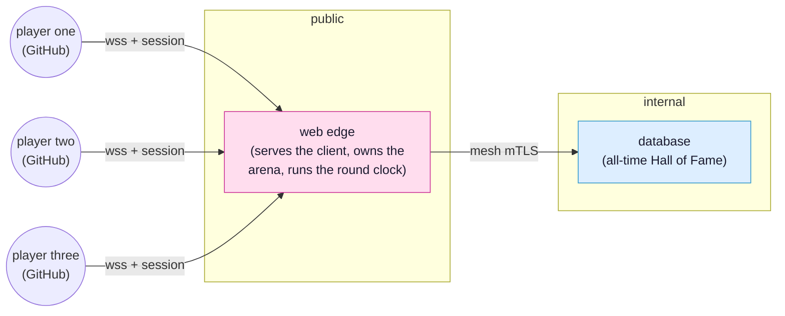

<!-- SPDX-FileCopyrightText: 2026 Alexandre 'kidev' Poumaroux -->
<!-- SPDX-License-Identifier: Apache-2.0 -->

# A multiplayer game

In [the auction](tutorial.md) you shared a few live values between a browser and a web
edge. A multiplayer game is the same idea at a larger scale: many browsers, one shared
world, and everyone sees everyone else move in real time. You already know the pieces (a
contract, a connect point, `Caller`, sign-in, scopes, a database). This tutorial puts
them under a live arena.

Goal: a small [agar.io](https://agar.io) style game. Every signed-in player is a blob on a
shared map. You move around eating pellets to grow, and you can swallow any player smaller
than you. A live scoreboard shows the biggest blobs on the map. Every ten minutes the
round resets, and the biggest player earns one point in an all-time Hall of Fame that
survives restarts. The edge owns every blob's position and moves it itself, so a hostile
client can neither teleport nor move faster than its size allows.

> [!NOTE]
> A 2D blob world is simple enough for the edge to own movement completely. The client
> sends where it wants to go, never its position, and the edge moves every blob at the
> speed its mass allows. With no position to report, the client has none to forge, which
> rules out a whole class of cheats.
>
> The view shows a window of the arena, not the whole map, so this tutorial builds three
> techniques that make a networked game feel right and scale:
>
> - **Client side prediction:** your own blob follows your cursor at once.
> - **Entity interpolation:** everyone else moves smoothly between snapshots.
> - **Interest management:** the edge sends each player only what they can see.
>
> The owner stays the only authority throughout. What these three leave out (input
> replay reconciliation, lag compensation, splitting) is in the
> [further reading](tutorial-multiplayer-run.md#netcode-gets-hard-fast). This is the
> auction's rule with more players: a consumer asks, and the owner decides.

Many players connect to one edge, and a database behind the edge keeps the permanent
scores.


```mermaid
flowchart LR
  p1(("player one<br/>(GitHub)"))
  p2(("player two<br/>(GitHub)"))
  p3(("player three<br/>(GitHub)"))
  p1 -->|"wss + session"| web
  p2 -->|"wss + session"| web
  p3 -->|"wss + session"| web
  subgraph public
    web["<span style='color:#1a1a2e'>web edge<br/>(serves the client, owns the<br/>arena, runs the round clock)</span>"]
  end
  subgraph internal
    db["<span style='color:#1a1a2e'>database<br/>(all-time Hall of Fame)</span>"]
  end
  web -->|"mesh mTLS"| db
  style web fill:#fde,stroke:#c39,color:#1a1a2e
  style db fill:#def,stroke:#39c,color:#1a1a2e
```

The live arena lives in the edge's memory, which is all a fast game needs. Only the
permanent leaderboard must last, so it goes in a database that the edge reaches and the
browser never does, as in [the Hall of Fame](tutorial-hall-of-fame.md).

[Open it in the designer](/designer/#example=arena) to see the finished system before you
build it: the entities, the links, and the contract on each line. The designer runs in
the browser and changes nothing on your disk.

## What you will learn

- **A simulation on the owner:** a fixed tick advances the whole world, and consumers
  see the result instead of driving it.
- **Authority by contract shape:** the client sends an aim point, never a position, so the
  client has no position to forge, and no rule is needed.
- **Client side prediction:** your blob moves the moment you point, and your guess never
  becomes the truth.
- **Entity interpolation:** everyone else moves smoothly between snapshots that arrive
  ten times a second, instead of jumping on each one.
- **Interest management:** with `shared: false` on the edge, one simulation serves
  everybody while each browser gets only the slice it can see.
- **Fan-out cost:** what it costs to publish to N consumers, and where one edge stops
  scaling.
- **Rounds and a leaderboard:** a round clock on the edge, and a permanent leaderboard in
  a database entity the browser never reaches.

The tutorial has five parts:

1. This overview and the starting scene.
2. [The arena the edge owns](tutorial-multiplayer-world.md): the edge side.
3. [See the others](tutorial-multiplayer-client.md): the client's camera, prediction and
   smoothing.
4. [The round and the Hall of Fame](tutorial-multiplayer-rounds.md): a ten minute round
   and a database.
5. [Only what you can see](tutorial-multiplayer-run.md): interest management, and where to
   go next.

## Before you start

Do [Getting started](getting-started.md) first. It also helps to have done
[the base auction](tutorial-base-auction.md), for connect points and `Caller`, and
[the Hall of Fame](tutorial-hall-of-fame.md), for the database entity in part four. You
need a GitHub account, plus a second account (or a friend) to see two blobs at once.

Create the project and leave `synqt dev` running for the whole tutorial:

```cli
synqt new arena
cd arena
synqt dev
```

`synqt new` asks nothing and scaffolds the defaults: a client, a web edge, no
authentication and no other entities. You add GitHub sign-in in part two and the database
in part four.
([`synqt create`](build-system-and-cli.md#scaffolding-a-project-synqt-new-and-synqt-create)
does the same but asks these as questions.)

## Start from an empty arena

The client is a square view onto the world. As in agar.io, it is a camera: it shows a
window of the map centered on your blob, not the whole map. The world point at the middle
of the view is `(myX, myY)`. Every other point is offset from it and scaled by a zoom that
grows a little with your size. For now the camera stays at the middle of the map with one
blob; the next parts make it move and add players.

Replace `client/app/Main.qml` with this starting scene:

```qml
// client/app/Main.qml
import SynQt                       // the new import: Server, Session, and contracts
import QtQuick.Controls

ApplicationWindow {
    id: root

    visible: true
    width: 900
    height: 700
    title: "Arena"
    color: "#0d1020"                              // matches the field, for the HUD around it

    readonly property real world: 4000            // the arena is 4000 x 4000 units

    // The camera, the world point at the centre of the view. For now it sits at the
    // middle of the map. In part three it tracks your own blob as you predict it.
    property real myX: world / 2
    property real myY: world / 2
    property real myMass: 10

    // How much world the view shows across, and smaller is more zoomed in. It grows with
    // your mass, so a bigger blob sees more of the map, the way agar.io does.
    function viewWorld(mass) { return 900 + Math.sqrt(mass) * 90; }
    function radiusFor(mass) { return 6 + Math.sqrt(mass) * 3; }

    Rectangle {
        id: view
        anchors.centerIn: parent
        width: Math.min(parent.width, parent.height)
        height: width
        color: "#0d1020"
        clip: true

        // world units -> pixels at the current zoom, with (myX,myY) at the centre.
        readonly property real zoom: width / root.viewWorld(root.myMass)
        function sx(wx) { return (wx - root.myX) * zoom + width / 2; }
        function sy(wy) { return (wy - root.myY) * zoom + height / 2; }

        // A grid that scrolls under the camera, so your motion is visible even alone.
        Canvas {
            id: grid
            anchors.fill: parent

            // A Canvas does not repaint when a value its onPaint reads changes, so the
            // two values this drawing depends on are bindings that ask for one.
            readonly property point origin: Qt.point(view.sx(0), view.sy(0))
            readonly property real step: 200 * view.zoom

            onOriginChanged: grid.requestPaint()
            onStepChanged: grid.requestPaint()
            onPaint: {
                const ctx = getContext("2d"); ctx.reset();
                ctx.strokeStyle = "#182042"; ctx.lineWidth = 1;
                const mod = (a, n) => ((a % n) + n) % n;
                for (let x = mod(grid.origin.x, grid.step); x < width; x += grid.step) {
                    ctx.beginPath(); ctx.moveTo(x, 0); ctx.lineTo(x, height); ctx.stroke(); }
                for (let y = mod(grid.origin.y, grid.step); y < height; y += grid.step) {
                    ctx.beginPath(); ctx.moveTo(0, y); ctx.lineTo(width, y); ctx.stroke(); }
            }
        }

        // You, always at the centre of your own view.
        Rectangle {
            readonly property real r: root.radiusFor(root.myMass) * view.zoom
            width: 2 * r; height: 2 * r; radius: r
            x: view.width / 2 - r
            y: view.height / 2 - r
            color: "#5cd6a0"
            border.color: "white"; border.width: 2
        }
    }
}
```

Save the file. The browser reloads to a dark square with a grid and a green blob in the
middle. That is your blob, and it stays centered while the world moves around it. In the
next part the edge builds a real arena behind it.
