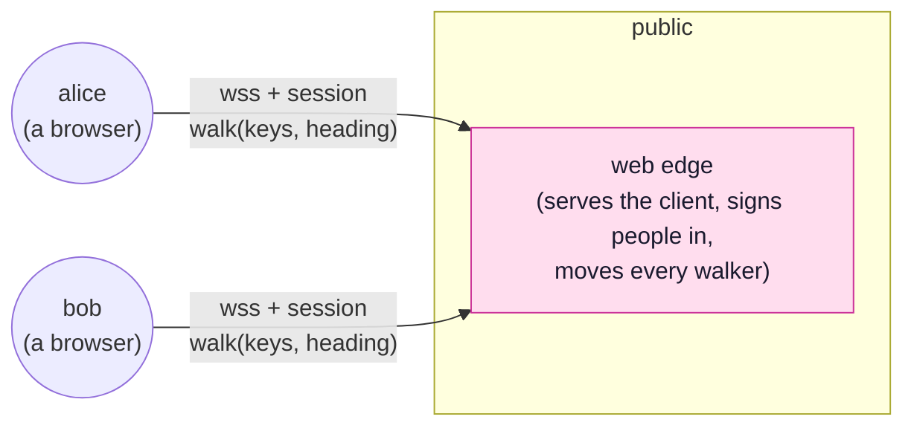

<!-- SPDX-FileCopyrightText: 2026 Alexandre 'kidev' Poumaroux -->
<!-- SPDX-License-Identifier: Apache-2.0 -->

# A 3D plaza

The [multiplayer game](tutorial-multiplayer.md) is a flat arena seen from above. Here you
stand in it. Every signed-in person is a figure in a walled square, drawn in
[Qt Quick 3D](https://doc.qt.io/qt-6/qtquick3d-index.html) from a cylinder, a sphere and a
box, with their name floating overhead. You walk with the keyboard, turn by dragging, and
stop when you hit a wall, a pillar or another person.

The movement comes from Qt's
[CharacterController example](https://doc.qt.io/qt-6/qtquick3dphysics-charactercontroller-example.html):
a `CharacterController` from
[Qt Quick 3D Physics](https://doc.qt.io/qt-6/qtquick3dphysics-index.html) carries the
camera and is driven by WASD and the mouse. This tutorial adds everybody else, and an edge
that decides where they all stand.

> [!NOTE]
> The edge owns every position, as in the multiplayer game: a browser sends what its keys
> ask for and which way it faces, and the edge moves the walker. The edge leaves Qt Quick
> 3D Physics out of this. `PhysicsWorld` steps in lockstep with rendering, and an edge
> renders nothing, so the edge keeps the rules that matter (walking speed, the walls, the
> pillars, and nobody standing inside anybody else) in a few lines of 2D arithmetic, seen
> from above. The browser runs the real physics against the same walls, pillars and
> people, so your walker moves the moment a key goes down and stops where the edge will
> stop it. When the two disagree, the edge wins.



There are two entities: the client, which draws the plaza and predicts your walker, and
the edge, which owns the plaza. The plaza needs no database, because nothing about a walk
in a square must survive a restart. [Where to go next](tutorial-plaza-run.md#where-to-go-next)
adds one.

The finished project is
[`examples/plaza`](https://github.com/Kidev/SynQt/tree/main/examples/plaza).
[Open it in the designer](/designer/#example=plaza) to see its shape before you build it.
The designer runs in the browser and changes nothing on your disk.

## What you will learn

- **3D in the client:** using Qt Quick 3D and Qt Quick 3D Physics, what `synqt build` links
  for them, and how they change the client's license.
- **Physics in a browser:** the one line Qt Quick 3D Physics needs there, and why.
- **Authority without the engine:** how the edge owns positions in a 3D world without
  running the physics engine, and how the client's physics and the edge's arithmetic
  agree.
- **Colliding with snapshots:** how a `CharacterController` collides with people it knows
  only from snapshots, through kinematic bodies moved by those snapshots.
- **Labels in 3D:** drawing a 2D label in a 3D scene so it always faces the camera.
- **Testing alone:** running a multiplayer app as two named people in two tabs of one
  browser.

The tutorial has four parts:

1. This overview and the starting scene.
2. [The plaza the edge owns](tutorial-plaza-edge.md): the contract, the sign-in and the
   edge.
3. [Everyone else](tutorial-plaza-others.md): the client draws the others and their
   names, and predicts your walker.
4. [Two people, one plaza](tutorial-plaza-run.md): running it, and trying to break it.

## Before you start

Do [Getting started](getting-started.md) first. This tutorial assumes you know prediction
and interpolation, which [the multiplayer game](tutorial-multiplayer.md) explains in
detail, but it does not use anything built there.

The client imports two Qt modules no other tutorial uses, so both Qt kits need them.
Create the project, then check what is missing:

```cli
synqt new plaza --auth github
cd plaza
synqt doctor
```

Once the client imports `QtQuick3D`, `synqt doctor` checks both kits for `qtquick3d`,
`qtquick3dphysics`, `qtquicktimeline` and `qtshadertools`, and prints the `aqt` command
that installs the missing ones. It reads the client's imports, as the build does, so run
it again after the first step below. Then leave `synqt dev` running for the rest of the
tutorial:

```cli
synqt dev
```

> [!IMPORTANT]
> Qt Quick 3D and Qt Quick 3D Physics are GPLv3 under open source Qt, with no LGPL option.
> The browser client is GPLv3 anyway (the Qt for WebAssembly port is), so nothing changes
> there. A native desktop build of this client is GPLv3 too, where a 2D client would be
> LGPLv3. `synqt build` links both modules, so it lists them in the client's
> `THIRD-PARTY-LICENSES`. See [licensing](licensing.md).

## Start from a square to walk in

Three files, all in `client/app/`. The first is the square. Every wall and pillar is a
`StaticRigidBody` (which the physics treats as immovable) holding the `Model` that draws
it. The sizes match the ones the edge enforces in the next part.

```qml
// client/app/Square.qml
import SynQt
import QtQuick3D
import QtQuick3D.Physics

Node {
    id: square

    required property real half
    required property real pillarHalf
    required property var pillars

    readonly property real wallHeight: 120
    readonly property real wallThickness: 40

    // The ground. A plane is infinite for the physics, and the model is the part you see.
    StaticRigidBody {
        eulerRotation.x: -90
        collisionShapes: PlaneShape {}

        Model {
            source: "#Rectangle"
            scale: Qt.vector3d(square.half / 50, square.half / 50, 1)
            materials: PrincipledMaterial {
                baseColor: "#39406a"
                roughness: 0.9
            }
        }
    }

    // Four walls, one per side, standing just outside the square.
    Repeater3D {
        model: [Qt.vector3d(0, 0, -1), Qt.vector3d(0, 0, 1),
                Qt.vector3d(-1, 0, 0), Qt.vector3d(1, 0, 0)]

        delegate: StaticRigidBody {
            id: wall

            required property vector3d modelData

            readonly property real across: 2 * (square.half + square.wallThickness)

            position: Qt.vector3d(
                wall.modelData.x * (square.half + (square.wallThickness / 2)),
                square.wallHeight / 2,
                wall.modelData.z * (square.half + (square.wallThickness / 2)))
            collisionShapes: BoxShape {
                extents: wall.modelData.x === 0
                         ? Qt.vector3d(wall.across, square.wallHeight, square.wallThickness)
                         : Qt.vector3d(square.wallThickness, square.wallHeight, wall.across)
            }

            Model {
                source: "#Cube"
                scale: wall.modelData.x === 0
                       ? Qt.vector3d(wall.across / 100, square.wallHeight / 100,
                                     square.wallThickness / 100)
                       : Qt.vector3d(square.wallThickness / 100, square.wallHeight / 100,
                                     wall.across / 100)
                materials: PrincipledMaterial {
                    baseColor: "#8a90c0"
                    roughness: 0.8
                }
            }
        }
    }

    // The pillars, square from above like the edge's, and three times a walker's height.
    Repeater3D {
        model: square.pillars

        delegate: StaticRigidBody {
            id: pillar

            required property var modelData

            position: Qt.vector3d(pillar.modelData.x, 240, pillar.modelData.z)
            collisionShapes: BoxShape {
                extents: Qt.vector3d(2 * square.pillarHalf, 480, 2 * square.pillarHalf)
            }

            Model {
                source: "#Cube"
                scale: Qt.vector3d(square.pillarHalf / 50, 4.8, square.pillarHalf / 50)
                materials: PrincipledMaterial {
                    baseColor: "#d7dafa"
                    roughness: 0.7
                }
            }
        }
    }
}
```

The built-in meshes (`#Rectangle`, `#Cube`, `#Cylinder`, `#Sphere`) are 100 units across,
so every `scale` is a size divided by 100. The unit is the centimetre, Qt Quick 3D
Physics' default, so a walker is 1.6 m tall and walks at 3.5 m/s.

The second file is a person, made of three shapes: a cylinder for the body, a sphere for
the head, and a flat box on the front of the head that shows which way they face. Their
name floats overhead, as a plain `Text` item inside the 3D scene.

```qml
// client/app/Walker.qml
import SynQt
import QtQuick3D

Node {
    id: walker

    required property string name
    required property int hue
    // How far the camera is turned from the way this walker faces, in degrees. The name tag
    // turns by it, so it always faces the camera and never reads backwards.
    property real facingCamera: 0

    readonly property color skin: Qt.hsla(walker.hue / 360, 0.55, 0.55, 1)

    Model {
        source: "#Cylinder"
        y: -25
        scale: Qt.vector3d(0.6, 1.1, 0.6)
        materials: PrincipledMaterial {
            baseColor: walker.skin
            roughness: 0.6
        }
    }

    Model {
        source: "#Sphere"
        y: 58
        scale: Qt.vector3d(0.5, 0.5, 0.5)
        materials: PrincipledMaterial {
            baseColor: Qt.lighter(walker.skin, 1.35)
            roughness: 0.5
        }
    }

    // On the front of the head. Forward is -z, the way a CharacterController walks.
    Model {
        source: "#Cube"
        position: Qt.vector3d(0, 62, -22)
        scale: Qt.vector3d(0.32, 0.09, 0.08)
        materials: PrincipledMaterial {
            baseColor: "#1b2036"
            roughness: 0.2
        }
    }

    // A 2D item in the 3D scene is drawn in its node's XY plane, one unit per pixel, and
    // its y runs up the screen. So the label sits above the node's origin, centred on it.
    Node {
        y: 110
        eulerRotation.y: walker.facingCamera

        Text {
            x: -width / 2
            y: -height
            color: "white"
            font.pixelSize: 26
            font.bold: true
            style: Text.Outline
            styleColor: "black"
            text: walker.name
        }
    }
}
```

The third is the window. For now you are alone in the square: a `CharacterController` with
a `Walker` and a camera inside it, moved by the keys. Replace `client/app/Main.qml` with
it:

```qml
// client/app/Main.qml
import SynQt
import QtQuick.Controls
import QtQuick3D
import QtQuick3D.Physics

ApplicationWindow {
    id: root

    // The layout and the rules. The edge will hold the same numbers.
    readonly property real half: 1200
    readonly property real radius: 30
    readonly property real speed: 350
    readonly property real pillarHalf: 60
    readonly property var pillars: [
        {"x": -500, "z": -500}, {"x": 500, "z": -500},
        {"x": -500, "z": 500}, {"x": 500, "z": 500}
    ]

    // What the controls ask for. Forward and sideways in -1..1, and the way you face.
    property bool up: false
    property bool down: false
    property bool left: false
    property bool right: false
    readonly property real forward: (root.up ? 1 : 0) - (root.down ? 1 : 0)
    readonly property real side: (root.right ? 1 : 0) - (root.left ? 1 : 0)
    property real heading: 0

    // One key, down or up. Arrows and WASD both walk, Q and E turn.
    function press(event: var, held: bool): void {
        if (event.isAutoRepeat) {
            return;
        }
        switch (event.key) {
        case Qt.Key_W:
        case Qt.Key_Up:
            root.up = held;
            break;
        case Qt.Key_S:
        case Qt.Key_Down:
            root.down = held;
            break;
        case Qt.Key_A:
        case Qt.Key_Left:
            root.left = held;
            break;
        case Qt.Key_D:
        case Qt.Key_Right:
            root.right = held;
            break;
        case Qt.Key_Q:
            if (held) {
                root.heading += 15;
            }
            break;
        case Qt.Key_E:
            if (held) {
                root.heading -= 15;
            }
            break;
        default:
            return;
        }
        event.accepted = true;
    }

    // Give the keys to the controls. Cleared and taken again rather than taken once, because
    // of how the browser build reads the keyboard: Qt gives the page's keyboard focus to its
    // window only when the item with focus changes, and a click on the page takes that
    // focus back. So every click hands focus over again, and the keys follow it.
    function takeKeys(): void {
        controls.focus = false;
        controls.forceActiveFocus();
    }

    visible: true
    width: 1100
    height: 700
    title: qsTr("The plaza")

    PhysicsWorld {
        numThreads: 0
        scene: view.scene
    }

    View3D {
        id: view

        anchors.fill: parent
        camera: camera

        environment: SceneEnvironment {
            antialiasingMode: SceneEnvironment.MSAA
            backgroundMode: SceneEnvironment.Color
            clearColor: "#141a33"
        }

        DirectionalLight {
            eulerRotation: Qt.vector3d(-50, -35, 0)
            ambientColor: "#50546e"
        }

        Square {
            half: root.half
            pillarHalf: root.pillarHalf
            pillars: root.pillars
        }

        CharacterController {
            id: me

            position: Qt.vector3d(0, 90, 0)
            eulerRotation.y: root.heading
            gravity: Qt.vector3d(0, -981, 0)
            movement: Qt.vector3d(root.side * root.speed, 0, -root.forward * root.speed)
            collisionShapes: CapsuleShape {
                diameter: 2 * root.radius
                height: 100
            }

            Walker {
                name: qsTr("you")
                hue: 150
            }

            // Behind and above, looking over your shoulder. A child of the controller, so it
            // follows you and turns when you do.
            PerspectiveCamera {
                id: camera

                position: Qt.vector3d(0, 240, 480)
                eulerRotation.x: -18
                clipNear: 10
                clipFar: 10000
            }
        }
    }

    // The controls. A layer over the scene that takes the keys, and a drag across it turns.
    Item {
        id: controls

        anchors.fill: parent

        Keys.onPressed: event => root.press(event, true)
        Keys.onReleased: event => root.press(event, false)

        TapHandler {
            onTapped: root.takeKeys()
        }

        DragHandler {
            id: turning

            property real from: 0

            target: null
            onActiveChanged: {
                if (turning.active) {
                    turning.from = root.heading;
                    root.takeKeys();
                }
            }
            onTranslationChanged: root.heading = turning.from - (turning.translation.x * 0.3)
        }
    }

    Label {
        anchors { bottom: parent.bottom; horizontalCenter: parent.horizontalCenter; margins: 12 }
        color: "#d7dafa"
        text: qsTr("Click, then WASD or the arrows to walk, drag or Q and E to turn")
    }
}
```

Save. The browser reloads to the square, with you in the middle. Click the page to give it
the keyboard, then walk. You stop at the walls and pillars, and slide along them when you
hit them at an angle. Qt Quick 3D Physics does all of that.

Three details are specific to a browser or to physics:

- **`numThreads: 0`** is the one line Qt Quick 3D Physics needs in a browser. By default it
  steps the simulation on worker threads. The single threaded WebAssembly build cannot
  start them, so nothing moves. The multi threaded build starts them, then blocks the
  page's only UI thread waiting for them, so the page freezes. Zero steps on the calling
  thread and works on both.
  [`tests/wasm-quick3dphysics`](https://github.com/Kidev/SynQt/tree/main/tests/wasm-quick3dphysics)
  proves it in a headless browser, on both kits.
- **`movement`** is a velocity relative to the controller's facing, with -z forward and +x
  to the right. Turning the controller (`eulerRotation.y`) changes what forward means,
  which is also what the edge computes from your heading. The Qt example calls this the one
  transform you may change while the simulation runs, since it changes only the meaning
  of `movement`, not the body's position.
- **`takeKeys()`** gives the controls the keyboard in a browser. Qt's WebAssembly port reads
  keys through its own element, and moves the page's keyboard focus there only when the
  item holding focus changes. A layer that starts with `focus: true` never changes, so it
  never hears a key, and a click on the page takes the keyboard away. Dropping focus and
  taking it back on every click counts as a change each time. A native build works
  without it, and it does no harm there.

The camera is a child of the controller, so it follows you and turns with you. The heading
is the only rotation, which keeps the name tags in the next parts simple.

`synqt build` linked the two 3D modules because the client imports them. You declare
nothing: the build, `THIRD-PARTY-LICENSES` and `synqt doctor` all read the imports.

In the next part, the edge takes over where you stand.
