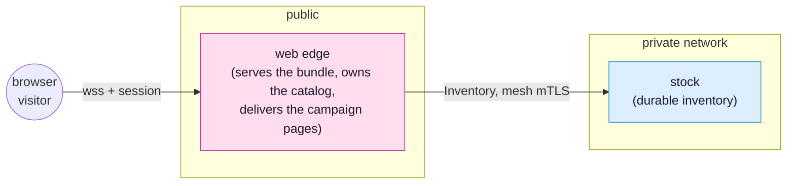

<!-- SPDX-FileCopyrightText: 2026 Alexandre 'kidev' Poumaroux -->
<!-- SPDX-License-Identifier: Apache-2.0 -->

# The light storefront

A SynQt client normally compiles every view into the bundle a visitor downloads. That is
the right default, but not for a page that changes weekly and that most visitors never
open. This tutorial covers the other kind of route: one the web edge delivers on demand.
Such a page arrives from the network at run time, so it needs care.

You will build a small storefront called the stall. Its product grid and cart are compiled
in, like everything you have written so far. Its campaign pages are not: they live on the
edge, the client fetches one the first time somebody opens it, and a merchandiser can
rewrite one without rebuilding the client or making visitors reload.

## What you will build

A shop with three entities. The browser talks only to the web edge. The edge owns the live
catalog, delivers the campaign pages, and is the only entity that reaches the database
holding the stock.



The finished app is
[`examples/stall`](https://github.com/Kidev/SynQt/tree/main/examples/stall). Read it at any
point, or run it if a step goes wrong.

[Open it in the designer](/designer/#example=stall) to see the finished system before you
build it: the entities, the links, and the contract on each line. The designer runs in
the browser and changes nothing on your disk.

## What you will learn

- **Two kinds of route:** pages the bundle carries (`view:`) and pages the edge delivers
  (`remote:`), and why the route makes that choice, not the code in it.
- **The palette:** `router.palette` lists the modules a delivered page may import. It is a
  trust boundary.
- **Page seeds:** a seed runs on the edge, per request, before the page is sent, so a
  delivered page's first frame shows real content.
- **Caching:** the page body travels once, under a content hash, while the seed stays
  fresh on every navigation.
- **What a scope protects:** a `scope:` on a delivered page protects the page's markup,
  never its data, and the check that protects data lives elsewhere.
- **Real URLs:** a delivered page gets a URL a visitor can bookmark, refresh, edit by hand
  and reach with the Back button.

## Before you start

Do [the auction](tutorial.md) first, or at least
[the base case](tutorial-base-auction.md) and
[a permanent Hall of Fame](tutorial-hall-of-fame.md). The stall's catalog and database
entity follow the auction's pattern, so this tutorial covers them briefly and focuses on
what is new.

Then create the project and leave it running:

```cli
synqt new stall
```

`synqt new` asks nothing and scaffolds the defaults: a client, a web edge, no
authentication and no other entities.
([`synqt create`](build-system-and-cli.md#scaffolding-a-project-synqt-new-and-synqt-create)
does the same but asks these as questions.) You write the route table, the campaign page
and the seed yourself. Copy the catalog and the `stock` entity from
[`examples/stall`](https://github.com/Kidev/SynQt/tree/main/examples/stall) when you need
them.

```cli
cd stall
synqt dev
```

> [!IMPORTANT]
> Keep `synqt dev` running in this terminal for the whole tutorial. It watches your
> files, reloads the browser when you save, and reloads a delivered page without
> rebuilding the client. Half of what follows relies on that.

## The three parts

1. [Build it](tutorial-remote-pages-build.md): the route table, the palette, the campaign
   page on the edge, and the seed that paints its first frame. At the end, the storefront
   runs.
2. [Lighter and live](tutorial-remote-pages-live.md): three hands-on checks that show the
   smaller bundle and the live editing, and the one boundary a delivered page never
   crosses.
3. [Links that work](tutorial-remote-pages-urls.md): the other half of a route, its URL,
   and what a visitor can do to the address bar without breaking anything.

> [!NOTE]
> This tutorial introduces each idea as you use it. The references are
> [remote pages](remote-pages.md) for what the edge delivers and how,
> [routes and URLs](routing.md) for the route table and the address bar, and
> [security](security.md#remote-pages-edge-delivered-qml) for how far to trust a page that
> arrives at run time.
