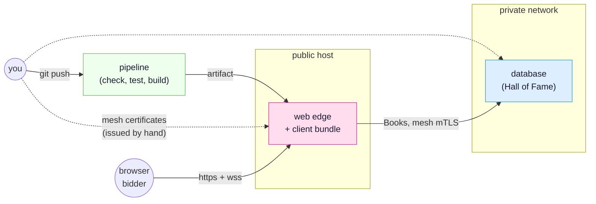

<!-- SPDX-FileCopyrightText: 2026 Alexandre 'kidev' Poumaroux -->
<!-- SPDX-License-Identifier: Apache-2.0 -->

# Shipping it

So far everything ran on one machine under `synqt dev`, with a throwaway certificate
authority and a browser talking plaintext to localhost. That is right for development and
wrong for a deployment. This tutorial moves your auction onto remote hosts, built by a
pipeline, and reachable by other people.

A deployment adds four things to what `synqt dev` provides: real certificates, real
secrets, real TLS to the browser, and something that keeps the processes running. The rest
of this tutorial arranges those four so the setup survives the second deploy, the tenth,
and the one someone else runs at two in the morning.

## What you will build

A pipeline and two hosts. The pipeline checks, tests and builds on every push, and
produces the artifact you deploy. One host faces the internet and runs nothing else. The
other runs the database, and only the first host can reach it. The certificate authority
that lets the two trust each other lives on neither.

You deploy [the auction](tutorial.md), unchanged.
[Open it in the designer](/designer/#example=gavel) to keep its shape in view while you
read where each piece will run.

## What you will learn

- **Checking for production early:** what `synqt check --release` adds to the check you
  already run, and why a profile file keeps one topology instead of two copies.
- **What a pipeline holds:** your CI builds the system and never holds the key that lets
  entities trust each other.
- **Two kinds of certificate:** who issues each, and which one your users' browsers
  recognize.
- **Where files go on a host:** why a SynQt deployment is a whole project directory.
- **What a release is:** a tag, an artifact, a start order, and, for a desktop client, a
  signing decision no framework can make for you.
- **Changing a running system:** a new build, a rotated certificate, a rollback, and the
  downtime each costs.

## Before you start

Do all three stages of [the auction](tutorial.md) first. This tutorial deploys that
project, and assumes `gavel` is on disk with its web edge, its database entity and GitHub
sign-in.

You also need (or can pretend to have):

- **A git host that runs CI.** The pipeline here is for GitHub Actions. It is four
  commands, so porting it is mechanical.
- **Two Linux hosts you can reach over SSH.** Containers, virtual machines or cloud
  instances all work. With only one, run both entities on it, and treat the private
  network parts as something to fix later.
- **A domain name pointing at the public host,** with a public TLS certificate for it.
  Any ACME client works.

You need no hosting provider, orchestrator or container registry. Every step is a file you
write and a command you run, so when you later add an orchestrator, you know what it does
for you.

> [!NOTE]
> If one machine is all you have, do the whole tutorial on it. Two SSH targets that are
> both `localhost` teach the same lessons in the same order; only the address in
> `synqt.production.yaml` changes.

## The four parts

1. [The pipeline that says no](tutorial-ship-pipeline.md): the production profile, the
   four commands, and the CI workflow that runs them on every push. Afterwards, a push
   produces a deployable artifact, and a push that fails a check produces none.
2. [Two authorities](tutorial-ship-certificates.md): the private CA your entities trust and
   the public certificate your visitors trust, who holds each, and what happens when one
   expires.
3. [Where the binaries go](tutorial-ship-hosts.md): the layout of a deployed project, the
   two hosts, the service units that keep it running, and the first boot.
4. [Cutting a release](tutorial-ship-release.md): tagging, the desktop client and its
   signing decision, the license obligations of a shipped client, and how to upgrade, roll
   back and rotate without taking the auction down.

> [!NOTE]
> This tutorial introduces each idea as you use it. The references are
> [deploying a SynQt system](deploying.md) for the ordered checklist,
> [build system and CLI](build-system-and-cli.md) for every command and flag,
> [security](security.md) for the trust model the deployment sets up, and
> [licensing](licensing.md) for what shipping a client obliges you to publish.
