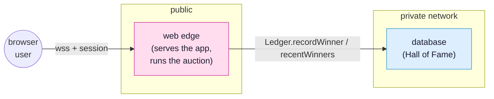

# Overview

This is a hands on, build it yourself introduction to SynQt. You will build one
project across three stages, and each stage adds exactly one new idea. By the end
you will have a working real time auction with sign in and a persistent Hall of
Fame, and, more importantly, you will understand why SynQt is shaped the way it is,
because at a few points you will try the tempting shortcut, watch it fail, and see
the reason for the safe path.

You do not need to know Qt or QML beforehand. You need to be comfortable in a
terminal and a code editor. The auth stage needs a GitHub account. Plan on about
an hour.

## What you will build

A live auction. One item is up for bids. Everyone watching sees the current high
bid update the instant someone raises it, with no refresh. You will grow it in
three stages:

1. [The base case](tutorial-base-auction.md): a live auction anyone can bid on.
   This teaches connect points, the heart of SynQt.
2. [Real bidders](tutorial-sign-in.md): add sign in, so a bid is tied to a real
   person and only signed in users can bid. This teaches identity and
   authorization.
3. [A Hall of Fame](tutorial-hall-of-fame.md): add a database so closed lots and
   their winners are remembered forever and shown to everyone. This teaches
   entities, the mesh, and segmentation.

Here is where you will end up, an auction made of three entities:



> [!NOTE]
> This tutorial is the friendly front door. When you want the full reference for
> anything it touches, follow the links: the [programming model](programming-model.md),
> [configuration](project-layout-and-config.md), [security](security.md),
> [entities](entities.md), [authentication](authentication.md),
> and [providers](providers.md).

## Before you start

Complete [Getting started](getting-started.md) first: install `synqt` and confirm
`synqt doctor` is happy. For the sign in stage you will also need a GitHub account.

Then create this tutorial's project and leave it running for the rest of the
tutorial:

```cli
synqt new gavel
```

Answer no to authentication and no to starting entities; you will add both
yourself, in [Real bidders](tutorial-sign-in.md) and
[A permanent Hall of Fame](tutorial-hall-of-fame.md).

```cli
cd gavel
synqt dev
```

> [!IMPORTANT]
> Keep `synqt dev` running in this terminal for the whole tutorial. It watches your
> files and reloads the browser when you save. When a step says "save and look at
> the browser," this is what makes that work.
