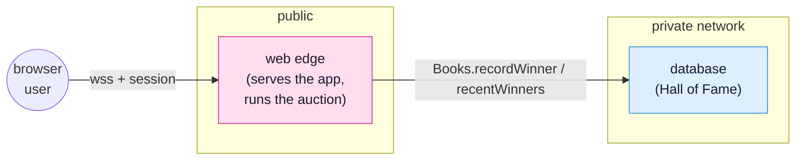

<!-- SPDX-FileCopyrightText: 2026 Alexandre 'kidev' Poumaroux -->
<!-- SPDX-License-Identifier: Apache-2.0 -->

# Overview

In this tutorial you build one SynQt project in three stages, and each stage adds one
idea. You end with a real time auction that has sign-in and a Hall of Fame kept in a
database. At a few points you try a tempting shortcut, see it fail, and learn why the
safe path exists.

Knowing Qt or QML is optional. You need to be at ease in a terminal and a code
editor, and the sign-in stage needs a GitHub account. Plan on about an hour.

## What you will build

A live auction. One item is up for bids, and everyone watching sees the high bid update
the moment someone raises it, with no refresh. You build it in three stages:

1. [The base case](tutorial-base-auction.md): a live auction anyone can bid on.
   This teaches connect points.
2. [Real bidders](tutorial-sign-in.md): add sign-in, so each bid belongs to a real
   person and only signed-in users can bid. This teaches identity and authorization.
3. [A Hall of Fame](tutorial-hall-of-fame.md): add a database that keeps closed lots and
   their winners and shows them to everyone. This teaches entities, the mesh and
   segmentation.

The finished auction has three entities:


```mermaid
flowchart LR
  user(("browser<br/>user"))
  user -->|"wss + session"| web
  subgraph public
    web["<span style='color:#1a1a2e'>web edge<br/>(serves the app,<br/>runs the auction)</span>"]
  end
  subgraph private["private network"]
    db["<span style='color:#1a1a2e'>database<br/>(Hall of Fame)</span>"]
  end
  web -->|"Books.recordWinner / recentWinners"| db
  style web fill:#fde,stroke:#c39,color:#1a1a2e
  style db fill:#def,stroke:#39c,color:#1a1a2e
```

[Open it in the designer](/designer/#example=gavel) to see the finished system before
you build it: the entities, the links, and the contract on each line. The designer runs
in the browser and changes nothing on your disk.

## What you will learn

- **Contracts:** why both ends of a live value are generated from one declaration that
  neither side can widen on its own.
- **Connect points:** an owner, a list of consumers, and the one path between them. The
  rest of SynQt builds on this.
- **Live values:** how a change on the owner reaches every open browser with no fetch,
  no refresh and no sync code of your own.
- **Where a rule belongs:** every check that matters runs on the owner. You will see
  what happens to the same rule written on the client.
- **Identity:** how a person becomes a session with a scope, and how a slot asks who is
  calling through `Caller`.
- **Entities:** what an entity is, why the database is one, and why the browser cannot
  reach it even though it sees the data the edge publishes.

> [!NOTE]
> This tutorial introduces each idea as you use it. When you want the full reference
> for anything it touches, follow the links: the [programming model](programming-model.md),
> [configuration](project-layout-and-config.md), [security](security.md),
> [entities](entities.md), [authentication](authentication.md),
> and [providers](providers.md).

## Before you start

Complete [Getting started](getting-started.md) first: install `synqt` and check that
`synqt doctor` reports no problem. The sign-in stage also needs a GitHub account.

Then create the project and leave it running for the whole tutorial:

```cli
synqt new gavel
```

`synqt new` asks nothing and scaffolds the defaults: a client, a web edge, no
authentication and no other entities. You add authentication in
[Real bidders](tutorial-sign-in.md) and the database in
[A permanent Hall of Fame](tutorial-hall-of-fame.md).
([`synqt create`](build-system-and-cli.md#scaffolding-a-project-synqt-new-and-synqt-create)
does the same but asks these as questions.)

```cli
cd gavel
synqt dev
```

> [!IMPORTANT]
> Keep `synqt dev` running in this terminal for the whole tutorial. It watches your
> files and reloads the browser when you save, which is what "save and look at the
> browser" relies on.
